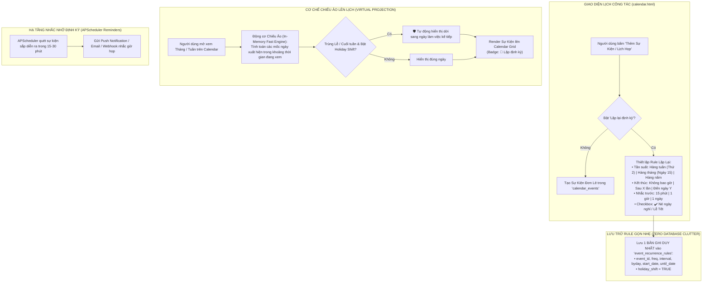

# NGUYÊN TẮC BẤT DI BẤT DỊCH (CORE SYSTEM PRINCIPLES) - HUEIC IMP
> **Dự án**: Cổng Thông Tin & Quản Lý Điều Hành Nội Bộ - HueIC IMP  
> **Áp dụng cho**: Mọi kỹ sư phần mềm, lập trình viên và Trợ lý AI khi thao tác trên repository này.

---

## 1. 🌐 Quy Hoạch Dải Cổng Cố Định & Container Isolation (Block 88xx)
- **Host Ports (Máy chủ Host)**:
  - Frontend Web (Nginx): `8880`
  - Backend API (FastAPI): `8881`
  - Database (PostgreSQL): `8882`
- **Quy tắc**:
  - **TUYỆT ĐỐI KHÔNG** đổi sang cổng mặc định (80, 8000, 5432) để tránh xung đột cổng trên Ubuntu Server.
  - Luôn sử dụng tiền tố container `hueic_imp_` (`hueic_imp_frontend`, `hueic_imp_backend`, `hueic_imp_db`).
  - Toàn bộ kết nối API từ Frontend gọi về `/api/v1/...` qua Nginx Reverse Proxy (cổng `8880`).

---

## 2. 🗄️ Toàn Vẹn CSDL, Migration An Toàn & Quy Chuẩn Seed Data
- Mật khẩu kết nối CSDL trong Python phải luôn được mã hóa URL bằng `urllib.parse.quote_plus` để hỗ trợ ký tự đặc biệt (`@`, `!`, `#`).
- Khi sửa đổi mô hình dữ liệu (Database Schema), luôn dùng lệnh an toàn:
  ```sql
  ALTER TABLE ... ADD COLUMN IF NOT EXISTS ...
  ```
- **Quy chuẩn Seed Data**: Dữ liệu mẫu (Seed Demo Data) chỉ được khởi tạo **duy nhất 1 lần đầu tiên** khi cơ sở dữ liệu hoàn toàn trống. **TUYỆT ĐỐI KHÔNG** tự động nạp lại (re-seed/resurrect) các tài khoản người dùng hoặc phòng ban mà người quản trị đã chủ động xóa mỗi khi khởi động lại Backend container.

---

## 3. 🏢 Chuẩn Hóa Cơ Cấu 12 Đơn Vị HueIC & Mã Viết Tắt
- Hệ thống chuẩn hóa đúng 12 Đơn vị/Khoa/Phòng trực thuộc trường Cao đẳng Công nghiệp Huế:
  1. `BGH`: Ban Giám hiệu
  2. `HCTH`: Phòng Hành chính - Tổng hợp
  3. `ĐT`: Phòng Đào tạo
  4. `QTĐT`: Phòng Quản trị - Đầu tư
  5. `TSDV`: Trung tâm Tuyển sinh - dịch vụ & Công tác sinh viên
  6. `CKOT`: Khoa Cơ khí - Ô tô
  7. `DC`: Khoa Điện - Điện tử
  8. `CNTT`: Khoa Công nghệ Thông tin
  9. `NL`: Khoa Năng lượng
  10. `KHCB`: Khoa Khoa học Cơ bản
  11. `TTGD`: Trung tâm Giáo dục nghề nghiệp
  12. `CĐ`: Công đoàn cơ sở

---

## 4. 🧩 Kiến Trúc Đa Trang Module Hóa Frontend (Multi-Page Modular)
- Để đảm bảo DOM siêu nhẹ, tốc độ tải tức thì (<50ms) và tránh xung đột code khi hệ thống mở rộng, Frontend tuân thủ mô hình **Đa Trang Tinh Gọn (Multi-Page Modular)**:
  - `index.html` ⟷ `assets/js/dashboard.js`: Dashboard KPI, biểu đồ Chart.js, bộ lọc phạm vi 3 cấp.
  - `tasks.html` ⟷ `assets/js/tasks.js`: Quản lý danh sách nhiệm vụ, 3 Modals (Giao việc, Cập nhật tiến độ, Thảo luận).
  - `calendar.html` ⟷ `assets/js/calendar.js`: Lịch công tác chuyên nghiệp 4 views, mini-calendar, bộ lọc đơn vị.
  - `settings.html` ⟷ `assets/js/settings.js`: Cấu hình 12 Đơn vị, Nhân sự & Ma trận phân quyền RBAC.
  - `assets.html` & `documents.html`: Các phân hệ mở rộng trong Phase 2.
  - `login.html`: Trang đăng nhập độc lập.
  - Module dùng chung: `assets/js/api.js` (JWT & Fetch API), `assets/js/common.js` (Device Detector, Drawer Mobile, Header, Toast, Logout).

---

## 5. 📱 Tự Động Nhận Diện Thiết Bị & Tối Ưu Hóa Chuyên Biệt Cho PC & Mobile (Adaptive Responsive)
- **Tự động nhận diện thiết bị**: JavaScript trong `common.js` tự động phát hiện `isMobile()` / `isTablet()` / `isDesktop()` và gắn class nhận diện (`device-mobile`, `device-desktop`) lên thẻ `<body>`.
- **Hiển thị tối ưu theo môi trường**:
  - **🖥️ Trên PC / Laptop**: Bảng biểu hiển thị dạng bảng đầy đủ cột chi tiết, Sidebar cố định, layout 2-3 cột rộng rãi.
  - **📱 Trên Điện thoại (Mobile)**:
    * **Thẻ Nhiệm Vụ (Touch Cards)**: Tự động chuyển đổi từ bảng cuộn sang dạng danh sách thẻ to bản, có thanh tiến độ và 2 nút thao tác dễ bấm.
    * **Thanh Điều Hướng Nhanh (Mobile Bottom Navigation Bar)**: Cố định dưới đáy màn hình giúp chuyển trang 1 chạm.
    * **Sidebar Drawer Trượt Trái**: Nút Hamburger 3 gạch mở menu mượt mà, tự động đóng khi chọn trang.
    * **Modals chống tràn**: `max-h-[90vh]` và `overflow-y-auto` đảm bảo không bị bàn phím ảo che mất nút Lưu.
- **Chống nhảy dòng (Wrap-free)**: Các cột Trạng thái, Thao tác, Mã viết tắt phải luôn có class `whitespace-nowrap` và `inline-flex`.

---

## 6. 🔍 Rà Soát Lỗi Tận Gốc Rễ, Giải Pháp Vĩ Mô & Bảo Toàn Tính Toàn Vẹn Liên Kết (Integrity Guard)
- **Truy tìm Nguyên nhân Gốc rễ (Root-Cause First)**: Khi phát sinh lỗi, không được sửa chắp vá bề nổi (superficial patch). Phải phân tích tận gốc chuỗi dữ liệu (Database Schema ⟷ SQLAlchemy Models ⟷ FastAPI Endpoints ⟷ Nginx Proxy ⟷ Frontend API Client ⟷ DOM Event Handler).
- **Phương án Cải tiến Vĩ mô (Macro-Level Solution)**: Luôn chọn giải pháp có tầm nhìn dài hạn, giải quyết triệt để vấn đề ở tầng kiến trúc cốt lõi để ngăn ngừa tuyệt đối lỗi tương tự tái diễn trong tương lai.
- **Bảo toàn Tính Toàn vẹn & Không Đứt gãy Liên kết (Cross-Module Dependency Check)**: Khi chỉnh sửa bất kỳ module, tệp tin hay API nào, **bắt buộc phải rà soát toàn bộ các tệp tin và luồng nghiệp vụ phụ thuộc** để đảm bảo 100% không gây ra hiệu ứng phụ (side-effects) hay làm gián đoạn liên kết giữa các file liên quan.

---

## 7. 📝 BẮT BUỘC CẬP NHẬT HISTORY.MD SAU MỖI LẦN SỬA ĐỔI (MANDATORY)
- **Mỗi khi thực hiện bất kỳ thay đổi nào** (thêm tính năng, fix bug, sửa giao diện, chỉnh database, cập nhật docker):
  - **BẮT BUỘC** ghi nhật ký vào file `HISTORY.md` trước khi kết thúc lượt làm việc.
  - Cấu trúc nhật ký: Phiên bản (`vX.Y.Z`), ngày giờ, tóm tắt yêu cầu, chi tiết thay đổi mã nguồn, file đã tác động.

---

## 8. 📚 BẮT BUỘC CẬP NHẬT README.MD KHI THAY ĐỔI KIẾN TRÚC / MÔ HÌNH (MANDATORY)
- **Mỗi khi có sự thay đổi về mặt cấu trúc thư mục, mô hình ứng dụng (ví dụ từ SPA sang Multi-Page), cấu hình cổng, hoặc bổ sung phân hệ mới**:
  - **BẮT BUỘC** cập nhật đồng bộ file `README.md` để tài liệu dự án luôn phản ánh chính xác nhất hiện trạng hệ thống.

---

## 9. 🤖 GIAO THỨC TỰ ĐỘNG GHI NHẬN NGUYÊN TẮC (AUTONOMOUS PRINCIPLE RECORDING PROTOCOL)
- **Cơ chế hoạt động**:
  - Trợ lý AI có trách nhiệm **CHỦ ĐỘNG PHÁT HIỆN, TRÍCH XUẤT VÀ TỰ ĐỘNG GHI LẠI** mọi quy tắc kỹ thuật, quyết định thiết kế hoặc thỏa thuận vận hành mới trực tiếp vào `.keywork.md` ngay trong chính lượt trao đổi đó mà **KHÔNG CẦN NGƯỜI DÙNG PHẢI NHẮC**.
  - Mọi AI Agent khi tiếp quản dự án bắt buộc phải đọc và tuân thủ tuyệt đối toàn bộ các nguyên tắc trong file này.

---

## 10. 🎯 QUẢN TRỊ TIẾN ĐỘ BẰNG QUY TRÌNH TỪNG BƯỚC & CHECKLIST BƯỚC MỐC (WORKFLOW PIPELINE & MILESTONES)
- **Chuẩn hóa đo lường tiến độ**: Tiến độ % và Trạng thái nhiệm vụ phải phản ánh chính xác thực tế qua **Quy trình các bước mốc (Workflow Steps)** từ 2 đến 8 bước:
  - ⚡ `QUICK_2`: Mẫu 2 bước nhanh *(1. Soạn thảo/Thực hiện ➡️ 2. Trình duyệt/Bàn giao)*.
  - 📋 `PDCA_4`: Mẫu 4 bước tiêu chuẩn *(1. Lập kế hoạch ➡️ 2. Triển khai ➡️ 3. Kiểm tra/Thẩm định ➡️ 4. Nghiệm thu bàn giao)*.
  - 🎓 `DAO_TAO_5`: Mẫu 5 bước Đào tạo *(1. Xây dựng đề cương ➡️ 2. Hội đồng Khoa ➡️ 3. Hội đồng Trường ➡️ 4. BGH duyệt ➡️ 5. Ban hành)*.
  - 🏗️ `QTĐT_8`: Mẫu 8 bước Mua sắm/Đầu tư *(1. Khảo sát ➡️ 2. Lập dự toán ➡️ 3. BGH duyệt chủ trương ➡️ 4. Báo giá/Thầu ➡️ 5. Ký HĐ ➡️ 6. Thi công/Giao hàng ➡️ 7. Nghiệm thu ➡️ 8. Quyết toán)*.
  - ➕ Khả năng tùy biến thêm/xóa/sửa từng bước tự do cho từng công việc cụ thể.
- **Cơ chế tính toán & Hiển thị thông minh**:
  * **TUYỆT ĐỐI CẤM KÉO TRƯỢT % TIẾN ĐỘ THỦ CÔNG**: Không cho phép người dùng kéo slider tự do để điền % cảm tính.
  * **TỶ LỆ % ĐƯỢC TÍNH TỰ ĐỘNG CHÍNH XÁC 100%**: `% Tiến độ = round((Số bước đã tích hoàn thành / Tổng số bước) * 100)`.
  * Khi ở trạng thái `DANG_THUC_HIEN`, % tiến độ phản ánh trung thực số bước đã hoàn thành (ví dụ: 1/8 bước = 12%, 3/8 bước = 38%, 2/5 bước = 40%, 1/4 bước = 25%).
  * Tên và số thứ tự bước đang làm dở (ví dụ: `Bước 3/8: Phê duyệt chủ trương (38%)`) phải luôn được hiển thị nổi bật trên Bảng PC, Thẻ Mobile, Modal Cập nhật và Timeline Stepper đồ họa trong Chi tiết.
  * **CHUẨN HÓA DROPDOWN TRẠNG THÁI**: Tuyệt đối không gắn % cố định như `(0%)`, `(100%)` vào danh sách tên trạng thái trong các thẻ `<option>` dropdown. Trạng thái chỉ dùng tên chữ chuẩn hóa (*Chưa bắt đầu, Đang thực hiện, Chờ nghiệm thu, Đã hoàn thành, Tạm dừng, Trễ hạn*) để tránh mâu thuẫn với % động thực tế được tính từ các bước mốc.
  * Tích hoàn thành 100% các bước ➡️ Trạng thái tự động chuyển `HOAN_THANH` (100%).
  * Bỏ tích hết các bước (0 bước) ➡️ Trạng thái tự động về `CHUA_BAT_DAU` (0%).

---

## 11. 📋 PHÂN HỆ QUẢN LÝ DANH MỤC QUY TRÌNH CHUẨN ĐỘNG (DYNAMIC WORKFLOW TEMPLATE CATALOG & SOP ENGINE)
- **Bộ Gợi Ý Quy Trình Thông Minh (Smart Workflow Suggester)**:
  - Tự động phân tích từ khóa trong ô tiêu đề nhiệm vụ khi giao việc (ví dụ: *'mua sắm', 'đề cương', 'học bổng', 'sự kiện', 'máy chủ', 'trình ký', 'pdca'*).
  - Tự động hiện banner gợi ý quy trình chuẩn HueIC tương ứng kèm nút `Áp dụng ngay` giúp gán phòng ban chủ trì, tên quy trình và các bước mốc chỉ bằng 1 cú click chuột.

---

## 12. 🗓️ PHÂN HỆ LỊCH CÔNG TÁC ĐỘC LẬP CHUYÊN NGHIỆP (PROFESSIONAL WORK CALENDAR HUB)
- **Cấu Trúc Sidebar Ngữ Cảnh Chuẩn (Calendar Context Hierarchy)**:
  - Trên màn hình Lịch Công Tác (`calendar.html`), các công cụ tiện ích mở rộng của Lịch được gắn liền mạch trực tiếp dưới mục "Lịch Công Tác":
    1. `Phân hệ cốt lõi`: Tổng Quan ➡️ Quản Lý Công Việc ➡️ Lịch Công Tác (Active).
    2. `Tiện ích Lịch`: Mini-Calendar tháng thu nhỏ ➡️ Bảng Chú thích màu trạng thái (kết thúc ở dòng *Tạm dừng*).
    3. `Điều hướng tiếp theo (dưới dòng Tạm dừng)`: Thiết Lập Hệ Thống ➡️ Phân hệ mở rộng (Quản Lý Tài Sản, Văn Bản & Hồ Sơ) ➡️ Footer Ports & Docs.
- **Lưới Lịch Đầy Đủ Chiều Cao & Phân Vùng Rõ Nét (Full-Height Adaptive Month Grid)**:
  - Lưới tháng tự động co giãn phủ kín 100% chiều cao màn hình (`flex-1 grid-auto-rows: 1fr`), tuyệt đối không để khoảng trống trắng phía dưới.
  - Phân vùng màu sắc trực quan: Cột Thứ 7 & Chủ Nhật có nền ánh hồng nhẹ (`bg-rose-50/20`) và header màu đỏ; Ngày ngoài tháng có nền muted mờ nhẹ (`bg-slate-50/70`); Ngày hôm nay có viền/badge xanh dương tròn nổi bật (`bg-blue-800 text-white`).
- **Thẻ Nhiệm Vụ Đẳng Cấp (Event Chips with Accent Bar & Tooltip)**:
  - Thiết kế dạng badge bo góc với viền màu trạng thái bên trái (`border-l-3`), hiển thị mã đơn vị `[BGH]`, `[CNTT]`, tiêu đề rút gọn và tooltip chi tiết (Tiêu đề, Đơn vị, Người phụ trách, Hạn chót, % Tiến độ).
- **4 Chế Độ Xem Đẳng Cấp (Google Calendar + Notion + ClickUp)**:
  - 📅 **Xem Tháng (Month View)**: Lưới 7 cột (Thứ 2 ➡️ Chủ Nhật), chip nhiệm vụ màu chuẩn theo trạng thái và deadline, hiển thị badge đếm số lượng công việc trong ngày.
  - 📆 **Xem Tuần (Week View)**: 7 cột theo ngày trong tuần, hiển thị thẻ nhiệm vụ theo dạng timeline dọc trực quan.
  - ⏱️ **Xem Ngày (Day View)**: Chi tiết toàn bộ nhiệm vụ đến hạn trong ngày kết hợp Timeline phân chia khung giờ làm việc hành chính chuẩn nhà trường (Sáng 07:00 - 11:30, Nghỉ trưa, Chiều 13:30 - 17:00).
  - 📋 **Xem Danh Sách / Lịch Trình (Agenda View)**: Danh sách cuộn dạng dòng thời gian gom nhóm theo ngày hạn chót, hiển thị đầy đủ Đơn vị chủ trì, Cán bộ phụ trách và % tiến độ.
- **Bộ Lọc Nhanh Đơn Vị & Tìm Kiếm Trực Tiếp Trên Header Lịch**:
  - Hỗ trợ dropdown lọc nhanh 12 đơn vị trường và ô tìm kiếm tức thì theo từ khóa ngay trên thanh công cụ Lịch.
- **Hệ Thống Badge & Thống Kê Nhanh Thời Gian Thực**:
  - Đếm tự động số việc `Đến hạn hôm nay`, `Quá hạn` và `Sắp đến hạn` ngay trên thanh công cụ header.
- **Tương Tác & Chuyển Đổi Liền Mạch**:
  - Click vào bất kỳ nhiệm vụ nào trên Lịch sẽ tự động điều hướng sang `tasks.html?task_id=...` mở chi tiết và lịch sử trao đổi.

---

## 13. 🔑 HỆ THỐNG GHI NHẬN TẬP TRUNG MỌI QUY TẮC (.keywork.md)
- **Trung tâm tri thức kỹ thuật**: Tất cả các nguyên tắc bất di bất dịch, quy định kiến trúc, giao thức vận hành và các thỏa thuận phát triển (coding conventions) đều phải được cập nhật đầy đủ và duy nhất tại file `.keywork.md`. 
- **Quyền hạn truy xuất**: Mọi thay đổi về cấu trúc hệ thống hoặc quy trình vận hành sau khi được thống nhất đều phải được ghi chú vào đây để đảm bảo sự thống nhất tuyệt đối cho mọi phiên làm việc tiếp theo của AI và con người.

---

## 14. 📊 ĐỒNG BỘ TỶ LỆ KÍCH THƯỚC BIỂU ĐỒ & BẢNG TIẾN ĐỘ DASHBOARD (CHART & TABLE HARMONIZATION)
- **Chiều cao động theo số lượng đối tượng**: Biểu đồ thanh ngang (Horizontal Bar Chart) tiến độ 12 Đơn vị trường (`#chartDeptProgress`) phải được định kích thước container tự động theo số lượng phần tử.
- **Tương quan trực quan với Bảng chi tiết**: Chiều cao của biểu đồ tiến độ tương xứng trực quan với chiều cao của Bảng Theo Dõi Tiến Độ Chi Tiết, các thanh bar (`barThickness: 10-14px`, `borderRadius: 5-6px`) và nhãn tên 12 Đơn vị/Khoa/Phòng luôn rõ ràng, thoáng đãng và dễ quan sát.
- **Biểu đồ Cơ Cấu Tình Trạng (Doughnut Chart)**: Container hình tròn được căn giữa dọc và hỗ trợ tương tác click-to-filter mượt mà sang Quản lý công việc.

---

## 15. 🚀 EXECUTIVE OPERATIONAL & DECISION-MAKING DASHBOARD (TRỢ LÝ ĐIỀU HÀNH RA QUYẾT ĐỊNH)
- **Chuyển hóa từ Data Dashboard sang Action Hub**:
  - Không chỉ dừng lại ở số liệu thống kê đơn thuần, Dashboard đóng vai trò là Trung tâm Giám sát và Điều hành (Executive Operational Hub), nhìn vào là biết ngay tình hình thực tế, điểm nghẽn nằm ở đâu và cần xử lý việc gì tiếp theo.
- **Phân vùng ⚡ Việc Cần Xử Lý Ngay (Action Queue / Decision Hub)**:
  - Hiển thị danh sách các điểm nghẽn ưu tiên cao nhất cần lãnh đạo ra quyết định:
    1. 🔴 **Nhiệm vụ Quá hạn**: Tên công việc, Mã đơn vị `[ĐT]`, Cán bộ phụ trách, Số ngày trễ hạn, Nút `[Xử lý →]` mở thẳng chi tiết nhiệm vụ.
    2. ⏳ **Nhiệm vụ Sắp đến hạn (trong 48-72h)**: Cảnh báo thời gian còn lại, Nút `[Đôn đốc →]`.
    3. 🟡 **Nhiệm vụ Chờ nghiệm thu**: Tên công việc, % tiến độ, Nút `[Phê duyệt →]`.
    4. ✨ **Trạng thái xuất sắc**: Khi không có công việc tồn đọng, hiển thị thông điệp tích cực ghi nhận vận hành đúng tiến độ.
- **Khối Theo Dõi Tiến Độ Đa Dạng (Tabbed View)**:
  - Cung cấp 3 chế độ xem chuyển đổi linh hoạt:
    - **Tab 1: 📈 Tiến Độ (%)**: Danh sách thanh progress bar ngang của từng đơn vị/cán bộ kèm badge trạng thái vận hành và nút lọc nhanh.
    - **Tab 2: 📊 Biểu Đồ Bar**: Biểu đồ so sánh Tỷ lệ hoàn thành (%) và Tổng khối lượng công việc.
    - **Tab 3: 🥧 Cơ Cấu %**: Biểu đồ hình tròn Doughnut Chart phân bổ 6 trạng thái nhiệm vụ.
- **Băng Ngang Ưu Tiên Xử Lý (Priority Action Strip)**:
  - Bố cục 4 mức độ trực quan: `🔴 01 — KHẨN CẤP` (kèm badge trễ hạn nếu có), `🟠 02 — CAO`, `🔵 03 — TRUNG BÌNH`, `⚪ 04 — THẤP`, hỗ trợ tương tác 1-click để lọc danh sách tương ứng.
- **Cột Trạng Thái Vận Hành Quản Trị (Operational Status Column)**:
  - Bảng Chi Tiết 12 Đơn Vị được bổ sung cột đánh giá quản trị:
    - 🔴 `🚨 Có X việc trễ hạn` (Đỏ cảnh báo)
    - ⏳ `⏳ Đang triển khai` (Hổ phách)
    - 🟢 `✅ Đúng tiến độ` (Xanh lá)
    - ⚪ `Chưa có việc` (Xám)
- **Tổ Chức Sidebar 3 Nhóm Chức Năng Chuẩn Enterprise**:
  - `ĐIỀU HÀNH`: Tổng Quan (Dashboard), Quản Lý Công Việc, Lịch Công Tác.
  - `QUẢN TRỊ`: Thiết Lập Hệ Thống, Quản Lý Tài Sản.
  - `HỒ SƠ`: Văn Bản & Hồ Sơ.
  - Tích hợp Badge thông báo số lượng điểm nghẽn/trễ hạn thời gian thực cạnh menu Quản Lý Công Việc.

---

### 16. NGUYÊN TẮC BẢO MẬT NÂNG CAO, CHỐNG BRUTE-FORCE & CENTRALIZED LOGGING (V2.4.3+)
- **Chính Sách Khóa Tài Khoản Tạm Thời (Account Lockout Policy)**:
  - Nếu đăng nhập sai liên tiếp `MAX_FAILED_LOGIN_ATTEMPTS` (mặc định: 5 lần), tài khoản/IP sẽ bị khóa tạm thời trong `LOCKOUT_DURATION_MINUTES` (mặc định: 15 phút) và trả về mã lỗi `HTTP 429 Too Many Requests`.
  - Phản hồi cho người dùng số lần thử còn lại trước khi kích hoạt lệnh khóa.
- **Bảo Mật Tầng Proxy Nginx (Security Headers & Limits)**:
  - Luôn cấu hình đầy đủ `X-Frame-Options SAMEORIGIN`, `X-Content-Type-Options nosniff`, `X-XSS-Protection "1; mode=block"`, `Referrer-Policy "strict-origin-when-cross-origin"`.
  - Giới hạn tải file `client_max_body_size 25M` để tránh tấn công cạn kiệt tài nguyên.
- **Hệ Thống Ghi Log Tập Trung & An Toàn (Structured Centralized Logging)**:
  - Xuất log console chuẩn format ISO timestamp cho Docker/Cloud-Native.
  - Ghi log xoay vòng `RotatingFileHandler` ra file `logs/hueic_imp.log` (10MB/file, giữ lại 5 backups).
  - Global Exception Handler bắt toàn bộ lỗi chưa xử lý (500), tạo correlation error ID (`ERR_xxxxxxxx`) ghi chi tiết stack trace vào log file và chỉ trả về thông báo an toàn cho client, không để lộ cấu trúc bảng hay thông tin nhạy cảm.
- **Chuẩn Hóa Múi Giờ UTC+7 (Asia/Ho_Chi_Minh)**:
  - Toàn bộ backend xử lý thời gian đối sánh hạn chót (Deadline, Quá hạn, Việc sắp đến hạn trong 72h) đều chuẩn hóa theo múi giờ Việt Nam.

---

### 17. KIẾN TRÚC EXECUTIVE DASHBOARD REACT 18 & RECHARTS 2 (V2.4.4+)
- **Nâng Cấp Dashboard Lên React 18 & Recharts 2**:
  - Trang `index.html` được chuyển đổi sang React 18 với JSX và Babel Standalone, tích hợp thư viện vẽ biểu đồ chuyên nghiệp `Recharts 2.x`.
- **Hệ Thống Thiết Kế Editorial & Tông Màu Cao Cấp (Tokens)**:
  - Nền ấm `#F6F5F1`, Mực chính `#16233D`, Viền `#E4E1D8`, Teal `#0E7C7B`, Amber `#C17817`, Red `#B3261E`.
  - Phông chữ kết hợp: `Manrope` (tiêu đề & số liệu lớn) và `Inter` (dữ liệu & nhãn).
- **Khắc Phục Vấn Đề Dữ Liệu Thưa (Sparse Data Handling)**:
  - Dùng **Horizontal Stacked Bar** cho Cơ cấu trạng thái & Phân bổ ưu tiên thay cho Donut chart.
  - Dùng **Vertical Bar Chart (Recharts)** chỉ lọc và hiển thị các đơn vị/cán bộ đang có công việc (> 0 việc), sắp xếp theo % tiến độ giảm dần.
  - Bảng chi tiết 12 đơn vị tự động gom các đơn vị 0 việc vào **Accordion thu gọn (`showIdle`)**, tối ưu hóa diện tích hiển thị và tập trung sự chú ý vào các điểm nóng điều hành.
- **Tích Hợp Action Queue & Scope Filtering**:
  - Tích hợp Dropdown lọc phạm vi (Toàn trường, Từng phòng ban, Từng cán bộ) và card cảnh báo điểm nghẽn 1-click điều hướng.

---

### 18. QUY CHUẨN THIẾT KẾ LỊCH CÔNG TÁC HIỆN ĐẠI (WORK CALENDAR REDESIGN - V2.5.0+)
- **Đồng Bộ Design Tokens Warm Editorial**:
  - Tông màu: Nền `#F6F5F1`, Mực chính `#16233D`, Viền `#E4E1D8`, Teal `#0E7C7B`, Amber `#C17817`, Red `#B3261E`, Green `#3B8B6E`, Purple `#6B5B95`.
  - Phông chữ kết hợp: `Manrope` (tiêu đề, số liệu) và `Inter` (nhãn, sự kiện).
- **Giải Quyết Triệt Để 7 Vấn Đề UX Lịch**:
  1. **Ô Ngày Co Giãn Thông Minh**: Ngày không có sự kiện chỉ chiếm min-height nhỏ (~64px), ngày có sự kiện co giãn tự nhiên (~92px+) — loại bỏ khoảng trắng rỗng vô nghĩa.
  2. **Tên Sự Kiện Đa Dòng & Tooltip**: Tự động xuống dòng tối đa 2 dòng (`line-clamp-2`) kèm `title` tooltip đầy đủ tên nhiệm vụ và phòng ban.
  3. **Điểm Nhấn "Hôm Nay" Chuẩn Mực**: Viền Teal 2px (`#0E7C7B`) bao quanh ô và gắn nhãn nhỏ "Hôm nay", không làm bẩn ô ngày.
  4. **Tách Biệt 2 Hệ Màu**: Cuối tuần (Thứ 7 - CN) chỉ dùng màu chữ dịu `#B7756F` (không tô nền hồng cả cột) để màu trạng thái (Teal, Red, Amber, Green, Purple) không bị xung đột với ngày nghỉ.
  5. **Top Bar Rõ Nhãn & Số Liệu**: Chỉ số "Quá hạn", "Sắp hạn", "Nhắc nhở" được hiển thị rõ text + icon + badge đếm.
  6. **Mini Calendar Thông Minh**: Chấm nhỏ màu hổ phách đánh dấu ngày có sự kiện, chuyển tháng nhanh.
  7. **Hỗ Trợ Toàn Diện 4 Chế Độ Xem**: Tháng (Month), Tuần (Week), Ngày (Day), Danh sách (Agenda).

---

### 19. KIẾN TRÚC MASTER EXECUTIVE PORTAL VÀ PHÂN HỆ CÔNG VIỆC CHUYÊN SÂU (V2.6.0+)
- **Phân Cấp Thông Tin Chuẩn Enterprise GovTech (Master IA)**:
  - **Trang Chủ (`index.html`) - Master Executive Portal**: Bàn điều khiển vĩ mô cấp trường của Ban Giám Hiệu, tập hợp 4 phân hệ ngang (*Công việc & Điểm nghẽn*, *Lịch công tác trọng tâm*, *Hiện trạng tài sản & CSVC*, *Văn bản & Hồ sơ điều hành*).
  - **Phân Hệ Quản Lý Công Việc (`tasks.html`)**: Chuyển thành phân hệ chuyên sâu đa chế độ xem:
    - *Tab 1: Báo Cáo & Tiến Độ 12 Đơn Vị* (Tích hợp React 18 + Recharts 2 chuyên sâu, Accordion thu gọn 0-việc).
    - *Tab 2: Danh Sách Công Việc* (Bảng lọc chi tiết, tìm kiếm, xuất dữ liệu).
    - *Tab 3: Bảng Thẻ Kanban* (Luồng trạng thái PDCA).
    - *Tab 4: Lịch Công Tác* (Điều hướng nhanh sang `calendar.html`).
- **Liên Kết Điều Hướng Mượt Mà (Seamless Deep Linking)**:
  - Bấm vào bất kỳ điểm nghẽn hoặc đơn vị nào ở trang chủ `index.html` đều điều hướng trực tiếp sang đúng nhiệm vụ hoặc bộ lọc của đơn vị tại `tasks.html` / `calendar.html`.

---

### 20. QUY CHUẨN MÀU SẮC, TRẠNG THÁI & MỨC ĐỘ ƯU TIÊN TOÀN HỆ THỐNG (V2.6.1+)
- **Thứ Tự & Bảng Màu Quy Chuẩn Toàn Hệ Thống**:
  - **Trạng Thái Công Việc (Status Workflow)**:
    1. `Chưa bắt đầu` (`CHUA_BAT_DAU`, Xám `#8B96AC`, order: 1)
    2. `Đang làm` (`DANG_THUC_HIEN`, Teal `#0E7C7B`, order: 2)
    3. `Chờ duyệt` (`CHO_DUYET`, Amber `#C17817`, order: 3)
    4. `Quá hạn` (`TRE_HAN`, Đỏ `#B3261E`, order: 4)
    5. `Hoàn thành` (`HOAN_THANH`, Xanh lá `#3B8B6E`, order: 5)
    6. `Tạm dừng` (`TAM_DUNG`, Tím `#6B5B95`, order: 6)
  - **Mức Độ Ưu Tiên (Priority)**:
    1. `Khẩn cấp` (`KHAN_CAP`, Đỏ `#B3261E`, order: 1)
    2. `Mức độ cao` (`CAO`, Amber `#C17817`, order: 2)
    3. `Trung bình` (`TRUNG_BINH`, Teal `#0E7C7B`, order: 3)
    4. `Mức độ thấp` (`THAP`, Xám `#8B96AC`, order: 4)
- **Tùy Biến Linh Hoạt Trong Thiết Lập Hệ Thống (`settings.html`)**:
  - Bổ sung Tab `[🎨 Màu Sắc & Trạng Thái]` trong `settings.html` cho phép người dùng thay đổi mã màu, thứ tự hiển thị của từng trạng thái / ưu tiên.
  - Cung cấp nút **"Khôi phục chuẩn mặc định" (Reset to Default)** để quay về thiết lập mẫu chuẩn của HueIC IMP bất cứ lúc nào.
  - Lưu trữ động qua `Common.getStatusConfig()` & `Common.getPriorityConfig()`, đồng bộ hóa tự động cho Dashboard, Công việc và Lịch trình.

---

### 21. BỘ NGUYÊN TẮC PHÁT TRIỂN & VẬN HÀNH WEB QUẢN TRỊ NỘI BỘ (ENTERPRISE WEB ENGINEERING STANDARDS)
HueIC IMP áp dụng và tinh chỉnh 5 nhóm nguyên tắc web kỹ thuật cao phù hợp tuyệt đối cho hệ thống quản trị hành chính giáo dục:

1. **Trải Nghiệm Người Dùng (UX/UI & Workflow Ergonomics)**:
   - **Quy tắc 3 lần nhấp (3-Click Rule)**: Từ Dashboard hoặc Menu chính, người dùng có thể tiếp cận bất kỳ tác vụ nào (tạo việc mới, phê duyệt nghiệm thu, tra cứu lịch, xem báo cáo đơn vị) trong tối đa 3 lần bấm chuột.
   - **Cấu Trúc Phân Cấp Thị Giác (Visual Hierarchy)**: Kết hợp phông `Manrope` (cho tiêu đề, chỉ số KPI lớn) và `Inter` (cho bảng dữ liệu, nhãn), tạo độ tương phản rõ ràng giữa Nhóm Trạng Thái (Teal, Amber, Red, Green) và Hành Động Chính (CTA Navy/Blue).
   - **Thiết Kế Adaptive & Responsive (Mobile-First / Multi-Screen)**: Trên PC hiển thị bảng lưới dữ liệu lớn & bộ lọc đa tiêu chí; trên Mobile/Tablet tự động chuyển đổi sang Thẻ chạm (Touch Cards), Thanh điều hướng đáy (Bottom Nav) và Sidebar ngăn kéo (Drawer Backdrop).
   - **Khoảng Trắng & Nhịp Điệu Giao Diện (White Space & Rhythm)**: Áp dụng bảng màu nền ấm `#F6F5F1`, giữ khoảng cách thông thoáng (padding/margin chuẩn 12-24px), hiệu ứng hover tinh tế (`translateY(-2px)`), không gây quá tải thông tin.

2. **Hiệu Năng & Tốc Độ Phản Hồi (Performance & Low-Latency)**:
   - **Tối Ưu Tài Nguyên Đồ Họa**: Sử dụng hoàn toàn SVG vector và FontAwesome, không sử dụng ảnh bitmap nặng; icon và badge có dung lượng tối thiểu.
   - **Lazy Loading & Virtual Accordion**: Bảng dữ liệu lớn phân trang thông minh; các đơn vị hoặc dữ liệu 0-phát sinh được gom vào Accordion thu gọn (`showIdle`) nhằm giảm số lượng DOM node render.
   - **Caching & Tối Ưu Truy Vấn**: Proxy Nginx quản lý cache tài nguyên tĩnh; Backend FastAPI / SQLAlchemy tối ưu truy vấn Index, hạn chế tối đa N+1 Query. Mục tiêu tải trang chính < 1.5 giây và API phản hồi < 200ms.

3. **Bảo Mật Cổng Thông Tin Nội Bộ (Enterprise GovTech Security)**:
   - **Không Lưu Thông Tin Nhạy Cảm Lộ Thiên**: Tuyệt đối không commit file `.env`, mật khẩu DB, SECRET_KEY lên kho Git công khai; bảo vệ file cấu hình trên server.
   - **Kiểm Soát & Làm Sạch Dữ Liệu Đầu Vào (Input Validation & Sanitization)**: 100% tham số API được xác thực qua Schema Pydantic; câu lệnh cơ sở dữ liệu qua ORM an toàn chống SQL Injection; render dữ liệu an toàn chống XSS.
   - **Chính Sách Chống Tấn Công (Brute-Force & Rate Limiting)**: Cơ chế khóa đăng nhập tạm thời 15 phút khi sai 5 lần liên tiếp (HTTP 429); quản lý Token JWT phiên đăng nhập và phân quyền RBAC nghiêm ngặt.

4. **Kiến Trúc Mã Nguồn & Khả Năng Bảo Trì (Clean Architecture & Maintainability)**:
   - **Tách Biệt Ranh Giới 3 Tầng (Separation of Concerns)**: Frontend (Modular HTML/JS/React Recharts) ↔ Backend (FastAPI Router/Schema/CRUD) ↔ Database (PostgreSQL Containerized).
   - **Quy Ước Đặt Tên Nhất Quán**: Backend Python sử dụng `snake_case` cho hàm/biến và `PascalCase` cho Model/Schema; Frontend JavaScript sử dụng `camelCase` cho hàm/biến và `SCREAMING_SNAKE_CASE` cho Design Tokens.
   - **Xử Lý Lỗi Tập Trung (Centralized Error Handling)**: Backend trả về mã lỗi chuẩn kèm Error Correlation ID (`ERR_xxxxxxxx`); Frontend hiển thị thông báo Toast (`Common.showToast()`) trực quan, tuyệt đối không để xảy ra màn hình trắng rỗng.

5. **Cấu Trúc Ngữ Nghĩa & Khả Năng Tiếp Cận (Semantic HTML & Accessibility - a11y)**:
   - **Thẻ HTML Ngữ Nghĩa (Semantic HTML)**: Sử dụng chuẩn xác `<header>`, `<nav>`, `<main>`, `<aside>`, `<section>`, `<table>`, `<dialog>` giúp mã nguồn trong sáng và tối ưu cho các công cụ hỗ trợ tiếp cận.
   - **Khả Năng Tiếp Cận (a11y & WCAG)**: Độ tương phản màu sắc giữa chữ và nền luôn đạt chuẩn dễ đọc cho cán bộ/giảng viên; các nút bấm chỉ có icon bắt buộc phải có thuộc tính `title` hoặc `aria-label`.

---

### 22. BỘ NGUYÊN TẮC KỸ THUẬT LẬP TRÌNH & VIẾT MÃ SẠCH (SOFTWARE CRAFTSMANSHIP & CLEAN CODE STANDARDS)
HueIC IMP cam kết áp dụng nghiêm ngặt 4 nhóm nguyên tắc thiết kế và tư duy viết mã sạch trong mọi chu kỳ phát triển:

1. **Các Nguyên Tắc Tư Duy Kinh Điển**:
   - **KISS (Keep It Simple, Stupid)**: Giữ mã nguồn đơn giản nhất có thể. Không viết các cấu trúc phức tạp hay logic vòng vèo khi bài toán có thể giải quyết bằng giải pháp tường minh, trực quan và dễ hiểu.
   - **DRY (Don't Repeat Yourself)**: Không lặp lại mã nguồn. Gom các đoạn mã có cùng nhiệm vụ thành hàm, tiện ích dùng chung (`Common`, `API`, `CRUD base`) để khi có sửa đổi chỉ cần cập nhật tại một nơi duy nhất.
   - **YAGNI (You Aren't Gonna Need It)**: Chỉ lập trình những tính năng đáp ứng yêu cầu thực tế hiện tại. Tuyệt đối không phỏng đoán hay xây dựng sẵn các cấu trúc phức tạp "cho tương lai" khi chưa có nhu cầu nghiệp vụ thực tế.
   - **Boy Scout Rule (Quy tắc hướng đạo sinh)**: *"Luôn để lại bãi trại sạch hơn lúc bạn đến"*. Mỗi khi sửa hoặc đọc một đoạn mã cũ, hãy tranh thủ dọn dẹp biến thừa, refactor logic chưa tối ưu hoặc chuẩn hóa lại tên hàm trước khi lưu lại.

2. **Nguyên Tắc Đặt Tên & Khả Năng Đọc Hiểu (Readability & Self-Documenting)**:
   - **Tên Biến/Hàm Tự Giải Thích (Self-Documenting Code)**: Tên hàm phải là động từ mô tả chính xác hành động (`getUserById`, `calculateOverdueDays`, `switchView`), tên biến phải là danh từ rõ nghĩa (`isCompleted`, `leadingDeptCode`, `priorityData`). Tuyệt đối cấm dùng tên tắt vô nghĩa (`a`, `b`, `temp1`, `data2`).
   - **Ưu Tiên Code Dễ Hiểu Hơn Comment**: Viết mã rõ ràng, mạch lạc để người khác đọc hiểu ngay luồng xử lý; chỉ sử dụng comment khi cần giải thích lý do tại sao thực hiện theo cách đó (**Why** - rationale/business logic), không lặp lại điều hiển nhiên mã nguồn đang làm (**What**).
   - **Nhất Quán Quy Ước (Convention Strictness)**: Tuân thủ chặt chẽ một chuẩn định dạng trên toàn dự án (`camelCase` cho JS hàm/biến, `snake_case` cho Python hàm/biến, `PascalCase` cho Model/Schema/React Component, `SCREAMING_SNAKE_CASE` cho Hằng số/Design Tokens).

3. **Nguyên Tắc Thiết Kế SOLID (Kiến Trúc Mô-đun & Hướng Đối Tượng)**:
   - **S - Single Responsibility Principle (Đơn Trách Nhiệm)**: Mỗi hàm, router endpoint, service hoặc component chỉ chịu trách nhiệm cho một công việc duy nhất (VD: `tasks_dashboard.js` chỉ render UI báo cáo, logic gọi dữ liệu qua `API`).
   - **O - Open/Closed Principle (Đóng/Mở)**: Thiết kế module sao cho dễ dàng mở rộng thêm tính năng mới (thêm trạng thái, thêm đơn vị) mà không phải sửa đổi trực tiếp mã nguồn cũ đã chạy ổn định.
   - **L - Liskov Substitution Principle (Thay Thế Liskov)**: Các lớp con hoặc schema kế thừa (`TaskOut` kế thừa `TaskBase`) phải hoạt động bình thường mà không làm thay đổi tính đúng đắn của chương trình.
   - **I - Interface Segregation Principle (Phân Tách Giao Diện)**: Không ép một class/module phải phụ thuộc vào những thuộc tính/phương thức mà nó không cần sử dụng; chia nhỏ schema (`TaskCreate`, `TaskUpdate`, `TaskOut`).
   - **D - Dependency Inversion Principle (Đảo Ngược Phụ Thuộc)**: Các module cấp cao không phụ thuộc trực tiếp vào module cấp thấp; phụ thuộc vào abstraction (sử dụng FastAPI Dependency Injection `Depends(get_db)`, `Depends(get_current_user)`).

4. **Nguyên Tắc Kiểm Soát Luồng & Lập Trình Phòng Thủ (Defensive Programming)**:
   - **Return Early (Guard Clauses)**: Xử lý và ngắt sớm các điều kiện sai/lỗi ngay đầu hàm bằng `return` hoặc `raise HTTPException`, tránh lồng nhau quá nhiều khối `if-else` gây sâu cây logic (loại bỏ Arrow Anti-pattern).
   - **Fail Fast & Explicit Error Handling**: Xử lý lỗi cụ thể, có chủ đích; bắt đúng loại ngoại lệ (`IntegrityError`, `ValidationError`) và ghi log chi tiết kèm Correlation ID, tuyệt đối không dùng `except Exception: pass` hoặc `catch (e) {}` bỏ qua lỗi âm thầm.
   - **Immutable State (Hạn Chế Thay Đổi Trạng Thái Gốc)**: Ưu tiên tạo ra dữ liệu mới sau khi xử lý (sử dụng `.map()`, `.filter()`, spread operator `[...arr]`, `{...obj}`) thay vì biến đổi trực tiếp trên mảng/đối tượng gốc, bảo đảm tính nhất quán tuyệt đối cho luồng dữ liệu phản ứng (Reactive Data Flow).

---

### 23. NGUYÊN TẮC KIẾN TRÚC HỆ THỐNG ĐA MODULE ĐỘC LẬP & PHÂN CẤP PHẠM VI DỮ LIỆU (MULTI-MODULE ECOSYSTEM & SCOPED WORKSPACES)
HueIC IMP (ICP) là một hệ sinh thái chuyển đổi số quản trị nội bộ gồm nhiều phân hệ (module) nghiệp vụ hoạt động độc lập và liên kết chặt chẽ. Hệ thống tuân thủ 3 nguyên tắc phân cấp kiến trúc cốt lõi:

1. **Cấu Trúc Module Chuẩn Hóa (Standardized Module Architecture)**:
   - Mỗi phân hệ nghiệp vụ (như *Quản Lý Công Việc*, *Quản Lý Tài Sản*, *Văn Bản & Hồ Sơ*...) hoạt động độc lập với không gian làm việc chuyên biệt.
   - **Tab Đầu Tiên Của Mọi Module Bắt Buộc Là Báo Cáo Tổng Quan (Module-Specific Executive Dashboard)**: Cung cấp 5 thẻ KPI, cơ cấu trạng thái, phân bổ ưu tiên và biểu đồ tiến độ Recharts chuyên sâu của riêng module đó.
   - Các tab tiếp theo là các không gian thao tác chi tiết: *Danh Sách Dữ Liệu*, *Bảng Thẻ Kanban*, *Lịch Công Tác*.

2. **Vai Trò Của Trang "Tổng Quan (Dashboard)" Toàn Trường (`index.html`)**:
   - Mục **[Tổng Quan (Dashboard)]** ở Menu dọc bên trái (`index.html`) là **Trang Điều Hành Cấp Cao Nhất (Master Enterprise Dashboard)** của Toàn Trường.
   - Có nhiệm vụ tổng hợp số liệu hàng ngang của **TẤT CẢ các phân hệ** (Tổng quan Nhiệm vụ, Tình trạng Tài sản, Văn bản đến/đi, Nhân sự 12 đơn vị).

3. **Phân Cấp Phạm Vi Lịch Công Tác (Calendar Scoping Hierarchy)**:
   - **Lịch Phạm Vi Module (Module-Scoped Calendar)**: Lịch nằm bên trong một module chỉ hiển thị các sự kiện, hạn chót (deadline), lịch trình thuộc phạm vi nghiệp vụ của module đó (VD: trong Quản lý công việc chỉ hiển thị deadline công việc; trong Quản lý tài sản chỉ hiển thị lịch bảo dưỡng/kiểm kê...).
   - **Lịch Toàn Hệ Thống (Master System Calendar - `calendar.html`)**: Mục **[Lịch Công Tác]** ở Menu dọc bên trái là Lịch Điều Hành Tập Trung của Cả Trường, tổng hợp toàn bộ các sự kiện, cuộc họp BGH, deadline nhiệm vụ và lịch hoạt động của tất cả các phân hệ.

---

### 24. NGUYÊN TẮC ĐIỀU PHỐI GIAO NHIỆM VỤ THÔNG MINH & PHÂN CÔNG LINH HOẠT (SMART TASK DISPATCH & FLEXIBLE DELEGATION)
Form Giao Việc trong HueIC IMP hoạt động như một **Trung Tâm Điều Phối Thông Minh (Smart Dispatch Center)** thay vì biểu mẫu nhập liệu thủ công đơn thuần:

1. **Phân Công Linh Hoạt: Tập Thể Đơn Vị vs. Cán Bộ Đích Danh**:
   - **Giao cho Tập thể Đơn vị (Department Collective Assignment)**: Khi Ban Giám Hiệu hoặc lãnh đạo giao việc cho cả một Phòng/Khoa (chưa chỉ định đích danh cán bộ), trường Cán bộ phụ trách chọn `🏢 [Tập thể đơn vị tự điều phối]` (hoặc để trống). Hệ thống hiển thị rõ nhãn `🏢 [Mã ĐV] Tập thể đơn vị` trên Bảng dữ liệu, Mobile Cards và Kanban để đơn vị chủ động tiếp nhận và phân chia nội bộ.
   - **Giao cho Cá nhân Cụ thể (Individual Assignment)**: Gán đích danh chuyên viên/giảng viên phụ trách chính.

2. **Bộ Chọn 5 Hình Thái Nhiệm Vụ (Task Archetypes Selector)**:
   - Form tự động co giãn các trường nhập liệu tương ứng theo hình thái được chọn:
     - `⚡ Việc Nhanh (Express)`: Ẩn khối quy trình nhiều bước, giữ 4 trường cốt lõi, hoàn tất giao việc trong 5 giây.
     - `🔄 Quy Trình Chuẩn (Workflow)`: Mở bộ dựng Pipeline và kho mẫu chuẩn PDCA / Nghiệp vụ.
     - `🔁 Lặp Lại Định Kỳ (Recurring)`: Mở cấu hình chu kỳ lặp lại (Tuần, Tháng, Quý, Học kỳ).
     - `🏢 Liên Đơn Vị (Cross-Unit)`: Mở trường đơn vị phối hợp diện rộng.
     - `🚨 Khẩn Cấp (Urgent)`: Tự động nâng ưu tiên cao nhất, hạn chót 24h-48h, cảnh báo nổi bật.

3. **Chỉ Số Cân Bằng Tải Cán Bộ (Workload Balance Indicator)**:
   - Dropdown Cán bộ phụ trách tự động phân tích số lượng task đang thực hiện và task quá hạn của từng nhân sự:
     - `🟢 [Rảnh: 0 việc]` ➡️ Tự động đẩy lên đầu danh sách để ưu tiên giao việc.
     - `🟡 [Đang làm: X việc]`
     - `🔴 [⚠️ Quá tải: X việc, Y trễ]` ➡️ Cảnh báo để tránh dồn việc quá mức.

4. **Thư Viện Mẫu Quy Trình Chuẩn & Cảnh Báo Ngày Nghỉ**:
   - Cung cấp sẵn các mẫu quy trình đại học/cao đẳng (*Mua sắm trang thiết bị & CSVC, Tổ chức sự kiện & Khai giảng, Biên soạn đề cương CTĐT, Bảo dưỡng thiết bị phòng máy, Quy trình PDCA toàn trường*).
   - Tự động kiểm tra và nhắc nhở an toàn nếu Deadline rơi vào Thứ 7 / Chủ Nhật (ngày nghỉ).

---

### 25. NGUYÊN TẮC THIẾT KẾ BIỂU MẪU ĐỘNG THÍCH ỨNG THEO 3 NHÓM VAI TRÒ (ROLE-ADAPTIVE DYNAMIC DISPATCHING)
Hệ thống sử dụng **1 Bộ Khung Biểu Mẫu Thống Nhất (Single Dynamic Form Component)** kết hợp cơ chế hiển thị có điều kiện (Conditional Rendering) dựa trên vai trò người dùng thay vì tách thành 3 file độc lập:

1. **Nhóm 1: Ban Giám Hiệu / Lãnh Đạo (BGH - Cấp Chiến Lược)**:
   - Bản chất: Chỉ đạo, giao nhiệm vụ từ trên xuống cho toàn trường.
   - Quyền hạn: Toàn quyền chọn bất kỳ đơn vị nào trong 12 phòng/khoa, giao cho tập thể hoặc đích danh cán bộ, thiết lập đơn vị phối hợp và quy trình toàn trường.

2. **Nhóm 2: Trưởng Phòng / Khoa / Tổ (DEPT_HEAD - Cấp Điều Phối Nội Bộ)**:
   - Bản chất: Điều phối công việc trong nội bộ đơn vị phụ trách hoặc gửi yêu cầu phối hợp.
   - Quyền hạn: Đơn vị chủ trì bị khóa cứng (`readonly/disabled`) theo đơn vị của Trưởng phòng; trường phân công chỉ lọc danh sách nhân sự thuộc đơn vị; quy trình là các bước nội bộ đơn vị.

3. **Nhóm 3: Cá Nhân / Cán Bộ / Giảng Viên (STAFF - Cấp Thực Thi & Đề Xuất)**:
   - Bản chất: Tối giản tuyệt đối, tự quản lý công việc bản thân hoặc đề xuất lên cấp trên.
   - 2 Chế độ chính:
     - `📝 Việc Cá Nhân (My To-Do)`: Tự lập danh sách việc cần làm cho chính mình.
     - `💡 Đề Xuất Cho Trưởng Phòng`: Gửi đề xuất công việc lên Trưởng đơn vị phê duyệt trước khi thành việc chính thức.
   - **Trường Người Giao Việc (Custom Searchable Combobox)**: Khắc phục nhược điểm của datalist mặc định, hệ thống trang bị Combobox tùy biến cao cấp:
     - Dropdown menu độc lập với `max-h-48`, cuộn riêng biệt, hiển thị avatar icon (`🏛️` BGH, `🏢` Trưởng phòng, `👤` Cán bộ), tên đầy đủ và badge đơn vị.
     - Tự động đóng khi click ra ngoài, có nút `✕` xóa nhanh, tuyệt đối không bị tràn hay che phủ form.

---

### 26. NGUYÊN TẮC THIẾT KẾ BỘ ĐIỀU KHIỂN MỨC ĐỘ ƯU TIÊN & THỜI HẠN CHUẨN EXECUTIVE (EXECUTIVE PRIORITY & DEADLINE CONTROLLER)
Thay vì dùng các dropdown và các ô nhập liệu rời rạc gây lặp từ hoặc vỡ bố cục, hệ thống áp dụng widget liền khối đẳng cấp:
1. **Segmented Priority Pill Selector (4 Mức Màu Sắc Nét)**:
   - `⚪ Thấp` • `🔵 T.Bình` • `🟡 Cao` • `🔥 Khẩn`. Click 1 chạm chuyển trạng thái tức thì.
2. **Đồng Bộ Hai Chiều Thông Minh Giữa Số Ngày & Mức Độ Ưu Tiên**:
   - Khi chọn Mức độ ưu tiên: Tự động điền số ngày tương ứng (`🔥 Khẩn` = 1d, `🟡 Cao` = 3d, `🔵 T.Bình` = 7d, `⚪ Thấp` = 14d) và tính ra Hạn chót.
   - Khi thay đổi Số ngày hoặc chọn ngày Hạn chót: Tự động nhảy Mức độ ưu tiên tương ứng (`<=1` ngày ➡️ Khẩn, `2-3` ngày ➡️ Cao, `4-7` ngày ➡️ T.Bình, `>=8` ngày ➡️ Thấp) và tự động highlight nút pill tức thì.
3. **Mốc Deadline Thời Gian Thực**:
   - Sử dụng định dạng ngày `YYYY-MM-DD` trực quan, tinh gọn, không hiển thị giờ phút AM/PM cồng kềnh.

---

### 27. NGUYÊN TẮC QUẢN LÝ BỘ NHỚ ĐỆM & ĐỒNG BỘ CẢI TIẾN TỨC THÌ (CACHE-BUSTING & INSTANT REFRESH PROTOCOL)
Để đảm bảo người dùng luôn thấy ngay các cải tiến mới mà không bị dính mã nguồn cũ do trình duyệt lưu cache:
1. **Cấu Hình Nginx Header (Server-Side Anti-Cache)**:
   - Tất cả các file tĩnh `.html`, `.js`, `.css` phục vụ từ Nginx phải gửi kèm headers:
     `Cache-Control: no-cache, no-store, must-revalidate, max-age=0`
     `Pragma: no-cache`
     `Expires: 0`
2. **Kỹ Thuật Cache-Busting Version Query Parameter (Client-Side Versioning)**:
   - Khi nhúng script trong HTML, bắt buộc gắn đuôi phiên bản: `<script src="assets/js/tasks.js?v=X.X.X"></script>`.
   - Bất cứ khi nào có thay đổi code JS/CSS, tăng số phiên bản `?v=...` để trình duyệt lập tức tải bản mới nhất 100%.

---

### 28. BẢN ĐẶC TẢ KỸ THUẬT TỔNG THỂ & 4 TRỤ CỘT CHỐT CỨNG (FINAL BLUEPRINT & ARCHITECTURAL CALLS)

#### PHẦN 1: 4 TRỤ CỘT CHỐT CỨNG (THE 4 FINAL CALLS)
1. **Mô hình Dữ liệu Đơn vị Sự thật (`parent_id`)**:
   - Giữ nguyên `parent_id` (Self-referencing Foreign Key) trên bảng `tasks`. Tuyệt đối **BỎ** bảng `task_steps` để tránh có 2 nguồn sự thật.
   - Khi phân rã PDCA thành các bước, hệ thống tạo các **Task con (Child Tasks)** với `parent_id` trỏ về Task cha.
   - Hỗ trợ `progress_rule` (`AVERAGE` | `WEIGHTED` | `ALL`) để tính lũy kế tiến độ cha (`recalculate_parent_progress`).
2. **Động cơ Escalation 3 Nấc (Human-in-the-loop - Cảnh báo thông minh, không tự phạt)**:
   - `Sau 24h`: Nấc 1 - Gửi Digest / Ping nhắc nhở nhẹ nhàng Trưởng Đơn vị.
   - `Sau 48h`: Nấc 2 - Cảnh báo Vàng trên Dashboard BGH.
   - `Sau 72h`: Nấc 3 - Cảnh báo Đỏ cấp BGH kèm 3 nút hành động chủ động: `[Điều chuyển]` `[Nhắc lại lần cuối]` `[Bỏ qua]`. Người quyết định tối cao là BGH, hệ thống không tự ý phạt.
3. **Phân tầng Hiển thị Tuyệt đối 3 Tầng (`visibility`)**:
   - `PRIVATE`: Việc cá nhân (To-Do) - Ẩn hoàn toàn khỏi Dashboard chung.
   - `DEPARTMENT`: Việc nội bộ phòng/khoa - Tính KPI Đơn vị, ẩn khỏi Dashboard chiến lược BGH để chống nhiễu thông tin.
   - `ORGANIZATIONAL`: Việc toàn trường - Hiển thị trên Dashboard BGH và báo cáo tổng quan.
4. **Quy tắc Định kỳ Riêng biệt (`task_recurring_rules`)**:
   - Bảng `tasks` chỉ lưu `series_id`. Toàn bộ cấu hình Cron Expression, chu kỳ lặp được lưu tại bảng `task_recurring_rules`, cho phép sửa lịch mà không làm hỏng lịch sử các task đã sinh ra.

#### PHẦN 2: LUỒNG QUY TRÌNH CHUẨN 6 BƯỚC (6-STEP WORKFLOW)
- **Bước 1**: Khởi tạo dựa theo Role (BGH, Trưởng đơn vị, Cá nhân - Form động thông minh).
- **Bước 2**: Chọn 1 trong 4 hình thái (Nhanh, Quy trình chuẩn PDCA, Định kỳ, Phối hợp).
- **Bước 3**: Nhập nội dung & Chọn đầu mối (**Smart Workload Indicator**: `🟢 Rảnh` / `🔴 Bận` kèm số lượng việc đang làm).
- **Bước 4**: Đặt ưu tiên & Deadline (**Weekend Smart Shield**: Tự động phát hiện rơi vào Thứ 7/CN và đưa nút 1-chạm lùi sang Thứ Hai).
#### PHẦN 3: SCHEMA DỮ LIỆU CỐT LÕI (CORE DATABASE ENTITIES)
- `users`: `id`, `name`, `role` (BGH, DEPT_HEAD, STAFF), `department_id`, logic tải công việc (`in_progress_count`).
- `tasks`: `id`, `title`, `description`, `type` (STRATEGIC, ROUTINE, SELF, PROPOSAL, ESCALATION), `status` (PENDING, IN_PROGRESS, UNDER_REVIEW, COMPLETED, REJECTED, CANCELLED, ON_HOLD), `priority`, `deadline`, `created_by`, `parent_id` (FK tự tham chiếu), `workflow_template_id`, `progress_percent`, `weight`, `progress_rule` (AVERAGE, WEIGHTED, ALL), `visibility` (PRIVATE, DEPARTMENT, ORGANIZATIONAL), `series_id`, `received_at`, `escalation_level`.
- `task_assignments`: `id`, `task_id`, `role` (RESPONSIBLE, ACCOUNTABLE, CONSULTED, INFORMED), `assigned_by_id`, `assigned_to_id`, `department_id`, `status` (TRANSFERRING, ACCEPTED, REJECTED, WAITING_APPROVAL, COMPLETED), `assigned_deadline`.
- `task_recurring_rules`: `id`, `cron_expression`, `frequency`, `start_date`, `end_date`, `next_run_at`, `is_active`.
- `task_actions` (Audit Log) & `notifications` (Level: REALTIME, DIGEST).

#### PHẦN 4: SƠ ĐỒ LUỒNG XỬ LÝ TỔNG THỂ (MERMAID END-TO-END WORKFLOW DIAGRAM)


---

## 29. ĐẶC TẢ TÁCH BIỆT 2 HỆ SINH THÁI: GIAO VIỆC (TASK DISPATCH) & LỊCH CÔNG TÁC (CALENDAR RECURRENCE)

Hệ thống HueIC IMP phân định ranh giới kiến trúc tuyệt đối giữa hai hệ sinh thái để bảo vệ hiệu năng và ngăn ngừa hoàn toàn rác dữ liệu:

### 🏛️ 1. PHÂN ĐỊNH 2 HỆ SINH THÁI ĐỘC LẬP
1. **Hệ Sinh Thái Giao Việc (Task Dispatch Ecosystem - `tasks.html`, `tasks-list.html`)**:
   * *Bản chất*: **Thực thi & Chịu trách nhiệm** (Có người nhận, có tiến độ %, có Deadline, có nghiệm thu PDCA, tính KPI đơn vị).
   * *Mô hình CSDL*: Bảng `tasks` (với `parent_id`, `visibility`, `progress_rule`), `task_assignments`.
   * *Quy tắc chốt cứng*: **Loại bỏ hoàn toàn khái niệm lặp lại (Recurring) khỏi Form Giao Việc & Bảng `tasks`**. Không để các công việc hành chính định kỳ sinh rác trên Dashboard KPI hay Kanban của BGH.
   * *3 Hình thái chuẩn*: `⚡ Việc Nhanh`, `🔄 Quy Trình Chuẩn (PDCA)`, `🏢 Phối Hợp Liên Đơn Vị`.
2. **Hệ Sinh Thái Lịch Công Tác & Nhắc Việc (Calendar & Event Reminders - `calendar.html`)**:
   * *Bản chất*: **Ghi nhớ, Lịch trình & Nhắc nhở định kỳ** (Ví dụ: Họp giao ban 08:00 sáng Thứ 2, Nộp báo cáo ngày 15 hàng tháng, Kiểm tra CSVC đầu quý...).
   * *Mô hình CSDL*: Bảng `calendar_events`, `event_recurrence_rules`, `event_reminders`.
   * *Cơ chế Chiếu Ảo Theo Thời Gian Thực (Virtual Occurrence Projection)*: Hệ thống **KHÔNG clone hàng trăm task rác vào Database**, mà chỉ lưu 1 bản ghi Rule và tự động chiếu (render) lên lưới Calendar theo tháng/tuần.
   * *Ưu thế vượt trội*: Không làm bẩn Dashboard, tiết kiệm bộ nhớ, khi đổi giờ họp từ 8h sang 9h chỉ sửa 1 Rule là các tuần tương lai tự động cập nhật mà không ảnh hưởng quá khứ.

---

### ⚙️ 2. SƠ ĐỒ VẬN HÀNH CALENDAR RECURRENCE & EVENT REMINDERS (MERMAID)



---

## 30. MÔ THỨC PHỐI HỢP CÁ NHÂN & NHÓM ĐỒNG NGHIỆP (COLLABORATORS & RACI MATRIX)

Trong môi trường giáo dục đại học, cán bộ/giảng viên khi tự lập kế hoạch (To-Do cá nhân) hoặc đề xuất nhiệm vụ thường cần sự phối hợp của đồng nghiệp liên phòng/khoa:

### 👥 1. NGUYÊN TẮC VẬN HÀNH RACI CÁ NHÂN
* **Chủ Trì (Responsible)**: Người tạo việc / Cán bộ phụ trách chính $\rightarrow$ Chịu trách nhiệm chính, cập nhật % tiến độ các bước mốc và nộp kết quả.
* **Người Phối Hợp (Consulted / Support)**: Các nhân sự được gắn tag trong ô `👥 Người phối hợp cùng thực hiện`:
  * Được lưu tự động vào bảng `task_assignments` với vai trò `CONSULTED`.
  * Nhiệm vụ tự động xuất hiện trên danh sách công việc & Dashboard của người phối hợp để cùng theo dõi tiến độ, trao đổi tài liệu và thảo luận.

### 🎨 2. TRẢI NGHIỆM GIAO DIỆN (UI/UX)
* Tìm kiếm và gắn tag linh hoạt nhiều người phối hợp (`Tag Pill` có thể xóa bằng nút ✕).
* Placeholder: `🔍 Gõ tìm tên Người phối hợp để thêm vào danh sách...`
* Để trống mặc định nếu làm việc độc lập 1 mình.

---

## 31. HỆ THỐNG GIAO DIỆN & CHẾ ĐỘ MÀU SẮC DỊU MẮT (EYE-CARE THEME ENGINE)

Để bảo vệ thị lực cho cán bộ/giảng viên làm việc 8 tiếng/ngày và đáp ứng tính đa dạng người dùng:

### ☀️ 1. 2 CHẾ ĐỘ GIAO DIỆN CHÍNH THỨC CỦA HUEIC IMP
1. **`soft-light` (Sáng Dịu Mắt - Eye-Care Soft Light - ⭐ MẶC ĐỊNH HỆ THỐNG)**:
   * Nền Canvas xám ấm dịu `#F4F6F8`, chữ xám than `#1E293B`, viền êm ái `#E2E8F0`.
   * Triệt tiêu hoàn toàn ánh sáng chói lóa của nền trắng tinh, chống mỏi mắt và bảo vệ thị lực khi làm việc 8 tiếng liên tục.
2. **`dark` (Chế Độ Tối - Studio Default Dark Theme - ⭐ BAN ĐÊM)**:
   * **Bảng màu chuẩn Studio/Developer**:
     * `Background`: **`#101010`** (Nền đen sâu chuẩn studio/OLED, triệt tiêu hoàn toàn ánh sáng xanh).
     * `Foreground`: **`#CCCCCC`** (Chữ sáng dịu chống lóa, tiêu đề chính `#FFFFFF` tương phản sắc nét).
     * `Accent`: **`#007ACC`** (Điểm nhấn xanh lập trình viên/VS Code hiện đại, tràn đầy năng lượng).
     * `Surfaces/Cards`: **`#1E1E1E`**, viền phân cách **`#2D2D2D`**, input nền **`#161616`** viền **`#3E3E3E`**.
   * Thẻ nhãn, bảng biểu và form nhập liệu được tăng cường độ tương phản cao, tối ưu tuyệt đối cho mắt khi làm việc ban đêm.

### ⚙️ 2. QUY CHUẨN KỸ THUẬT & ĐỒNG BỘ
* **Vị trí thiết lập**: Trong tab `Giao Diện & Màu Sắc` của [Thiết Lập Hệ Thống (settings.html)](http://localhost:8880/settings.html).
* **Lưu trữ & Áp dụng**: Tự động lưu `localStorage.setItem('hueic_imp_theme', ...)` và được nạp ngay trong `Common.init()` trên toàn bộ 6 trang giao diện mà không bị giật/nháy (Flicker-free). Mặc định nếu chưa chọn là `soft-light`.

---

## 32. MÔ HÌNH PHÂN QUYỀN QUẢN TRỊ GIÁO DỤC 3 TẦNG THỰC TẾ (HUEIC AUTHORITY & RBAC ARCHITECTURE)

Nhằm đáp ứng đúng thực tế hành chính công và cấu trúc điều hành trong môi trường trường học:

### 🏛️ 1. CẤU TRÚC 3 TẦNG PHÂN QUYỀN
1. **Tầng 1: Vai Trò Chức Danh (Organizational Roles)**:
   * `SUPERADMIN`: Quản trị viên hệ thống & BGH toàn quyền.
   * `DEPT_HEAD`: Trưởng Đơn Vị (Trưởng Khoa / Trưởng Phòng).
   * `DEPT_VICE`: Phó Đơn Vị (Phó Khoa / Phó Phòng được ủy quyền điều hành).
   * `STAFF`: Cán bộ / Giảng viên / Chuyên viên.
2. **Tầng 2: Phạm Vi Quan Sát Dữ Liệu (Data Scope Matrix)**:
   * `scope:school` (Toàn trường) $\leftrightarrow$ `scope:dept` (Nội bộ đơn vị) $\leftrightarrow$ `scope:personal` (Cá nhân & Việc phối hợp).
3. **Tầng 3: Thẩm Quyền Tác Vụ Theo Luồng (Operational Authority)**:
   * **Giao việc**: `task:dispatch_school`, `task:dispatch_dept`, `task:todo_personal`.
   * **Phê duyệt & Nghiệm thu**: `task:approve_proposal`, `task:approve_complete`, `task:extend_deadline`.
   * **Quản trị**: `dept:manage`, `user:manage`, `workflow:manage`, `perm:manage`.

### ⚡ 2. MẪU QUYỀN CHUẨN (ROLE PRESETS) & GIAO DIỆN
* Hệ thống hỗ trợ tính năng **1-Click "Áp Dụng Mẫu Chuẩn Theo Chức Danh"** và gán nhanh mẫu quyền theo chức vụ.
* Cung cấp bộ lọc đa tiêu chí theo danh mục Đơn vị HueIC kết hợp tìm kiếm tên/username nhanh chóng.

---

## 33. MÔ HÌNH CƠ CẤU TỔ CHỨC CÂY ĐA TẦNG (HIERARCHICAL ORGANIZATION & DEPARTMENT TREE)

Nhằm phản ánh chính xác cấu trúc thực tế trong các trường Cao đẳng / Đại học công lập:

### 🏛️ 1. PHÂN CẤP ĐƠN VỊ (2 CẤP ĐIỀU HÀNH)
1. **Đơn Vị Cấp 1 (Trực thuộc Ban Giám Hiệu - `parent_id = NULL`)**:
   * **Khối Phòng chức năng (`DEPARTMENT`)**: `HCTH, ĐT, QTĐT...`
   * **Khối Khoa đào tạo (`FACULTY`)**: `CNTT, CKOT, DC, NL, KHCB...`
   * **Khối Trung tâm / Viện trực thuộc (`CENTER`)**: `TSDV...`
   * **Ban Giám Hiệu (`BGH`)**: Lãnh đạo cấp cao toàn trường.
2. **Đơn Vị Cấp 2 (Tổ / Ban / Xưởng trực thuộc - `parent_id = ID Cấp 1`)**:
   * **Tổ / Ban chuyên môn (`SECTION`)**: `Tổ Công nghệ phần mềm (thuộc Khoa CNTT)`, `Tổ Kỹ thuật Ô tô (thuộc Khoa CKOT)`, `Tổ Thiết bị CSVC (thuộc Phòng QTĐT)`, `Ban Chuyển đổi số (trực thuộc BGH)`...
   * **Xưởng thực hành / Phòng Lab / Trạm (`WORKSHOP`)**: `Xưởng Thực hành Cơ khí`, `Phòng Lab IoT`...

### ⚙️ 2. QUY CHUẨN KỸ THUẬT & TRẢI NGHIỆM GIAO DIỆN
* **Database Schema**: Bảng `departments` tự tham chiếu (`parent_id REFERENCES departments(id)` ON DELETE SET NULL), kèm cột `type` (`FACULTY`, `DEPARTMENT`, `CENTER`, `SECTION`, `WORKSHOP`) và `order_index`.
* **Hiển thị Bảng & Thẻ**: Đơn vị con tự động thụt đầu dòng `↳`, hiển thị nhãn badge `Thuộc [Mã ĐV] Tên Đơn Vị Cha`.
* **Bộ lọc Cấp bậc**: Lọc theo Đơn vị Cấp 1, Đơn vị Cấp 2 hoặc theo từng Khối loại hình.

---

## 34. PHÂN HỆ QUẢN TRỊ CƠ SỞ DỮ LIỆU & TRUNG TÂM DỮ LIỆU (DATABASE STUDIO & DATA CENTER)

### 🗄️ 1. VỊ TRÍ ĐIỀU HƯỚNG & QUYỀN TRUY CẬP
* Menu **`🗄️ Cơ Sở Dữ Liệu` (`database.html`)** được tích hợp chính thức vào nhóm **`QUẢN TRỊ`** trên Sidebar và Mobile Quick Nav trên toàn bộ các trang.
* **Bảo Mật Nghiêm Ngặt**: Chỉ tài khoản có vai trò `SUPERADMIN` mới được phép truy cập và thực thi các API quản trị CSDL.

### ⚡ 2. BỐN TRỤ CỘT CHỨC NĂNG CỦA DATABASE STUDIO
1. **Tổng Quan & Sức Khỏe CSDL (Health & Stats)**:
   * Hiển thị dung lượng CSDL PostgreSQL (`pg_size_pretty(pg_database_size())`), tổng số bản ghi toàn trường, tổng số bảng nghiệp vụ và cổng kết nối `Host Port 8882`.
   * Chi tiết từng bảng dữ liệu: `departments`, `users`, `tasks`, `task_comments`, `workflow_templates`.
   * Nút tác vụ **"Dọn Dẹp & Tối Ưu CSDL"** thực thi `VACUUM ANALYZE`.
2. **Trình Duyệt Bảng Dữ Liệu (Table Inspector)**:
   * Cho phép chọn bảng nghiệp vụ, xem dữ liệu chi tiết theo dạng lưới tương tác, phân trang an toàn (`LIMIT`, `OFFSET`), hiển thị kiểu dữ liệu từng cột.
3. **Trung Tâm Xuất / Nhập Dữ Liệu (Import & Export Center)**:
   * **Xuất**: 1-Click tải bản sao lưu toàn diện **Full JSON Backup** hoặc xuất file **CSV** từng bảng (`users.csv`, `tasks.csv`, `departments.csv`).
   * **Nhập**: Cung cấp tải file mẫu chuẩn CSV/Excel (`Mau_Nhap_Can_Bo.csv`, `Mau_Nhap_Don_Vi.csv`), tải lên, xem trước (Preview) 3 dòng đầu và nạp hàng loạt với 2 chế độ `Upsert` hoặc `Append`.
4. **Trình Thực Thi Truy Vấn SQL An Toàn (Safe SQL Studio)**:
   * Cho phép Admin nhập và chạy các câu lệnh SQL an toàn (`SELECT`, `WITH`, `EXPLAIN`).
   * Cung cấp các mẫu truy vấn phân tích sẵn có (Cây đơn vị, Cán bộ theo phòng ban, Thống kê tiến độ, Nhiệm vụ trễ hạn).

### 🖋️ 3. QUY CHUẨN TYPOGRAPHY FOOTER CREDITS
* Kích thước font chữ dòng bản quyền & ghi nhận tác giả ở chân Sidebar (`© 09/2026 HueIC-IMP / Idea & Direction by Nguyen Dinh Le Trung / Built with AI Assistance`) được chuẩn hóa mức `text-xs` (12px) và `text-[11.5px]`, mang lại độ tương phản cao, rõ ràng và trang trọng.

---

## 35. QUY CHUẨN ĐỊNH DẠNG DỮ LIỆU THÔNG MINH & URL SLUGS THÂN THIỆN (SMART FORMATTING & CLEAN URL SLUGS)

Nhằm tối ưu hóa tính thẩm mỹ và chuyên nghiệp trong trải nghiệm người dùng:

### 🌟 1. TRÌNH ĐỊNH DẠNG DỮ LIỆU THÔNG MINH (SMART DATA FORMATTER)
* **Tuyệt đối không hiển thị mã Enum thô** như `DANG_THUC_HIEN`, `CHUA_BAT_DAU`, `HOAN_THANH`, `SUPERADMIN`, `DEPT_HEAD` trên giao diện người dùng.
* **Tự động chuyển đổi thành Pill Badge trực quan**:
  * `DANG_THUC_HIEN` $\rightarrow$ 🔵 `Đang thực hiện` (badge xanh dương có hiệu ứng xung nhịp).
  * `CHUA_BAT_DAU` $\rightarrow$ ⚪ `Chưa bắt đầu` (badge xám thanh lịch).
  * `CHO_DUYET` $\rightarrow$ 🟡 `Chờ nghiệm thu` (badge vàng hổ phách).
  * `HOAN_THANH` $\rightarrow$ 🟢 `Đã hoàn thành` (badge xanh lá với icon check).
  * `TAM_DUNG` $\rightarrow$ 🟣 `Tạm dừng` (badge tím).
  * `TU_CHOI` $\rightarrow$ 🔴 `Trả lại` (badge hồng cánh sen).
2. **Khối Thẻ Nhóm Nổi Bật (Elevated Grouped White Cards)**:
   * Mỗi cụm trường thông tin liên quan được gom gọn trong một Card trắng sang trọng: `bg-white border border-slate-200/90 rounded-2xl shadow-xs p-3.5 space-y-3`.
3. **Các Trường Nhập Liệu Tương Phản Rõ Nét (High-Contrast Input Fields)**:
   * Các ô `input`, `textarea`, `select` có trạng thái nghỉ là nền xám nhẹ `bg-slate-50/50` kết hợp viền xám `border-slate-300 rounded-xl`.
   * Khi người dùng nhấp chuột (Focus state), ô nhập tự động chuyển sang nền trắng tinh khiết `focus:bg-white`, viền xanh đậm `focus:border-blue-800` và quầng sáng `focus:ring-2 focus:ring-blue-100`.
   * Tạo độ sâu trường nhìn (visual depth), giúp người dùng định vị tức thì nơi cần gõ phím.

---

## 39. QUY CHUẨN TỐI GIẢN MODAL TẠO VIỆC & MẶC ĐỊNH KHÔNG DÙNG QUY TRÌNH MẪU (DIRECT SINGLE TASK DEFAULT)

1. **Loại Bỏ Thanh Archetype Phụ Trùng Lặp (`archetypeBarSection`)**:
   * Thanh chọn "⚡ Việc Nhanh / 🔄 Quy Trình Chuẩn / 🏢 Phối Hợp Liên Đơn Vị" bị loại bỏ hoàn toàn do các tính năng này đã được tích hợp tự nhiên và đầy đủ trong thân Form (đơn vị chủ trì, đơn vị phối hợp, quy trình pipeline).
   * Giúp Modal thoáng đãng, gọn gàng, tăng diện tích thao tác và loại bỏ hoàn toàn cảm giác trùng lặp.
2. **Mặc Định Không Dùng Quy Trình Mẫu (Công Việc Đơn Lẻ: Giao Việc & Hoàn Thành)**:
   * Áp dụng nhất quán cho cả **3 cấp**: `🏛️ BGH`, `🏢 Trưởng Đơn Vị` và `👤 Cá Nhân`.
   * Khi mở Modal, Dropdown chọn quy trình luôn ở trạng thái: `-- Không dùng quy trình mẫu (Công việc đơn lẻ) --`.
   * Danh sách bước mốc mặc định để trống (`[]`). Khi giao việc đơn giản, người dùng chỉ cần nhập tiêu đề, hạn chót và bấm Lưu/Giao việc (1 bước duy nhất: Thực hiện $\rightarrow$ Nghiệm thu hoàn thành).
   * Chỉ khi người giao việc chủ động chọn 1 quy trình mẫu từ danh mục hoặc bấm `+ Thêm bước`, các bước mốc mới được nạp vào.

---

## 40. QUY CHUẨN THIẾT KẾ CẶP NÚT PRIMARY & SECONDARY (ACTION BUTTONS DUO)

1. **Nút Hành Động Chính (Primary Action Button - Lưu/Giao việc)**:
   * Sử dụng tông xanh đậm nhận diện: `px-5 py-2 bg-blue-800 hover:bg-blue-900 text-white rounded-xl font-bold transition flex items-center space-x-1.5 shadow-xs cursor-pointer`.
2. **Nút Phụ / Hủy Bỏ (Secondary Action Button - Hủy bỏ)**:
   * Sử dụng tông đỏ thanh lịch, nhận diện rõ ràng thao tác Hủy nhưng không gây giật mình như nút Xóa vĩnh viễn: `px-4 py-2 bg-red-50/80 hover:bg-red-100 text-red-700 hover:text-red-800 border border-red-200 hover:border-red-300 rounded-xl font-bold transition shadow-xs flex items-center space-x-1.5 cursor-pointer`.
   * Kèm icon thoát đỏ `<i class="fa-solid fa-xmark text-red-500 text-xs"></i>`.
   * Tạo sự cân đối hoàn hảo về tỷ lệ, chiều cao và độ nhận diện màu sắc với nút Primary xanh đậm.

---

## 41. GIAO THỨC PHỐI HỢP LIÊN ĐƠN VỊ 2 CHIỀU & TRUNG TÂM PHÊ DUYỆT THÔNG MINH (2-WAY COLLABORATION PROTOCOL & APPROVAL HUB)

1. **Giao Thức Phối Hợp Liên Đơn Vị 2 Chiều (2-Way Inter-Department Collaboration Protocol)**:
   * Khi **Ban Giám Hiệu** giao việc có đơn vị phối hợp: Hệ thống gắn trực tiếp `collaboration_status = DA_TIEP_NHAN` (Mệnh lệnh cấp trường, bắt buộc phối hợp).
   * Khi **Trưởng Đơn Vị A** tạo nhiệm vụ và chọn Đơn vị B phối hợp:
     * Hệ thống không tự động áp đặt ép buộc mà gắn trạng thái `collaboration_status = CHO_XAC_NHAN` (Chờ đơn vị B xác nhận).
     * Khi Trưởng Đơn Vị B vào xem, hệ thống hiển thị Banner Đề nghị phối hợp kèm 2 nút:
       - `[✅ Tiếp Nhận & Phân Công Đầu Mối]`: Chuyển sang `DA_TIEP_NHAN`, cho phép chỉ định cán bộ đầu mối của Đơn vị B, tự động thêm vào RACI (Consulted) và ghi nhật ký trao đổi.
       - `[❌ Từ Chối Phối Hợp]`: Chuyển sang `TU_CHOI`, bắt buộc nhập lý do từ chối và phản hồi lại Đơn vị A.
     * Khi bị từ chối, Trưởng Đơn Vị A có thể bấm `[🏛️ Chuyển BGH Chỉ Đạo]`: Nâng tầm nhiệm vụ lên cấp trường (`ORGANIZATIONAL` / `ESCALATION`) để Ban Giám Hiệu ra quyết định chỉ đạo phối hợp bắt buộc.
2. **Cơ Cấu Tab Trưởng Đơn Vị Trong Modal Giao Việc**:
   * Cung cấp 2 chế độ con:
     - `🏢 Việc Nội Bộ Đơn Vị`: Khóa đơn vị chủ trì là khoa/phòng mình, phân công cán bộ trong phòng hoặc tự phụ trách.
     - `🏛️ Đề Xuất Lên Ban Giám Hiệu`: Trình phê duyệt kế hoạch/chủ trương hoặc xin nguồn lực cấp trường.
3. **Trung Tâm Lọc Nhanh Phê Duyệt & Tiến Độ Chuẩn 8 Mục (Cognitive Quick Filter Bar)**:
   * Trên thanh lọc nhanh của trang Danh sách nhiệm vụ (`tasks-list.html`), chuẩn hóa 8 thẻ lọc 1-chạm theo đúng luồng tư duy điều hành:
     1. **`Tất cả`** (`qf-all`): Bức tranh tổng thể toàn bộ công việc.
     2. **`🎯 Việc của tôi`** (`qf-my_tasks`): Trọng tâm số 1 của mọi nhân sự & lãnh đạo.
     3. 💡 **`Đề xuất chờ duyệt`** (`qf-proposals` + `badgeProposalCount`): Hộp thư tờ trình cần lãnh đạo phê chuẩn.
     4. 🤝 **`Đề xuất phối hợp`** (`qf-pending_collab` + `badgePendingCollabCount`): Yêu cầu phối hợp 2 chiều từ đơn vị khác.
     5. 🔥 **`Khẩn cấp`** (`qf-urgent` + `badgeUrgentCount`): Nhiệm vụ đột xuất, hỏa tốc.
     6. 🚨 **`Quá hạn`** (`qf-overdue` + `badgeOverdueCount`): Báo động đỏ - Việc trễ hạn cần xử lý/đôn đốc ngay.
     7. ⏳ **`Sắp đến hạn (48h)`** (`qf-duesoon` + `badgeDueSoonCount`): Cảnh báo vàng - Việc phải xong trong 2 ngày tới.
     8. 🟢 **`Chưa đến hạn`** (`qf-ontrack` + `badgeOnTrackCount`): Việc đang chạy đúng tiến độ, thời hạn còn xa (> 48h).

---

## 42. 🎯 NGUYÊN TẮC QUY TRÌNH LẬP KẾ HOẠCH & PHÊ DUYỆT TRƯỚC KHI THỰC HIỆN (PLANNING-FIRST & APPROVAL-GATED EXECUTION PROTOCOL)

1. **Luôn Lập Kế Hoạch Đề Xuất Chi Tiết Trước Khi Bắt Tay Vào Làm (Planning-First Mandatory)**:
   * Trước khi thực hiện bất kỳ thay đổi nào liên quan đến kiến trúc hệ thống, cơ sở dữ liệu, logic nghiệp vụ, giao diện người dùng (UI/UX) hoặc bổ sung tính năng mới:
   * Trợ lý AI / Lập trình viên **BẮT BUỘC** phải nghiên cứu kỹ lưỡng toàn bộ ngữ cảnh, xây dựng bản Kế hoạch triển khai (Implementation Plan) chi tiết và trình bày rõ ràng cho Người dùng.
   * Bản kế hoạch phải bao gồm:
     - 🎯 **Mục tiêu & Yêu cầu trọng tâm**.
     - 🏗️ **Phương án thiết kế kỹ thuật (Backend, Frontend, Database, Security, UI/UX)**.
     - 📋 **Danh sách các tệp cụ thể cần chỉnh sửa hoặc tạo mới**.
     - 🔍 **Kế hoạch kiểm thử & xác minh (Verification Plan)**.
     - ⚠️ **Các câu hỏi thảo luận / Đánh giá rủi ro (nếu có)**.

2. **Cổng Phê Duyệt Cứng (Approval-Gated Execution)**:
   * **TUYỆT ĐỐI KHÔNG** tự ý sửa đổi code, database hay thực thi các lệnh biến đổi hệ thống khi Người dùng chưa xác nhận đồng ý kế hoạch.
   * Chỉ khi Người dùng đưa ra xác nhận phê duyệt (chấp thuận kế hoạch) thì mới chính thức bắt tay vào triển khai thực hiện.

3. **Vòng Lặp Thảo Luận Sâu & Tinh Chỉnh Kế Hoạch Đến Khi Hoàn Hảo (Continuous Alignment)**:
   * Nếu Người dùng chưa hài lòng, chưa đồng ý hoặc còn các điểm cần điều chỉnh, hai bên sẽ tiếp tục thảo luận, phản biện đa chiều và tinh chỉnh từng chi tiết của kế hoạch.
   * Quá trình trao đổi tiếp diễn cho đến khi phương án đạt mức độ tối ưu, hoàn thiện, chuẩn mực và đạt được sự đồng thuận 100%.

---

## 43. 🏛️ NGUYÊN TẮC MÔ HÌNH QUẢN TRỊ 2 PHA CHUẨN MỰC (TWO-PHASE MANAGEMENT MODEL)

Hệ thống HueIC IMP phân định rõ ràng và tách bạch 2 giai đoạn vòng đời của một nhiệm vụ:

1. **PHA 1: GIAO NHIỆM VỤ MỚI (KHỞI TẠO / CHỈ ĐẠO - MACRO LEVEL)**:
   * **Chủ thể**: Ban Giám Hiệu giao việc cấp trường cho đơn vị, Trưởng phòng giao việc nội bộ, hoặc Cá nhân tự lập việc cần làm.
   * **Đặc trưng**: Cực kỳ tinh gọn, nhanh chóng (< 30 giây).
   * **Trọng tâm**: Xác định rõ *Mục tiêu cốt lõi, Đơn vị chủ trì, Đầu mối tiếp nhận, Mức độ ưu tiên và Hạn chót*.
   * **Quy trình áp dụng**: Mặc định là *Công việc đơn lẻ* (hoặc chọn 1 mẫu quy trình SOP có sẵn của trường nếu cần). Không bắt buộc và không làm phức tạp bằng việc ngồi dựng từng bước thủ công lúc tạo nhanh.

2. **PHA 2: TRIỂN KHAI & PHÂN CÔNG (THỰC THI / TÁC NGHIỆP - MICRO LEVEL)**:
   * **Chủ thể**: Trưởng đơn vị sau khi tiếp nhận nhiệm vụ từ cấp trên $\rightarrow$ tiến hành tổ chức thực hiện trong nội bộ đơn vị mình.
   * **Đặc trưng**: Chuyên sâu, minh bạch trách nhiệm (RACI: Accountable vs. Responsible).
   * **Trọng tâm**: 
     - Thiết lập lộ trình các bước mốc thực hiện (Milestones: 2 đến 8 bước).
     - Phân công đích danh từng chuyên viên/giảng viên trong phòng phụ trách từng bước cụ thể.
     - Đặt hạn chót cho từng bước con.
   * **Đồng bộ hệ thống**: Khi nhân viên hoàn thành từng bước, hệ thống tự động tính toán % tiến độ tổng thể của nhiệm vụ và gửi thông báo báo cáo tiến độ lên Ban Giám Hiệu.

---

## 44. 🛡️ NGUYÊN TẮC PHÂN QUYỀN ĐA CHIỀU THÔNG MINH (MULTI-DIMENSIONAL SMART RBAC)

Mô hình phân quyền của HueIC IMP được xây dựng trên **4 Lớp dữ liệu kết hợp (4-Layer Stack)** và thẩm định quyền theo công thức 3 chiều:

$$\text{Quyền Thực Thi (Effective Rights)} = \text{Thao Tác (Action)} \times \text{Phạm Vi (Scope)} \times \text{Bối Cảnh (Context)}$$

1. **4 LỚP PHÂN QUYỀN ĐỘC LẬP**:
   * **Lớp 1: Role (Vai trò hệ thống - Base System Capability)**: `SUPERADMIN` (Quản trị hệ thống), `BGH` (Ban Giám Hiệu), `DEPT_HEAD` (Trưởng đơn vị), `DEPT_VICE` (Phó Trưởng đơn vị), `STAFF` (Cán bộ/Giảng viên).
   * **Lớp 2: Chức vụ (Position / Administrative Authority)**: *Hiệu trưởng, Phó Hiệu trưởng, Trưởng phòng, Tổ trưởng bộ môn, Giảng viên, Chuyên viên...* Xác định thẩm quyền ký duyệt và ký nhận bàn giao thực tế.
   * **Lớp 3: Phòng / Ban (Department / Unit Scope Boundary)**: Xác định ranh giới dữ liệu đơn vị trực thuộc. Trưởng đơn vị chỉ có quyền điều hành, phân công và phê duyệt trong phạm vi đơn vị `department_id` của mình.
   * **Lớp 4: User (Cá nhân / Custom Overrides & Delegation)**: Cho phép cấp thêm quyền hạn chuyên biệt hoặc quyền kiêm nhiệm cho từng cá nhân cụ thể (ví dụ: Chuyên viên được giao thêm quyền quản trị danh mục SOP `workflow:manage`).

2. **CƠ CHẾ THẨM ĐỊNH QUYỀN THÔNG MINH**:
   * **Phân biệt rạch ròi Thao tác (Action) và Phạm vi (Scope)**: Có quyền duyệt (`task:approve_complete`) nhưng chỉ có hiệu lực trên nhiệm vụ thuộc đơn vị mình phụ trách hoặc toàn trường nếu có `scope:school`.
   * **Bảo toàn quyền hạn khi Kiêm nhiệm (Multi-Role)**: Người dùng có vai trò `SUPERADMIN` nhưng trực thuộc một phòng ban cụ thể thì khi thực hiện nghiệp vụ của phòng ban đó vẫn được hưởng trọn vẹn thẩm quyền của Trưởng/Cán bộ đơn vị đó.
   * **Phân định rõ Người Giao (Pha 1) vs Người Nhận (Pha 2)**: Người tạo task không được tự phân công lại chính lệnh của mình; chỉ người tiếp nhận ở đơn vị chủ trì mới có quyền mở Pha 2 Triển khai & Phân công.

3. **CẤU HÌNH 2 CHẾ ĐỘ RBAC (ROLE BASELINE & USER OVERRIDES)**:
   * **Chế độ 1: Cấu hình Quyền Gốc theo Vai Trò (Role-based Baseline)**: Cho phép Quản trị viên thiết lập bộ quyền chuẩn và danh sách Module được phép truy cập cho toàn bộ 5 Role (SUPERADMIN, BGH, DEPT_HEAD, DEPT_VICE, STAFF).
   * **Chế độ 2: Tùy biến theo Cán Bộ (User Overrides)**: Kế thừa 100% quyền gốc từ Role, cho phép cấp thêm (➕) hoặc thu hồi (⛔) kèm cơ chế Hoàn tác và Khôi phục mặc định gốc an toàn.

4. **KIỂM SOÁT HIỂN THỊ MODULE & CHẶN TRUY CẬP TRÁI PHÉP KHI ĐĂNG NHẬP (applyModulePermissions)**:
   * Khi người dùng đăng nhập (Common.init()), hệ thống tự động tính toán tổng hợp quyền: Active Perms = Role Default Perms + User Custom Perms.
   * Tự động ẩn các Menu Sidebar (#nav-dashboard, #nav-tasks, #nav-calendar, #nav-assets, #nav-documents, #nav-database, #nav-settings) nếu tài khoản không có quyền truy cập module tương ứng (module:xyz).
   * Tự động cảnh báo và chuyển hướng (Redirect Guard) nếu người dùng cố tình truy cập trực tiếp bằng URL vào các phân hệ không được phép.


5. **BẢNG MA TRẬN PHÂN QUYỀN TRUY CẬP PHÂN HỆ / MODULE CHUẨN GỐC (BASELINE MODULE ACCESS MATRIX)**:

| Phân Hệ / Module (Trang) | 👑 SuperAdmin | 🏛️ BGH | 👔 Trưởng ĐV | 🎖️ Phó ĐV | 👤 Nhân Viên |
|---|:---:|:---:|:---:|:---:|:---:|
| **📊 Tổng Quan (Dashboard)** | ✅ *(Toàn trường)* | ✅ *(Toàn trường)* | ❌ *(Chỉ thấy khi cấp thêm)* | ❌ *(Chỉ thấy khi cấp thêm)* | ❌ *(Chỉ thấy khi cấp thêm)* |
| **📋 Quản Lý Công Việc (Tasks)** | ✅ *(Toàn trường)* | ✅ *(Toàn trường)* | ✅ *(Phạm vi Đơn vị)* | ✅ *(Phạm vi Đơn vị)* | ✅ *(Phạm vi Cá nhân)* |
| **📅 Lịch Biểu (Calendar)** | ✅ | ✅ | ❌ *(Chỉ thấy khi cấp thêm)* | ❌ *(Chỉ thấy khi cấp thêm)* | ❌ *(Chỉ thấy khi cấp thêm)* |
| **🏢 Cơ Sở Vật Chất (Assets)** | ✅ | ✅ | ➕ *(Chỉ QTĐT hoặc khi cấp)* | ➕ *(Chỉ QTĐT hoặc khi cấp)* | ❌ *(Chỉ thấy khi cấp thêm)* |
| **📁 Văn Bản & Hồ Sơ (Documents)** | ✅ | ✅ | ❌ *(Chỉ thấy khi cấp thêm)* | ❌ *(Chỉ thấy khi cấp thêm)* | ❌ *(Chỉ thấy khi cấp thêm)* |
| **🗄️ Quản Trị CSDL (Database)** | ✅ | ❌ | ❌ | ❌ | ❌ |
| **⚙️ Thiết Lập Hệ Thống (Settings)** | ✅ *(Toàn bộ 5 Tabs)* | ✅ *(Toàn bộ 5 Tabs)* | 🔓 *(Chỉ xem Quy Trình & Theme)* | 🔓 *(Chỉ xem Quy Trình & Theme)* | 🔓 *(Chỉ xem Quy Trình & Theme)* |

---

## 45. 📜 QUY CHUẨN BẢN QUYỀN & TÁC GIẢ BẤT BIẾN (COPYRIGHT & AUTHORSHIP STANDARD)

Toàn bộ hệ thống HueIC IMP (gồm toàn bộ các trang HTML, Sidebar Footer, Màn hình đăng nhập, Tài liệu hướng dẫn README.md, HISTORY.md và CSDL) phải luôn luôn hiển thị đầy đủ, chính xác và đồng bộ khối thông tin bản quyền:

© 09/2026 HueIC-IMP
Idea & Direction by Nguyen Dinh Le Trung
Built with AI Assistance.

---

## 46. 🎯 NGUYÊN TẮC PHÂN BIỆT NÚT ĐIỀU HƯỚNG/DANH MỤC VS NÚT TÁC VỤ (NAVIGATION/CATEGORY VS ACTION BUTTONS)

1. **Nhóm Nút Điều Hướng & Danh Mục Phân Cấp (Tabs / Navigation / Category Pills / Role List / Presets)**:
   - Áp dụng bảng màu đặc trưng riêng biệt theo thứ tự ngữ nghĩa (Role Hierarchy, Workflow Sequence, Tab Order).
   - Khi ở trạng thái Active hoặc Chọn: Hiển thị nền màu chủ đạo nổi bật, chữ trắng (text-white), font-bold, shadow sắc nét và viền đồng nhất.
   - Được hỗ trợ cấu hình và xem trước trực tiếp trong phân hệ **Giao Diện & Màu Sắc** (Settings $
ightarrow$ Themes).

2. **Nhóm Nút Tác Vụ & Tiện Ích Hành Động (Action / Utility Buttons - 'Hủy', 'Hoàn Tác', 'Khôi Phục Mặc Định Gốc', 'Đóng Modal')**:
   - **TUYỆT ĐỐI KHÔNG** biến thành dạng active đổi màu toggle/danh mục.
   - Luôn duy trì phong cách chuẩn mực: Màu trung tính êm dịu (Neutral Slate g-slate-100 hover:bg-slate-200 text-slate-700), nút cảnh báo/khôi phục an toàn (Amber/Red dịu mắt g-amber-50 text-amber-900 border-amber-300), nút hành động chính (Primary Blue g-blue-800 hover:bg-blue-900 text-white).

3. **TÍNH KẾ THỪA MÀU SẮC NGỮ NGHĨA GIỮA TAB CHA VÀ CHẾ ĐỘ CON (RBAC SEMANTIC COLOR INHERITANCE)**:
   - Nút 1. Cấu Hình Quyền Gốc Theo Vai Trò (Role Baseline) thuộc cấp độ tổ chức/đơn vị $
ightarrow$ Thừa hưởng 100% màu Xanh dương (g-blue-700 / #1d4ed8) của **Tab 1. Phòng / Khoa**.
   - Nút 2. Cấu Hình Tùy Biến Theo Cán Bộ (User Overrides) thuộc cấp độ nhân sự/cán bộ $
ightarrow$ Thừa hưởng 100% màu Xanh lá (g-emerald-600 / #059669) của **Tab 2. Cán Bộ & Nhân Sự**.

---

## 47. 🎨 HỆ THỐNG 10 MÀU CHUẨN HIỆN ĐẠI (HueIC APP PALETTE — 2025/2026)

Đây là bộ 10 màu chuẩn được nghiên cứu từ các Design System hàng đầu thế giới hiện tại:
**Radix UI Colors, shadcn/ui, Linear App, Vercel, Stripe, Tailwind v3**.
Khi cần gán màu cho Tab, Card, Badge, Pill, Button, Tag bất kỳ — lấy màu theo thứ tự từ bảng này.

### Bảng 10 Màu Chuẩn:
| # | Tên Màu     | Tailwind Class     | HEX Code  | Ngữ Nghĩa & Dùng Cho                              |
|---|-------------|--------------------|-----------|----------------------------------------------------|
| 1 | Violet      | iolet-600       | #7c3aed | SuperAdmin / Premium / Quyền Lực Tối Cao          |
| 2 | Indigo      | indigo-700       | #4338ca | BGH / Executive / Chỉ Đạo                         |
| 3 | Blue        | lue-700         | #1d4ed8 | Management / Phòng Khoa / Quản Lý                  |
| 4 | Teal        | 	eal-600         | #0d9488 | Phó Lãnh Đạo / Phối Hợp / Coordination            |
| 5 | Emerald     | emerald-600      | #059669 | Nhân Sự / Cán Bộ / People & HR                    |
| 6 | Cyan        | cyan-600         | #0891b2 | Operations / Hành Chính / Xử Lý Nghiệp Vụ        |
| 7 | Amber       | mber-500        | #f59e0b | Quy Trình / Workflow / Cảnh Báo Thân Thiện        |
| 8 | Orange      | orange-600       | #ea580c | Alert / Khẩn / Ưu Tiên Cao                        |
| 9 | Rose        | 
ose-500         | #f43f5e | Design / UI / Sáng Tạo / Giao Diện               |
|10 | Slate       | slate-600        | #475569 | Nhân Viên Thực Thi / Neutral / General Staff      |

### Quy Tắc Áp Dụng:
- **Dãy 1→5 (Violet→Emerald)**: Phổ màu cool → dùng cho phân cấp quyền lực/đơn vị.
- **Dãy 6→8 (Cyan→Orange)**: Màu ấm trung tính → dùng cho trạng thái hoạt động/quy trình.
- **9 (Rose)**: Dành riêng cho Design / UI / Sáng Tạo.
- **10 (Slate)**: Dành riêng cho vai trò chung / Nhân Viên / mặc định trung tính.
- Khi xếp liền nhau (tabs, pills, cards), luôn chọn màu theo thứ tự bảng trên để đảm bảo gradient thị giác liền mạch.

### Bảng Phân Cấp Vai Trò Chuẩn (Role Hierarchy Colors):
| Cấp | Vai Trò              | Màu Active                | Tailwind      | HEX       |
|-----|----------------------|---------------------------|---------------|-----------|
|  1  | 👑 SuperAdmin        | Violet đậm quyền lực      | iolet-600  | #7c3aed |
|  2  | 🏛️ Ban Giám Hiệu    | Indigo chàm chính thống   | indigo-700  | #4338ca |
|  3  | 👔 Trưởng Đơn Vị    | Blue xanh quản lý         | lue-700    | #1d4ed8 |
|  4  | 🎖️ Phó Đơn Vị      | Teal xanh phối hợp        | 	eal-600    | #0d9488 |
|  5  | 👤 Nhân Viên        | Slate xám tinh tế         | slate-600   | #475569 |

> **Lý do chọn cool-spectrum**: Purple→Indigo→Blue→Teal→Slate tạo gradient thị giác liền mạch,
> biểu thị sự giảm dần của quyền lực từ đậm sang nhạt một cách trực quan và chuyên nghiệp.
> Không dùng Amber (cam vàng) cho vai trò vì gây nhảy màu đột ngột giữa phổ cool và warm.

### Bảng Phân Cấp 5 Vai Trò Chuẩn Ánh Xạ Đúng 100% Theo 5 Màu Đầu Tiên Của Bảng 10 Màu (1..5):
| Cấp | Vai Trò              | Thứ Tự Màu | Màu Chuẩn        | Tailwind        | HEX Code  |
|-----|----------------------|------------|------------------|-----------------|-----------|
|  1  | 👑 SuperAdmin        | Màu #1     | Violet           | iolet-600    | #7c3aed |
|  2  | 🏛️ Ban Giám Hiệu    | Màu #2     | Indigo           | indigo-700    | #4338ca |
|  3  | 👔 Trưởng Đơn Vị    | Màu #3     | Blue             | lue-700      | #1d4ed8 |
|  4  | 🎖️ Phó Đơn Vị      | Màu #4     | Teal             | 	eal-600      | #0d9488 |
|  5  | 👤 Cán Bộ / NV      | Màu #5     | Emerald          | emerald-600   | #059669 |

---

## 47.1. 🎨 BẢNG 10 MÀU CHUẨN ĐỘC LẬP TÁCH BIỆT (DISTINCT 10-COLOR WHEEL PALETTE)

Để đảm bảo các màu cạnh nhau (đặc biệt là 4, 5, 6) không bị chìm hoặc trùng tông xanh:
| # | Tên Màu     | Tailwind Class     | HEX Code  | Ngữ Nghĩa & Đặc Điểm Thị Giác                      |
|---|-------------|--------------------|-----------|----------------------------------------------------|
| 1 | Violet      | iolet-600       | #7c3aed | SuperAdmin / RBAC / Tím quyền lực                  |
| 2 | Indigo      | indigo-700       | #4338ca | Ban Giám Hiệu / Chàm đậm chính thống               |
| 3 | Blue        | lue-600         | #2563eb | Phòng Khoa / Xanh dương sáng                       |
| 4 | Teal        | 	eal-600         | #0d9488 | Phó Đơn Vị / Xanh ngọc đậm                         |
| 5 | Green       | green-600        | #16a34a | Cán Bộ & Nhân Sự / Xanh lá tươi rực                |
| 6 | Yellow      | yellow-500       | #eab308 | Vàng Chanh / Điểm Nhấn Sáng (khác 100% xanh lá)   |
| 7 | Orange      | orange-500       | #f97316 | Quy Trình Mẫu / Cam năng động                      |
| 8 | Red         | 
ed-600          | #dc2626 | Cảnh Báo / Khẩn Cấp / Đỏ rực                       |
| 9 | Pink        | pink-600         | #db2777 | Giao Diện & Màu / Hồng cánh sen                    |
|10 | Slate       | slate-600        | #475569 | Trung Tính / Nhân Viên / Mặc định                  |

---

## 48. 🎨 QUY CHUẨN THỨ TỰ BẢNG 10 MÀU HỆ THỐNG HUEIC IMP (OFFICIAL SOFT 500/600 PALETTE - DỊU 75%)

Bảng 10 màu chuẩn cố định của toàn hệ thống được tinh chỉnh sang tone **Soft Medium (500/600)** dịu mắt, thanh thoát, giảm độ gắt tương phản so với tone đậm cũ (700/800):

### Bảng 10 Màu Hệ Thống:
| # | Tên Màu     | Tailwind Class  | HEX Code  | Ánh Xạ Tab / Vai Trò                                | Cảm Nhận Thị Giác |
|---|-------------|-----------------|-----------|-----------------------------------------------------|-------------------|
| 1 | **Violet**  | `violet-500`    | `#8b5cf6` | 🏛️ Tab 1. Phòng / Khoa & 👑 Role 1. SuperAdmin       | Tím pastel hiện đại, sang trọng |
| 2 | **Indigo**  | `indigo-500`    | `#6366f1` | 👥 Tab 2. Cán Bộ & NV & 🏛️ Role 2. Ban Giám Hiệu    | Xanh chàm dịu mắt, chuẩn GovTech |
| 3 | **Blue**    | `blue-500`      | `#3b82f6` | 🛡️ Tab 3. Phân Quyền & 👔 Role 3. Trưởng Đơn Vị     | Xanh dương thanh thoát, tươi sáng |
| 4 | **Green**   | `emerald-500`   | `#10b981` | 🔄 Tab 4. Quy Trình & 🎖️ Role 4. Phó Đơn Vị         | Xanh ngọc lục bảo tươi mát |
| 5 | **Yellow**  | `amber-500`     | `#f59e0b` | 🎨 Tab 5. Giao Diện & 👤 Role 5. Cán Bộ / NV         | Vàng hổ phách dịu mắt, đọc rõ chữ |
| 6 | **Orange**  | `orange-500`    | `#f97316` | Cam Năng Động / Trạng thái cảnh báo                 | Cam tươi năng động |
| 7 | **Teal**    | `teal-500`      | `#14b8a6` | Xanh Ngọc Dịu / Phối hợp nghiệp vụ                  | Xanh ngọc bích êm dịu |
| 8 | **Red**     | `rose-500`      | `#f43f5e` | Đỏ Hồng Nhung / Khẩn cấp                            | Không bị gắt như đỏ cờ |
| 9 | **Pink**    | `pink-500`      | `#ec4899` | Hồng Sáng Tạo / Điểm nhấn sáng tạo                  | Hồng tươi trẻ trung |
| 10| **Slate**   | `slate-500`     | `#64748b` | Xám Trung Tính / Mặc định                           | Nhã nhặn, thanh lịch |

### Nguyên Tắc Bất Biến Về Áp Dụng Màu Vào Nút & Tab:
1. **Các Tab & Nút liền kề**: Luôn áp dụng dải màu tuần tự theo đúng thứ tự 1 $
ightarrow$ 10 của bảng này.
2. **Ngoại lệ tuyệt đối**: Nút **Hủy**, **Hoàn Tác**, **Khôi Phục Mặc Định**, **Đóng**, **Xác Nhận / Lưu** luôn giữ nguyên kiểu màu trung tính / nút hành động chuẩn, **KHÔNG BAO GIỜ** gán màu toggle vào các nút này.

---

## 49. 🛡️ QUY CHUẨN TOÀN VẸN MÔ HÌNH DỮ LIỆU & RÀNG BUỘC CSDL NÂNG CAO (DATA INTEGRITY & MODEL HARDENING - V2.9.68+)

Để đảm bảo tính nhất quán dữ liệu ở mức cao nhất, hệ thống áp dụng các quy chuẩn CSDL nghiêm ngặt:

1. **Ràng Buộc Khóa Ngoại Tường Minh (Explicit Foreign Keys)**:
   - Mọi trường liên kết giữa các bảng (như `Task.workflow_template_id`, `Task.series_id`) bắt buộc phải có `ForeignKey` với `ondelete="SET NULL"` hoặc `ondelete="CASCADE"` phù hợp.
   - Mọi câu lệnh DDL migration trong `init_db.py` phải chứa đầy đủ mệnh đề `REFERENCES ... ON DELETE ...`.

2. **Ràng Buộc Nghiệp Vụ Mức CSDL (Database-Level CHECK Constraints)**:
   - `chk_task_progress_percent`: `progress_percent >= 0.0 AND progress_percent <= 100.0`
   - `chk_task_escalation_level`: `escalation_level >= 0 AND escalation_level <= 3`
   - `chk_task_weight`: `weight > 0.0`

3. **Chống Phân Công Trùng Lặp (Task Assignment Uniqueness)**:
   - Bảng `task_assignments` bắt buộc có ràng buộc `UniqueConstraint('task_id', 'assigned_to_id', name='uq_task_user_assignment')` nhằm ngăn ngừa việc 1 cá nhân bị phân bổ lặp lại trên cùng một nhiệm vụ.

4. **Bảo Toàn Lịch Sử & Audit Trail Khi Xóa Người Dùng (Audit Preservation Protocol)**:
   - `TaskComment.author_id` bắt buộc cho phép `nullable=True` và dùng `ondelete="SET NULL"`. Khi xóa tài khoản người dùng, bình luận và tiến trình trao đổi nhiệm vụ vẫn được bảo toàn nguyên vẹn trong hệ thống.

5. **Mở Rộng Cây Cơ Cấu Tổ Chức Đa Tầng (Hierarchical Organization Support)**:
   - `Department.code` được chuẩn hóa `VARCHAR(100)` và bổ sung trường `path` (Materialized Path, VD: `/BGH/CNTT/BM_PM`) để hỗ trợ truy vấn cây phân cấp nhanh và hiệu quả.
   - `TaskAssignment` và `TaskComment` luôn có cột `updated_at` có timezone để theo dõi dấu vết sửa đổi.

---

## 50. 🛡️ QUY CHUẨN PHÂN QUYỀN HẠT MỊN, RACI & NHẬT KÝ KIỂM TOÁN CÔNG VIỆC (TASK RBAC & AUDIT LOG - V2.9.73+)

Để bảo vệ toàn vẹn dữ liệu điều hành và nâng cao tính minh bạch, Module Quản lý Công việc tuân thủ các nguyên tắc cốt lõi:

1. **Kiểm Soát Truy Cập Hạt Mịn (Granular Read/Write RBAC)**:
   - **Quyền Đọc (`can_user_read_task`)**: Chặn triệt để IDOR. Cán bộ `STAFF` chỉ được xem công việc của chính mình, công việc phối hợp được phân công, hoặc công việc cấp Đơn vị / Toàn trường được công khai. Không được xem công việc `PRIVATE` của người khác.
   - **Quyền Ghi Theo Trường (`can_user_update_task`)**: Phân tách rõ ràng giữa cấp quản lý (SuperAdmin/BGH/Trưởng đơn vị/Người tạo) và nhân sự thực hiện (Assignee/Assisting). Nhân sự thực hiện chỉ được cập nhật tiến độ (`progress_percent`), trạng thái (`status`), các bước mốc (`workflow_steps`) và thảo luận; không được tự ý đổi đơn vị chủ trì, trọng số hay xóa nhiệm vụ.
   - **Quyền Xóa (`can_user_delete_task`)**: Trưởng đơn vị chủ trì có quyền xóa/hủy nhiệm vụ thuộc nội bộ đơn vị mình ngoài Creator và SuperAdmin/BGH.

2. **Mô Hình Phân Công Trách Nhiệm RACI (`task_assignments`)**:
   - Hỗ trợ gán cán bộ theo 4 vai trò chuẩn quốc tế: `RESPONSIBLE` (Thực hiện chính), `ACCOUNTABLE` (Chịu trách nhiệm/Duyệt), `CONSULTED` (Tham vấn/Phối hợp), `INFORMED` (Theo dõi thông tin).
   - Có đầy đủ các endpoint quản lý phân công độc lập: `POST /tasks/{id}/assignments`, `DELETE /tasks/{id}/assignments/{aid}`.

3. **Cơ Chế Leo Thang Cảnh Báo Đa Mức (`escalation_level`)**:
   - Tích hợp endpoint `POST /tasks/{id}/escalate` cho phép báo cáo khẩn cấp lên Ban Giám Hiệu khi có nguy cơ trễ hạn.
   - Mức độ leo thang từ 1 (24h) đến 3 (72h), tự động nâng độ ưu tiên và chuyển `visibility = ORGANIZATIONAL` để BGH trực tiếp chỉ đạo.

4. **Quản Lý Công Việc Lặp Lại Định Kỳ (`task_recurring_rules`)**:
   - Quản lý quy tắc chu kỳ (Hàng ngày, Hàng tuần, Hàng tháng, Hàng quý, Hàng năm).
   - Tự động phát sinh nhiệm vụ kế tiếp thông qua endpoint `/tasks/recurring-rules/{id}/generate`.

5. **Nhật Ký Kiểm Toán Độc Lập (`task_action_logs`)**:
   - Bảng chuyên biệt lưu vết toàn bộ hành vi: `CREATE`, `UPDATE_STATUS`, `UPDATE_PROGRESS`, `REASSIGN`, `COLLABORATE`, `ESCALATE`, `DELETE`.
   - Lưu trữ người thực hiện (`actor_id`), mã hành động, thời gian và dữ liệu JSON chi tiết trước/sau thay đổi.

6. **Bảo Mật Thống Kê & Tính Toán Động Quá Hạn**:
   - Endpoint `/stats/summary` tự động áp dụng phạm vi phân quyền của `current_user`, ngăn nhân viên xem vượt cấp số liệu quản trị toàn trường.
   - Trạng thái quá hạn được tính toán động dựa trên `due_date < now()` thay vì gán tĩnh vào enum `TRE_HAN`.

---

## 51. 🤝 QUY CHUẨN TIẾP NHẬN / TỪ CHỐI NHIỆM VỤ & PHÊ DUYỆT ĐỀ XUẤT CẤP DƯỚI (TASK ACCEPTANCE & PROPOSAL APPROVAL - V2.9.74+)

Hệ thống HueIC IMP thiết lập quy trình tương tác 2 chiều minh bạch cho mọi vị trí trong trường học:

1. **Quy Trình Phân Công & Tiếp Nhận Nhiệm Vụ (Task Delegation & Acceptance)**:
   - Khi được Lãnh đạo phân công phụ trách, nhiệm vụ ở trạng thái `TRANSFERRING` (Chờ tiếp nhận) với `received_at = null`.
   - Cán bộ thực hiện có 2 hành động chính thức:
     - **`[Tiếp Nhận Nhiệm Vụ]` (`/assignment/accept`)**: Xác nhận bắt đầu thực hiện, gán `received_at = now()`, chuyển trạng thái `DANG_THUC_HIEN`, ghi Audit Log `ACCEPT_ASSIGNMENT` và bình luận hệ thống.
     - **`[Từ Chối Tiếp Nhận]` (`/assignment/reject`)**: Bắt buộc nhập lý do cụ thể (trùng lịch, quá tải, sai chuyên môn). Hệ thống gỡ cán bộ khỏi nhiệm vụ (`assignee_id = null`), thông báo về Lãnh đạo và ghi Audit Log `REJECT_ASSIGNMENT`.

2. **Quy Trình Đề Xuất Sáng Kiến / Nhiệm Vụ Từ Dưới Lên (Bottom-Up Proposal Lifecycle)**:
   - Cán bộ tạo đề xuất với `type = PROPOSAL`, `status = CHO_DUYET`.
   - Cấp trên (Trưởng đơn vị hoặc Ban Giám Hiệu) có 3 quyền quyết định:
     - **`[Phê Duyệt Đề Xuất]` (`/proposal/approve`)**: Chuyển đề xuất thành nhiệm vụ chính thức (`ROUTINE` hoặc `STRATEGIC`), chuyển trạng thái `CHUA_BAT_DAU`, chỉ định cán bộ thực hiện và hạn hoàn thành.
     - **`[Yêu Cầu Bổ Sung / Trả Lại]` (`/proposal/request-changes`)**: Chuyển trạng thái `TU_CHOI` (Trả lại) kèm ý kiến chỉ đạo để cán bộ hoàn thiện và trình lại.
     - **`[Bác Bỏ Đề Xuất]` (`/proposal/reject`)**: Bác bỏ đề xuất, chuyển trạng thái `HUY_BO` kèm lý do giải thích.

3. **Giao Diện Banner & Modal Nhập Lý Do Đa Năng (`modalReasonPrompt`)**:
   - Mọi thao tác từ chối nhận việc, từ chối phối hợp hoặc bác bỏ đề xuất đều sử dụng modal nhập lý do chuyên nghiệp, đảm bảo tính giải trình và minh bạch thông tin trong toàn trường.

---

## 52. 📋 QUY CHUẨN DẤU VẾT TRÁCH NHIỆM & KIỂM TOÁN ĐIỀU HÀNH 4 MỐC (GOVERNANCE AUDIT TRAIL & REPORTING READINESS - V2.9.79+)

Để phục vụ quản trị minh bạch, đánh giá KPI và sẵn sàng cho phân hệ báo cáo thống kê, mọi nhiệm vụ trong HueIC IMP bắt buộc duy trì chuỗi **Dấu Vết Trách Nhiệm & Điều Hành 4 Mốc Khép Kín**:

### 1. Mô Hình 4 Mốc Kiểm Toán Trực Tiếp (Direct Column Audit Trail):
1. **Mốc 1: Khởi Tạo (Creation Milestone)**:
   - `created_by_id` & `created_at`: Lưu định danh người tạo (cán bộ đề xuất hoặc lãnh đạo khởi tạo) và thời điểm tạo.
2. **Mốc 2: Phê Duyệt (Approval Milestone)**:
   - `approved_by_id` & `approved_at`: Lưu định danh lãnh đạo phê duyệt đề xuất chủ trương hoặc duyệt nghiệm thu, kèm thời điểm phê duyệt.
3. **Mốc 3: Phân Công & Tiếp Nhận (Delegation & Acceptance Milestone)**:
   - `assigned_by_id` & `assigned_at`: Lưu định danh người trực tiếp giao việc/chỉ định cán bộ.
   - `assignee_id` & `received_at`: Lưu cán bộ phụ trách và thời điểm cán bộ bấm *"Tiếp nhận nhiệm vụ"*.
4. **Mốc 4: Hoàn Thành & Đóng Nhiệm Vụ (Completion Milestone)**:
   - `completed_at` & `task_action_logs`: Lưu thời điểm hoàn thành 100% cùng toàn bộ lịch sử thao tác kiểm toán chi tiết.

### 2. Chuẩn Hóa Hiển Thị Giao Diện Người Dùng (UI Governance Standards):
- **Bảng Danh Sách Công Việc**: Cột tiêu đề hiển thị dòng meta kiểm toán thanh lịch: `✍️ Tạo: [Tên] ([Thời gian]) • 👑 Duyệt: [Tên] • 🎯 Giao: [Tên]`.
- **Thẻ Kanban & Mobile Cards**: Hiển thị người đề xuất / người nhận kèm badge trực quan.
- **Modal Chi Tiết Nhiệm Vụ (`modalTaskDetail`)**: Tích hợp khối **Governance Audit Timeline 4 Mốc** giúp lãnh đạo và cán bộ nắm bắt tức thì toàn bộ chuỗi mắt xích điều hành.

### 3. Sẵn Sàng Cho Phân Hệ Báo Cáo Thống Kê (Reporting & Export Ready):
- Tất cả các trường kiểm toán (`created_by_id`, `approved_by_id`, `assigned_by_id`) đều được đánh index trên CSDL PostgreSQL, hỗ trợ kết xuất báo cáo nhanh, thống kê năng suất cán bộ và tính KPI chính xác 100%.

---

## 53. ⚙️ NGUYÊN TẮC ĐỒNG BỘ DỮ LIỆU TỰ ĐỘNG & TRIỆT TIÊU PHỤ THUỘC TĨNH (DYNAMIC GOVERNANCE & ZERO-HARDCODE ARCHITECTURE - V2.9.84+)

Hệ thống HueIC IMP quán triệt nguyên tắc kiến trúc **Hướng Dữ Liệu Thực (Data-Driven Architecture)**, tuyệt đối không sử dụng danh sách tĩnh, mã cứng hay chuỗi hardcode:

### 1. Đồng Bộ Tuyệt Đối Với Phân Hệ Thiết Lập & Quản Trị Hệ Thống (`settings.html`):
- Mọi danh mục dữ liệu nền tảng gồm: **Đơn vị / Phòng ban (`departments`)**, **Người dùng & Chức vụ (`users`)**, **Quy trình mẫu (`workflow_templates`)**, **Thiết lập cấu hình (`system_settings`)** đều được quản trị tập trung tại CSDL PostgreSQL qua giao diện `settings.html`.
- Mọi module nghiệp vụ (Quản lý Công việc, Lịch công tác, Dashboard, Báo cáo...) bắt buộc đọc dữ liệu động từ API Backend (`API.getDepartments()`, `API.getUsers()`, `API.getWorkflowTemplates()`).

### 2. Tự Động Phân Giải Danh Xưng Lãnh Đạo & Cấp Thẩm Quyền Theo Ngữ Nghĩa CSDL:
- Khi người quản trị **thêm mới, sửa tên, đổi mã hoặc điều chỉnh cơ cấu tổ chức** trong `settings.html` (ví dụ: đổi *"Phòng Quản trị - Đầu tư"* thành *"Phòng Cơ Sở Vật Chất"* hoặc *"Khoa Công Nghệ Số"*):
  - Toàn bộ giao diện hệ thống (Bảng danh sách, Mobile cards, Sơ đồ RACI, Audit timeline, Dropdown lọc...) **tự động cập nhật tức thì** theo dữ liệu mới nhất.
  - Hệ thống sử dụng Engine phân giải ngữ nghĩa tự nhiên tiếng Việt kết hợp trường `Department.type`:
    - `type == 'FACULTY'` hoặc tên chứa `Khoa` $\rightarrow$ Tự động sinh danh xưng **`Trưởng Khoa [Tên/Mã]`**.
    - `type == 'CENTER'` hoặc tên chứa `Trung tâm` $\rightarrow$ Tự động sinh danh xưng **`Giám Đốc [Tên/Mã]`**.
    - `type == 'UNION'` hoặc tên chứa `Công đoàn` $\rightarrow$ Tự động sinh danh xưng **`Chủ Tịch Công Đoàn`**.
    - `type == 'DEPARTMENT'` hoặc tên chứa `Phòng` $\rightarrow$ Tự động sinh danh xưng **`Trưởng Phòng [Tên/Mã]`**.
    - `visibility == 'ORGANIZATIONAL'` $\rightarrow$ Tự động gán thẩm quyền **`Ban Giám Hiệu (BGH)`**.

### 3. Quy Chuẩn Không Hardcode (Zero Hardcode Standard):
- Nghiêm cấm gán cứng danh sách mã phòng ban (như mảng `['QTĐT', 'CNTT', ...]`) hay chuỗi chức danh trong mã nguồn Javascript/Python.
- Mọi thay đổi trong CSDL phải có hiệu lực ngay mà không đòi hỏi chỉnh sửa mã nguồn hay biên dịch lại.

---

## 54. 👑 CƠ CHẾ PHÊ DUYỆT & TINH CHỈNH ĐỀ XUẤT TOÀN DIỆN (PROPOSAL REFINEMENT & DIRECT LEADERSHIP AUTHORIZATION - V2.9.87+)

Để tối ưu hóa thời gian xử lý và giảm thiểu vòng lặp giao tiếp hành chính qua lại giữa Lãnh đạo và Nhân viên, hệ thống thiết lập cơ chế **Tinh Chỉnh & Phê Duyệt Trực Diện (Refine & Approve)**:

### 1. Quyền Tinh Chỉnh Của Lãnh Đạo Khi Phê Duyệt (`modalApproveProposal`):
- Khi cán bộ cấp dưới gửi đề xuất sáng kiến lên, Lãnh đạo (Trưởng/Phó đơn vị hoặc Ban Giám Hiệu) **được phép trực tiếp điều chỉnh và hoàn thiện nội dung nhiệm vụ ngay trong modal phê duyệt** mà không cần trả về yêu cầu cán bộ làm lại từ đầu:
  1. **Chuẩn hóa Tiêu đề nhiệm vụ (`title`)**: Chỉnh sửa tên nhiệm vụ cho trang trọng, đúng văn phong hành chính Nhà trường.
  2. **Hoàn thiện Mô tả / Yêu cầu chi tiết (`description`)**: Bổ sung nội dung, yêu cầu đầu ra, các tiêu chí chất lượng.
  3. **Xác định Loại hình (`type`) & Mức độ ưu tiên (`priority`)**: Chuyển thành việc thường quy (`ROUTINE`) hoặc chiến lược (`STRATEGIC`), chọn mức ưu tiên (`THAP`, `TRUNG_BINH`, `CAO`, `KHAN_CAP`).
  4. **Phân công Nhân sự (`assignee_id`) & Đơn vị phối hợp (`assisting_dept_id`)**: Giao lại cho người đề xuất hoặc nhân sự chuyên trách, chỉ định thêm khoa/phòng phối hợp nếu cần.
  5. **Ấn định Hạn hoàn thành (`due_date`)**: Căn chỉnh thời hạn thực thi thực tế.
  6. **Ý kiến chỉ đạo / Định hướng (`note`)**: Lưu vết chỉ đạo trực tiếp vào nhật ký điều hành.

### 2. Hành Động 1-Click Nhanh Ngay Tại Bảng Danh Sách (Fast-Action Dropdown):
- Cột Thao tác của dòng Đề xuất đang chờ duyệt tích hợp nút **`👑 Phê duyệt ▾`** với menu 3 quyết định dứt khoát:
  - 🟢 **`✅ Phê duyệt đề xuất`**: Mở modal tinh chỉnh toàn diện và chuyển thể nhiệm vụ.
  - 🟡 **`🔄 Yêu cầu bổ sung`**: Trả về yêu cầu cán bộ chỉnh sửa nếu thiếu hồ sơ/phương án lớn.
  - 🔴 **`❌ Bác bỏ đề xuất`**: Từ chối chủ trương đề xuất.

---

## 55. 🔔 HỆ THỐNG THÔNG BÁO ĐIỀU HÀNH & CHU TRÌNH TRÌNH DUYỆT LẠI ĐỀ XUẤT (NOTIFICATION CENTER & PROPOSAL RESUBMISSION LIFECYCLE - V2.9.88+)

Hệ thống thiết lập chu trình quản trị khép kín, minh bạch và tức thì giữa Lãnh đạo và Cán bộ:

### 1. Chu Trình Trình Duyệt Lại Đề Xuất (Proposal Resubmission Flow):
- Khi Đề xuất bị Lãnh đạo yêu cầu bổ sung (`status = TU_CHOI`):
  - Cán bộ khởi tạo thấy ngay thông báo cảnh báo và nút **`[🔄 Sửa & Gửi lại]`** trên bảng nhiệm vụ và modal chi tiết.
  - Modal **`modalResubmitProposal`** hiển thị toàn văn phản hồi của Lãnh đạo, cho phép Cán bộ cập nhật tiêu đề, mô tả, mức ưu tiên, hạn chót và nhập nội dung giải trình tiếp thu.
  - Sau khi gửi lại (`POST /tasks/{id}/proposal/resubmit`), trạng thái quay về `CHO_DUYET`, ghi nhận `TaskActionLog` (`RESUBMIT_PROPOSAL`) và bắn thông báo ngay đến Lãnh đạo.

### 2. Dấu Vết Toàn Vẹn Đánh Giá Năng Lực Cán Bộ (Competency Evaluation Audit Integrity):
- Tuyệt đối không xóa đè hay mất lịch sử bất kỳ lần xử lý đề xuất nào (Khởi tạo $\rightarrow$ Yêu cầu bổ sung $\rightarrow$ Sửa đổi gửi lại $\rightarrow$ Phê duyệt / Bác bỏ).
- Mọi dữ liệu được lưu vĩnh viễn trong `TaskActionLog` và `TaskComment` để phục vụ kết xuất Báo cáo Đánh giá Năng lực Cán bộ và tính điểm KPI sáng kiến.

### 3. Trung Tâm Thông Báo Thời Gian Thực (Notification Center 🔔):
- Bảng `task_notifications` lưu trữ thông báo cho từng người dùng với 7 loại sự kiện chuẩn: `ASSIGNMENT`, `PROPOSAL_APPROVED`, `PROPOSAL_CHANGES_REQUESTED`, `PROPOSAL_REJECTED`, `PROPOSAL_RESUBMITTED`, `COLLABORATION_REQUEST`, `COLLABORATION_ACCEPTED`.
- Header tích hợp **Chuông thông báo 🔔 kèm Badge đếm số lượng chưa đọc**, tự động đồng bộ mỗi 20 giây và hỗ trợ 1-click mở trực tiếp nhiệm vụ liên quan.

---

## 56. 🛡️ MA TRẬN PHÂN QUYỀN TẠO VIỆC & SOFT-DELETE RACI (GRANULAR CREATION RBAC & SOFT-DELETE RACI INTEGRITY - V2.9.89+)

### 1. Ma Trận Phân Quyền Tạo Nhiệm Vụ Hạt Mịn (`can_user_create_task`):
- **SUPERADMIN / BGH**: Toàn quyền tạo mọi loại nhiệm vụ và phạm vi hiển thị.
- **DEPT_HEAD / DEPT_VICE (Lãnh đạo đơn vị)**:
  - Có quyền tạo và phân công nhiệm vụ **`ROUTINE` / `STRATEGIC`** trong phạm vi đơn vị chủ trì của mình (`leading_dept_id == user.department_id`).
  - Có quyền gửi Đề xuất sáng kiến **`PROPOSAL`** cấp trường (`ORGANIZATIONAL`) hoặc cấp phòng (`DEPARTMENT`).
  - Toàn quyền tạo việc cá nhân **`SELF`**.
- **STAFF (Cán bộ / Giảng viên)**:
  - Chỉ có quyền tạo Việc cá nhân **`SELF + PRIVATE`** hoặc gửi Đề xuất sáng kiến **`PROPOSAL + DEPARTMENT/ORGANIZATIONAL`**.
  - Nghiêm cấm cán bộ tự ý tạo `ROUTINE`/`STRATEGIC` dạng giao việc cấp phòng/trường để bảo vệ tính tôn ti trật tự hành chính.

### 2. Bảo Toàn Lịch Sử Phân Công Bằng Soft-Delete RACI (`is_active`):
- Bảng `task_assignments` bổ sung cột `is_active = Column(Boolean, default=True)`.
- Khi cán bộ từ chối tiếp nhận việc, các bản ghi phân công liên quan được chuyển sang `is_active = False` và ghi chú lý do tự hủy thay vì xóa cứng (`DELETE`).
- Giữ trọn vẹn dấu vết phục vụ hậu kiểm và đánh giá KPI.

### 3. Đánh Số Thứ Tự Lần Trình Duyệt Lại Đề Xuất (Resubmit Ordinal Tracking):
- Không giới hạn số lần gửi lại đề xuất nhằm tạo điều kiện cho cán bộ liên tục tiếp thu, hoàn thiện phương án/dự toán đến khi đạt chuẩn.
- Hệ thống tự động đếm và gắn nhãn thứ tự rõ ràng: **`[Trình duyệt lại lần 1]`**, **`[Trình duyệt lại lần 2]`**, **`[Trình duyệt lại lần 3]`**, **`[Trình duyệt lại lần 4]`**... trên giao diện modal, comment giải trình và thông báo tới Lãnh đạo để phục vụ theo dõi chu trình nâng cao năng lực của cán bộ.

### 4. Tự Động Phân Công & Thông Báo Khi BGH Chỉ Đạo Phối Hợp (`Escalate Collaboration`):
- Khi chuyển BGH chỉ đạo phối hợp bắt buộc $\rightarrow$ Hệ thống tự động gán Trưởng đơn vị phối hợp (`DEPT_HEAD`) làm đầu mối, tạo RACI assignment `TRANSFERRING` và bắn ngay thông báo đến Trưởng đơn vị phối hợp cùng Ban Giám Hiệu.

---

## 57. 💬 TỐI GIẢN MODAL CHI TIẾT & PHÂN TÁCH FEED Ý KIẾN TRAO ĐỔI (STREAMLINED DETAIL MODAL & DUAL-MODE FEED - V2.9.90+)

Nhằm mang lại trải nghiệm tinh gọn, tập trung cao độ vào công tác chuyên môn và tránh làm người dùng bị quá tải thông tin trong Modal Chi Tiết:

### 1. Tinh Giản Khối Lộ Trình Thừa Thãi:
- Loại bỏ hoàn toàn khối tĩnh `Governance Audit Trail (Dấu Vết Trách Nhiệm)` khỏi modal chi tiết để nhường toàn bộ không gian cho nội dung nhiệm vụ, quy trình mốc và ý kiến trao đổi nghiệp vụ.
- Quy trình duyệt đề xuất đã được gói gọn trực quan trong **Banner Lộ Trình Phê Duyệt (Proposal Governance)**.

### 2. Khu Vực "Lịch Sử Cập Nhật & Ý Kiến Trao Đổi" Với Chế Độ Kép (Dual-Mode Feed):
- **Chế độ Mặc định (`💬 Ý kiến trao đổi`)**:
  - Chỉ tập trung hiển thị các cuộc thảo luận, ý kiến chỉ đạo của Lãnh đạo và phản hồi của người thực hiện / người khởi tạo.
  - Tự động gắn nhãn vai trò (`👑 Ban Giám Hiệu`, `🏢 Lãnh đạo đơn vị`, `✍️ Người khởi tạo`, `🎯 Người thực hiện`) và highlight màu sắc nổi bật.
- **Chế độ Mở rộng (`📜 Xem tất cả lịch sử`)**:
  - Khi người dùng click chọn, hệ thống tự động kết hợp cả các bản ghi cập nhật hệ thống (`TaskActionLog`: phân công, thay đổi tiến độ, duyệt, trả lại, gửi lại) theo thứ tự thời gian mới nhất lên trên.

---

## 58. 🚀 TỰ ĐỘNG ĐÓNG NHIỆM VỤ 100% & THÔNG BÁO TIẾN ĐỘ THỜI GIAN THỰC (AUTO-COMPLETION & REAL-TIME PROGRESS NOTIFICATIONS - V2.9.93+)

### 1. Tự Động Đóng Nhiệm Vụ Khi Đạt 100% (Instant Auto-Completion):
- Khi cán bộ hoàn thành tất cả các bước mốc (steps) hoặc cập nhật tiến độ đạt **$100\%$**:
  - Hệ thống **tự động chuyển trạng thái sang `HOAN_THANH` (Hoàn thành)** và gán `completed_at = now()`, tự động đóng nhiệm vụ dứt khoát mà không bắt buộc qua bước duyệt nghiệm thu thủ công gây trễ nải hành chính.
- Khi có tiến độ $> 0\%$ và $< 100\%$: Hệ thống tự động chuyển từ `CHUA_BAT_DAU` sang `DANG_THUC_HIEN`.

### 2. Tự Động Bắn Thông Báo Tiến Độ Thời Gian Thực (Smart Progress Notifications 🔔):
- Khi cán bộ cập nhật tiến độ ở **bất kỳ bước nào**:
  - Hệ thống tự động bắn thông báo `PROGRESS_UPDATE` đến **Người giao việc/Khởi tạo** (`created_by`), **Cán bộ phối hợp** và **Lãnh đạo đơn vị** (`DEPT_HEAD`, `DEPT_VICE`) để nắm bắt tình hình ngay lập tức (Ví dụ: `Tiến độ nhiệm vụ: 75% 📈`).
- Khi nhiệm vụ đạt **$100\%$ Hoàn thành**:
  - Tự động phát thông báo chúc mừng `TASK_COMPLETED` (Ví dụ: `🎉 Nhiệm vụ 'XYZ' đã hoàn thành 100%!`) đến toàn bộ các bên liên quan.

---

## 59. 🛡️ QUẢN TRỊ ĐỀ XUẤT CHẶT CHẼ & BẢO TOÀN NHÃN VAI TRÒ (STRICT PROPOSAL GOVERNANCE & BADGE INTEGRITY - V2.9.94+)

### 1. Nguyên Tắc Cấm Tự Duyệt Đề Xuất (No Self-Approval Rule):
- Người khởi tạo đề xuất (`task.created_by_id == user.id`) **tuyệt đối KHÔNG được quyền tự phê duyệt** đề xuất của chính mình, kể cả khi người đó giữ chức vụ Trưởng khoa/phòng.
- **Phân định thẩm quyền phê duyệt chuẩn hóa**:
  - **Đề xuất cấp trường / Đề xuất Vượt cấp (`ORGANIZATIONAL`)**: Do Trưởng phòng trình lên BGH HOẶC do Nhân viên đề xuất trực tiếp vượt cấp lên trường $\rightarrow$ **Chỉ Ban Giám Hiệu (`BGH`) và `SUPERADMIN`** có thẩm quyền Phê duyệt / Yêu cầu bổ sung / Bác bỏ.
  - **Đề xuất cấp phòng / Nội bộ đơn vị (`DEPARTMENT`)**: Do Nhân viên trong phòng đề xuất lên Trưởng phòng $\rightarrow$ **Chỉ Trưởng/Phó phòng của đơn vị đó** có thẩm quyền Phê duyệt / Yêu cầu bổ sung / Bác bỏ. **Ban Giám Hiệu & SuperAdmin chỉ quan sát (Read-only)**, không hiện nút phê duyệt để tôn trọng quyền tự chủ của đơn vị.

### 2. Ưu Tiên Nhãn Vai Trò Người Khởi Tạo (Badge Hierarchy Priority):
- Trong Lịch sử trao đổi, hệ thống ưu tiên kiểm tra quan hệ nhiệm vụ trước khi xét vai trò chức vụ chung:
  $$\text{Người khởi tạo (Creator)} \rightarrow \text{Người thực hiện (Assignee)} \rightarrow \text{Ban Giám Hiệu (BGH)} \rightarrow \text{Lãnh đạo đơn vị (Leader)}$$
- Tránh việc Trưởng phòng tạo đề xuất bị hiển thị nhầm nhãn `🏢 Lãnh đạo đơn vị`.

### 3. Tách Biệt Tuyệt Đối Log Hệ Thống Khỏi Bình Luận Nghiệp Vụ:
- Bảng `task_comments` CHỈ chứa ý kiến trao đổi, giải trình hoặc chỉ đạo chuyên môn thực tế của con người.
- Nhật ký hệ thống (khởi tạo việc, đổi trạng thái, cập nhật %) được lưu độc quyền tại `task_action_logs` và hiển thị trong tab **`📜 Xem tất cả lịch sử`**.

### 4. Bắt Buộc Mô Tả & Tùy Chọn "Không Đặt Hạn Hoàn Thành" Linh Hoạt (Flexible Due Date Option):
- **Nội dung mô tả**: Bắt buộc có (tối thiểu 10 ký tự, nêu rõ sự cần thiết, mục tiêu hoặc dự toán) để cấp trên có đủ căn cứ xét duyệt.
- **Tùy chọn Không đặt hạn**: Bổ sung checkbox trực quan `[ ] Không đặt hạn hoàn thành (Không giới hạn thời gian)` cho các nhiệm vụ thường xuyên, đề xuất định hướng nghiên cứu hoặc chủ trương dài hạn chưa ấn định ngày cụ thể. Khi tích chọn, trường `due_date` sẽ tự động lưu `null` an toàn.

---

## 60. 🔒 NGUYÊN TẮC CÁCH LY DỮ LIỆU TUYỆT ĐỐI & BẢO MẬT NHIỆM VỤ (STRICT TASK PRIVACY & ZERO-CROSS-DATA LEAK - V2.9.96+)

Hệ thống tuân thủ nghiêm ngặt mô hình bảo mật Zero-Trust trong điều hành tác nghiệp giáo dục:

### 1. Phân Tầng Cách Ly Nhiệm Vụ Cán Bộ (STAFF Task Isolation):
- **Chỉ người nào có tên trong danh sách mới thấy được nhiệm vụ đó**:
  - Người khởi tạo nhiệm vụ (`created_by_id == user.id`)
  - Người phụ trách chính (`assignee_id == user.id`)
  - Người phối hợp thực hiện (`assisting_assignee_id == user.id` hoặc có tên trong bảng phân công `task_assignments`)
- **Nguyên tắc "Người này không thấy việc người kia"**: Cán bộ nhân viên (`STAFF`) tuyệt đối KHÔNG nhìn thấy nhiệm vụ của cán bộ khác (kể cả cùng khoa hay khác khoa) và không thấy việc toàn trường nếu không được phân công trực tiếp.

### 2. Phân Tầng Cách Ly Liên Khoa / Phòng (Inter-Department Isolation):
- **Nguyên tắc "Khoa này không thấy việc Khoa kia"**: Lãnh đạo đơn vị (`DEPT_HEAD`, `DEPT_VICE`) chỉ nhìn thấy các nhiệm vụ thuộc đơn vị mình phụ trách (`leading_dept_id == user.department_id` hoặc `assisting_dept_id == user.department_id`) hoặc nhiệm vụ do chính mình khởi tạo/thực hiện.
- Tuyệt đối không nhìn thấy các nhiệm vụ nội bộ của các đơn vị khác.

### 3. Phân Tầng Quản Trị Cấp Trường (School-Wide Governance):
- **Ban Giám Hiệu (`BGH`) và `SUPERADMIN`**: Có quyền quan sát toàn bộ các nhiệm vụ cấp trường (`ORGANIZATIONAL`) và nhiệm vụ cấp phòng ban (`DEPARTMENT`) của cả 12 đơn vị; tự động ẩn các nhiệm vụ riêng tư cá nhân (`PRIVATE`) của người khác.

### 4. Bảo Mật Toàn Diện Các Endpoint Tác Nghiệp:
- `POST /tasks/{id}/escalate`: Chỉ Creator, Assignee hoặc Lãnh đạo đơn vị chủ trì/BGH mới có thẩm quyền leo thang cảnh báo.
- `GET /tasks/workload`: Phân vùng theo Scope (STAFF chỉ thấy đơn vị mình; Lãnh đạo thấy đơn vị mình; BGH thấy toàn trường).
- `POST /workflows` & `PUT /workflows/{id}`: Bắt buộc quyền `workflow:manage` hoặc vai trò Lãnh đạo mới được tạo/sửa quy trình mẫu.
- `GET /permissions/users/{id}`: Chỉ xem quyền của chính mình hoặc người có quyền `perm:manage` / BGH.

### 5. Khóa Nút Cập Nhật Tiến Độ Cho Việc Đã Hoàn Thành / Hủy Bỏ:
- Khi nhiệm vụ đạt trạng thái **`HOAN_THANH` (Đã hoàn thành 100%)** hoặc **`HUY_BO` (Đã hủy bỏ)**:
  - Hệ thống tự động **ẨN nút `[ Tiến độ ]`** trên cả giao diện bảng (Table View) và thẻ di động (Touch Cards), chỉ duy trì nút `[ Chi tiết ]`.
  - Hàm `openUpdateModal()` chủ động chặn và cảnh báo nếu người dùng cố tình can thiệp vào các nhiệm vụ đã kết thúc.

### 6. Phân Định Rạch Ròi Giữa "Ý Kiến Trao Đổi" và "Nhật Ký Hệ Thống":
- **Tab `💬 Ý kiến trao đổi`**: Chỉ hiển thị thông điệp con người trao đổi, giải trình chuyên môn, chỉ đạo điều hành (gắn badge `💬 Ý kiến trao đổi`, `✅ Quyết định phê duyệt`, `🔄 Yêu cầu bổ sung`, `❌ Quyết định bác bỏ`, `📤 Trình duyệt lại`).
- **Tab `📜 Xem tất cả lịch sử`**: Hiển thị kết hợp toàn bộ diễn biến kiểm toán (Audit Trail) với nhãn `⚙️ Hệ thống` cho các sự kiện tự động (khởi tạo, kéo %, đổi trạng thái).

## 61. NGUYÊN TẮC HỆ THỐNG ĐO LƯỜNG HIỆU SUẤT TÁC NGHIỆP & KPI ENGINE (V1.0 BLUEPRINT)

Hệ thống tính điểm KPI của **HueIC IMP** là cỗ máy đo lường hiệu suất và quản trị trách nhiệm tự động, vận hành dựa trên 8 Bất biến toán học:

### 1. 8 Bất Biến Cốt Lõi (Core Invariants):
1. **Không dùng điểm trừ tuyệt đối**: Toàn bộ điểm trừ/thưởng đều quy đổi thành **Hệ số % nhân trên Điểm chuẩn (Base Score)** của chính nhiệm vụ đó.
2. **Chặn trần và sàn**: Điểm KPI cá nhân và đơn vị luôn nằm trong khoảng an toàn: **0% – 120%**.
3. **Không tính trùng lặp (No Double-Count)**:
   - **Nhân viên**: Hưởng điểm từ các **Nhiệm vụ con (Child Tasks)** được giao trực tiếp.
   - **Trưởng đơn vị**: Hưởng điểm từ **Nhiệm vụ cha (Parent Tasks)** và **Điểm điều phối**.
4. **Khóa sửa Deadline trực tiếp**: Khi nhiệm vụ đang thực hiện (`IN_PROGRESS`), không ai được tự ý đổi Deadline. Mọi gia hạn phải qua quy trình gửi phiếu yêu cầu (`request_extensions`) và được phê duyệt.
5. **Chụp ảnh tải công việc (Workload Snapshot)**: Chỉ số tải công việc dùng để xét miễn trừ trách nhiệm được chốt **tại thời điểm giao việc**, không bị ảnh hưởng bởi các việc giao thêm trong tương lai.
6. **Điểm Task Cha có trọng số (Weighted Parent Score)**: Điểm của nhiệm vụ cha là trung bình có trọng số theo độ lớn của các nhiệm vụ con, tuyệt đối không dùng trung bình cộng đơn giản.
7. **Tách biệt Tiến độ % và Điểm KPI**: Làm được 80% tiến độ chưa có điểm KPI. Điểm chỉ được chốt khi có **Biên bản Nghiệm thu / Phê duyệt Hoàn thành** từ cấp trên.
8. **Độc lập phiên bản (Policy Versioning)**: Mọi phép tính gắn liền với Quy chế đánh giá của từng năm học qua bảng `kpi_formula_versions`.

### 2. Công Thức Tính Điểm 1 Nhiệm Vụ (Task Score):
$$\text{Actual Score} = \text{Base Score} \times H_{\text{Hoàn thành}} \times H_{\text{Thời gian}} \times H_{\text{Chất lượng}}$$
- $\text{Base Score} = \text{Priority Factor (1, 2, 3, 5)} \times \text{Weight}$.
- **Hệ số Thời gian ($H_{\text{Thời gian}}$)**: Sớm $\ge$ 2 ngày: 1.10 (Trần 1.15); Đúng hạn: 1.00; Trễ 1-3 ngày: giảm 0.15/ngày; Trễ > 3 ngày: Sàn 0.50.
- **Khiên Quá Tải (Overload Shield)**: Khi giao việc lúc tải $>120\%$, nếu trễ hạn thì nhân viên được giữ nguyên hệ số 1.00 (miễn phạt), điểm trừ chuyển sang Trưởng phòng.
- **Hệ số Chất lượng ($H_{\text{Chất lượng}}$)**: Hoàn thành đạt chuẩn lần 1: 1.00; Bị trả hồ sơ: Multiplicative $0.85^n$; Từ chối nhận việc: 0.50.
### 3. Phân Tầng Chỉ Số:
- **KPI Cá Nhân**: $\frac{\sum \text{Actual Score}}{\sum \text{Base Score}} \times 100\% + \text{Bonus Proposal}$.
- **KPI Trưởng Đơn Vị**: $70\% \times \text{Điểm Thực Thi (Weighted Parent)} + 30\% \times \text{Điểm Điều Phối (Governance)}$.
- **SPI Toàn Trường (BGH)**: $40\% \text{ Đúng hạn} + 25\% \text{ Hoàn thành} + 20\% \text{ Hoàn thành lần 1} + 15\% \text{ Tốc độ phản hồi}$.

### 4. Cấu Trúc Các Tệp Tin Phân Hệ KPI Engine:
- **Tài liệu Hướng dẫn**: `cachtinhKPI.md` (Sổ tay hướng dẫn & giải thích cách tính điểm lưu tại thư mục gốc).
- **Cơ sở Dữ liệu & Models**: `backend/app/models/kpi.py` (`KpiFormulaVersion`, `WorkloadSnapshot`, `RequestExtension`, `KpiLog`).
- **Lõi Xử lý Toán học (KPI Engine)**: `backend/app/kpi_engine/`:
  - `base_scorer.py`: Base Score, Time Factor, Quality Factor ($0.85^n$).
  - `workload_engine.py`: Chụp Snapshot tải bất biến, kích hoạt Khiên Quá Tải 🛡️.
  - `parent_scorer.py`: Weighted Parent Score, Database Row-level Lock (`with_for_update()`).
  - `governance_engine.py`: Điểm Điều phối 30% của Trưởng đơn vị.
  - `period_kpi_engine.py`: KPI Cá nhân, KPI Đơn vị, SPI Toàn trường.
- **Giao diện API**: `backend/app/api/v1/kpi.py` (Endpoints `/personal`, `/department/{id}`, `/spi`, `/extensions`).
### 5. Quy Chuẩn Tài Khoản Trải Nghiệm Mẫu (Demo Accounts):
- Mật khẩu chuẩn đồng bộ cho tất cả tài khoản mẫu là: **`HueIC@123`** *(chữ `IC` viết hoa)*.
- Danh sách 4 cấp bậc tài khoản:
  1. `admin` (SuperAdmin)
  2. `thcgiang` (Ban Giám Hiệu / Hiệu Trưởng)
  3. `qtdt` (Trưởng Phòng Quản trị - Đầu tư)
  4. `ndltrung` (Nhân viên Phòng Quản trị - Đầu tư)

### 6. Chiến Lược Kích Hoạt Vận Hành KPI Engine (Event-Driven Hybrid Architecture):
Để tối ưu hóa hiệu năng máy chủ ($O(1)$) và bảo toàn tính toàn vẹn của 8 Bất biến toán học, KPI Engine tuân thủ mô hình vận hành 3 tầng:
1. **Tầng 1 - Sự Kiện Tác Nghiệp (Event-Driven Hooks - $O(1)$)**: Hệ thống **TUYỆT ĐỐI KHÔNG CHẠY QUÉT LIÊN TỤC**, mà chỉ tính toán tức thì cho đúng 1 bản ghi bị tác động tại 5 sự kiện then chốt:
   - **Giao việc / Phân công**: Tính $\text{Base Score} = \text{Priority Factor} \times \text{Weight}$ và chụp ảnh tải $\text{Workload Snapshot}$ (Đóng băng dữ liệu làm căn cứ xét Khiên Quá Tải 🛡️).
   - **Nghiệm thu Hoàn thành 100%**: Tính và **chốt chết** $\text{Actual Score} = \text{Base Score} \times H_{\text{Time}} \times H_{\text{Quality}}$, sau đó cập nhật đệ quy có Khóa dòng (`with_for_update`) cho nhiệm vụ Cha.
   - **Trả lại Hồ sơ / Yêu cầu sửa đổi**: Tăng bộ đếm `quality_reject_count` của riêng nhiệm vụ đó.
   - **Phê duyệt Sáng kiến Đề xuất**: Ghi nhận $+15$ điểm thưởng Proposal Bonus cho người đề xuất (trần $+30$đ/kỳ).
   - **Phê duyệt Gia hạn Deadline**: Cập nhật `effective_deadline` phục vụ tính $H_{\text{Time}}$.
2. **Tầng 2 - Xem Báo Cáo (Query-Time Aggregation - $< 2\text{ms}$)**: Khi Cán bộ hoặc BGH mở Dashboard/Bảng việc, hệ thống chỉ thực hiện phép cộng đơn giản $\frac{\sum \text{Actual Score}}{\sum \text{Base Score}} \times 100\%$ trên các dữ liệu đã chốt sẵn, không quét lại thuật toán ma trận.
3. **Tầng 3 - Chốt Sổ Thi Đua Cuối Kỳ (Period Freezing)**: Khi kết thúc học kỳ/năm học, Quản trị viên kích hoạt chốt sổ $\rightarrow$ Toàn bộ điểm số được lưu bất biến vào bảng `kpi_logs` (`is_final = True`) phục vụ lưu trữ và thanh tra kiểm toán lâu dài.


