# NGUYÊN TẮC BẤT DI BẤT DỊCH (CORE SYSTEM PRINCIPLES) - HUEIC IMP
> **Dự án**: Cổng Thông Tin & Quản Lý Điều Hành Nội Bộ - HueIC IMP  
> **Áp dụng cho**: Mọi kỹ sư phần mềm, lập trình viên và Trợ lý AI khi thao tác trên repository này.

---

## 1. 🌐 Quy Hoạch Dải Cổng Cố Định & Container Isolation (Block 88xx)
- **Host Ports (Máy chủ Host)**:
  - Frontend Web (Nginx): `8880`
  - Backend API (FastAPI): `8881`
  - Database (PostgreSQL): `8882`
- **Quy tắc**:
  - **TUYỆT ĐỐI KHÔNG** đổi sang cổng mặc định (80, 8000, 5432) để tránh xung đột cổng trên Ubuntu Server.
  - Luôn sử dụng tiền tố container `hueic_imp_` (`hueic_imp_frontend`, `hueic_imp_backend`, `hueic_imp_db`).
  - Toàn bộ kết nối API từ Frontend gọi về `/api/v1/...` qua Nginx Reverse Proxy (cổng `8880`).

---

## 2. 🗄️ Toàn Vẹn CSDL, Migration An Toàn & Quy Chuẩn Seed Data
- Mật khẩu kết nối CSDL trong Python phải luôn được mã hóa URL bằng `urllib.parse.quote_plus` để hỗ trợ ký tự đặc biệt (`@`, `!`, `#`).
- Khi sửa đổi mô hình dữ liệu (Database Schema), luôn dùng lệnh an toàn:
  ```sql
  ALTER TABLE ... ADD COLUMN IF NOT EXISTS ...
  ```
- **Quy chuẩn Seed Data**: Dữ liệu mẫu (Seed Demo Data) chỉ được khởi tạo **duy nhất 1 lần đầu tiên** khi cơ sở dữ liệu hoàn toàn trống. **TUYỆT ĐỐI KHÔNG** tự động nạp lại (re-seed/resurrect) các tài khoản người dùng hoặc phòng ban mà người quản trị đã chủ động xóa mỗi khi khởi động lại Backend container.

---

## 3. 🏢 Chuẩn Hóa Cơ Cấu 12 Đơn Vị HueIC & Mã Viết Tắt
- Hệ thống chuẩn hóa đúng 12 Đơn vị/Khoa/Phòng trực thuộc trường Cao đẳng Công nghiệp Huế:
  1. `BGH`: Ban Giám hiệu
  2. `HCTH`: Phòng Hành chính - Tổng hợp
  3. `ĐT`: Phòng Đào tạo
  4. `QTĐT`: Phòng Quản trị - Đầu tư
  5. `TSDV`: Trung tâm Tuyển sinh - dịch vụ & Công tác sinh viên
  6. `CKOT`: Khoa Cơ khí - Ô tô
  7. `DC`: Khoa Điện - Điện tử
  8. `CNTT`: Khoa Công nghệ Thông tin
  9. `NL`: Khoa Năng lượng
  10. `KHCB`: Khoa Khoa học Cơ bản
  11. `TTGD`: Trung tâm Giáo dục nghề nghiệp
  12. `CĐ`: Công đoàn cơ sở

---

## 4. 🧩 Kiến Trúc Đa Trang Module Hóa Frontend (Multi-Page Modular)
- Để đảm bảo DOM siêu nhẹ, tốc độ tải tức thì (<50ms) và tránh xung đột code khi hệ thống mở rộng, Frontend tuân thủ mô hình **Đa Trang Tinh Gọn (Multi-Page Modular)**:
  - `index.html` ⟷ `assets/js/dashboard.js`: Dashboard KPI, biểu đồ Chart.js, bộ lọc phạm vi 3 cấp.
  - `tasks.html` ⟷ `assets/js/tasks.js`: Quản lý danh sách nhiệm vụ, 3 Modals (Giao việc, Cập nhật tiến độ, Thảo luận).
  - `calendar.html` ⟷ `assets/js/calendar.js`: Lịch công tác chuyên nghiệp 4 views, mini-calendar, bộ lọc đơn vị.
  - `settings.html` ⟷ `assets/js/settings.js`: Cấu hình 12 Đơn vị, Nhân sự & Ma trận phân quyền RBAC.
  - `assets.html` & `documents.html`: Các phân hệ mở rộng trong Phase 2.
  - `login.html`: Trang đăng nhập độc lập.
  - Module dùng chung: `assets/js/api.js` (JWT & Fetch API), `assets/js/common.js` (Device Detector, Drawer Mobile, Header, Toast, Logout).

---

## 5. 📱 Tự Động Nhận Diện Thiết Bị & Tối Ưu Hóa Chuyên Biệt Cho PC & Mobile (Adaptive Responsive)
- **Tự động nhận diện thiết bị**: JavaScript trong `common.js` tự động phát hiện `isMobile()` / `isTablet()` / `isDesktop()` và gắn class nhận diện (`device-mobile`, `device-desktop`) lên thẻ `<body>`.
- **Hiển thị tối ưu theo môi trường**:
  - **🖥️ Trên PC / Laptop**: Bảng biểu hiển thị dạng bảng đầy đủ cột chi tiết, Sidebar cố định, layout 2-3 cột rộng rãi.
  - **📱 Trên Điện thoại (Mobile)**:
    * **Thẻ Nhiệm Vụ (Touch Cards)**: Tự động chuyển đổi từ bảng cuộn sang dạng danh sách thẻ to bản, có thanh tiến độ và 2 nút thao tác dễ bấm.
    * **Thanh Điều Hướng Nhanh (Mobile Bottom Navigation Bar)**: Cố định dưới đáy màn hình giúp chuyển trang 1 chạm.
    * **Sidebar Drawer Trượt Trái**: Nút Hamburger 3 gạch mở menu mượt mà, tự động đóng khi chọn trang.
    * **Modals chống tràn**: `max-h-[90vh]` và `overflow-y-auto` đảm bảo không bị bàn phím ảo che mất nút Lưu.
- **Chống nhảy dòng (Wrap-free)**: Các cột Trạng thái, Thao tác, Mã viết tắt phải luôn có class `whitespace-nowrap` và `inline-flex`.

---

## 6. 🔍 Rà Soát Lỗi Tận Gốc Rễ, Giải Pháp Vĩ Mô & Bảo Toàn Tính Toàn Vẹn Liên Kết (Integrity Guard)
- **Truy tìm Nguyên nhân Gốc rễ (Root-Cause First)**: Khi phát sinh lỗi, không được sửa chắp vá bề nổi (superficial patch). Phải phân tích tận gốc chuỗi dữ liệu (Database Schema ⟷ SQLAlchemy Models ⟷ FastAPI Endpoints ⟷ Nginx Proxy ⟷ Frontend API Client ⟷ DOM Event Handler).
- **Phương án Cải tiến Vĩ mô (Macro-Level Solution)**: Luôn chọn giải pháp có tầm nhìn dài hạn, giải quyết triệt để vấn đề ở tầng kiến trúc cốt lõi để ngăn ngừa tuyệt đối lỗi tương tự tái diễn trong tương lai.
- **Bảo toàn Tính Toàn vẹn & Không Đứt gãy Liên kết (Cross-Module Dependency Check)**: Khi chỉnh sửa bất kỳ module, tệp tin hay API nào, **bắt buộc phải rà soát toàn bộ các tệp tin và luồng nghiệp vụ phụ thuộc** để đảm bảo 100% không gây ra hiệu ứng phụ (side-effects) hay làm gián đoạn liên kết giữa các file liên quan.

---

## 7. 📝 BẮT BUỘC CẬP NHẬT HISTORY.MD SAU MỖI LẦN SỬA ĐỔI (MANDATORY)
- **Mỗi khi thực hiện bất kỳ thay đổi nào** (thêm tính năng, fix bug, sửa giao diện, chỉnh database, cập nhật docker):
  - **BẮT BUỘC** ghi nhật ký vào file `HISTORY.md` trước khi kết thúc lượt làm việc.
  - Cấu trúc nhật ký: Phiên bản (`vX.Y.Z`), ngày giờ, tóm tắt yêu cầu, chi tiết thay đổi mã nguồn, file đã tác động.

---

## 8. 📚 BẮT BUỘC CẬP NHẬT README.MD KHI THAY ĐỔI KIẾN TRÚC / MÔ HÌNH (MANDATORY)
- **Mỗi khi có sự thay đổi về mặt cấu trúc thư mục, mô hình ứng dụng (ví dụ từ SPA sang Multi-Page), cấu hình cổng, hoặc bổ sung phân hệ mới**:
  - **BẮT BUỘC** cập nhật đồng bộ file `README.md` để tài liệu dự án luôn phản ánh chính xác nhất hiện trạng hệ thống.

---

## 9. 🤖 GIAO THỨC TỰ ĐỘNG GHI NHẬN NGUYÊN TẮC (AUTONOMOUS PRINCIPLE RECORDING PROTOCOL)
- **Cơ chế hoạt động**:
  - Trợ lý AI có trách nhiệm **CHỦ ĐỘNG PHÁT HIỆN, TRÍCH XUẤT VÀ TỰ ĐỘNG GHI LẠI** mọi quy tắc kỹ thuật, quyết định thiết kế hoặc thỏa thuận vận hành mới trực tiếp vào `.keywork.md` ngay trong chính lượt trao đổi đó mà **KHÔNG CẦN NGƯỜI DÙNG PHẢI NHẮC**.
  - Mọi AI Agent khi tiếp quản dự án bắt buộc phải đọc và tuân thủ tuyệt đối toàn bộ các nguyên tắc trong file này.

---

## 10. 🎯 QUẢN TRỊ TIẾN ĐỘ BẰNG QUY TRÌNH TỪNG BƯỚC & CHECKLIST BƯỚC MỐC (WORKFLOW PIPELINE & MILESTONES)
- **Chuẩn hóa đo lường tiến độ**: Tiến độ % và Trạng thái nhiệm vụ phải phản ánh chính xác thực tế qua **Quy trình các bước mốc (Workflow Steps)** từ 2 đến 8 bước:
  - ⚡ `QUICK_2`: Mẫu 2 bước nhanh *(1. Soạn thảo/Thực hiện ➡️ 2. Trình duyệt/Bàn giao)*.
  - 📋 `PDCA_4`: Mẫu 4 bước tiêu chuẩn *(1. Lập kế hoạch ➡️ 2. Triển khai ➡️ 3. Kiểm tra/Thẩm định ➡️ 4. Nghiệm thu bàn giao)*.
  - 🎓 `DAO_TAO_5`: Mẫu 5 bước Đào tạo *(1. Xây dựng đề cương ➡️ 2. Hội đồng Khoa ➡️ 3. Hội đồng Trường ➡️ 4. BGH duyệt ➡️ 5. Ban hành)*.
  - 🏗️ `QTĐT_8`: Mẫu 8 bước Mua sắm/Đầu tư *(1. Khảo sát ➡️ 2. Lập dự toán ➡️ 3. BGH duyệt chủ trương ➡️ 4. Báo giá/Thầu ➡️ 5. Ký HĐ ➡️ 6. Thi công/Giao hàng ➡️ 7. Nghiệm thu ➡️ 8. Quyết toán)*.
  - ➕ Khả năng tùy biến thêm/xóa/sửa từng bước tự do cho từng công việc cụ thể.
- **Cơ chế tính toán & Hiển thị thông minh**:
  * **TUYỆT ĐỐI CẤM KÉO TRƯỢT % TIẾN ĐỘ THỦ CÔNG**: Không cho phép người dùng kéo slider tự do để điền % cảm tính.
  * **TỶ LỆ % ĐƯỢC TÍNH TỰ ĐỘNG CHÍNH XÁC 100%**: `% Tiến độ = round((Số bước đã tích hoàn thành / Tổng số bước) * 100)`.
  * Khi ở trạng thái `DANG_THUC_HIEN`, % tiến độ phản ánh trung thực số bước đã hoàn thành (ví dụ: 1/8 bước = 12%, 3/8 bước = 38%, 2/5 bước = 40%, 1/4 bước = 25%).
  * Tên và số thứ tự bước đang làm dở (ví dụ: `Bước 3/8: Phê duyệt chủ trương (38%)`) phải luôn được hiển thị nổi bật trên Bảng PC, Thẻ Mobile, Modal Cập nhật và Timeline Stepper đồ họa trong Chi tiết.
  * **CHUẨN HÓA DROPDOWN TRẠNG THÁI**: Tuyệt đối không gắn % cố định như `(0%)`, `(100%)` vào danh sách tên trạng thái trong các thẻ `<option>` dropdown. Trạng thái chỉ dùng tên chữ chuẩn hóa (*Chưa bắt đầu, Đang thực hiện, Chờ nghiệm thu, Đã hoàn thành, Tạm dừng, Trễ hạn*) để tránh mâu thuẫn với % động thực tế được tính từ các bước mốc.
  * Tích hoàn thành 100% các bước ➡️ Trạng thái tự động chuyển `HOAN_THANH` (100%).
  * Bỏ tích hết các bước (0 bước) ➡️ Trạng thái tự động về `CHUA_BAT_DAU` (0%).

---

## 11. 📋 PHÂN HỆ QUẢN LÝ DANH MỤC QUY TRÌNH CHUẨN ĐỘNG (DYNAMIC WORKFLOW TEMPLATE CATALOG & SOP ENGINE)
- **Bộ Gợi Ý Quy Trình Thông Minh (Smart Workflow Suggester)**:
  - Tự động phân tích từ khóa trong ô tiêu đề nhiệm vụ khi giao việc (ví dụ: *'mua sắm', 'đề cương', 'học bổng', 'sự kiện', 'máy chủ', 'trình ký', 'pdca'*).
  - Tự động hiện banner gợi ý quy trình chuẩn HueIC tương ứng kèm nút `Áp dụng ngay` giúp gán phòng ban chủ trì, tên quy trình và các bước mốc chỉ bằng 1 cú click chuột.

---

## 12. 🗓️ PHÂN HỆ LỊCH CÔNG TÁC ĐỘC LẬP CHUYÊN NGHIỆP (PROFESSIONAL WORK CALENDAR HUB)
- **Cấu Trúc Sidebar Ngữ Cảnh Chuẩn (Calendar Context Hierarchy)**:
  - Trên màn hình Lịch Công Tác (`calendar.html`), các công cụ tiện ích mở rộng của Lịch được gắn liền mạch trực tiếp dưới mục "Lịch Công Tác":
    1. `Phân hệ cốt lõi`: Tổng Quan ➡️ Quản Lý Công Việc ➡️ Lịch Công Tác (Active).
    2. `Tiện ích Lịch`: Mini-Calendar tháng thu nhỏ ➡️ Bảng Chú thích màu trạng thái (kết thúc ở dòng *Tạm dừng*).
    3. `Điều hướng tiếp theo (dưới dòng Tạm dừng)`: Thiết Lập Hệ Thống ➡️ Phân hệ mở rộng (Quản Lý Tài Sản, Văn Bản & Hồ Sơ) ➡️ Footer Ports & Docs.
- **Lưới Lịch Đầy Đủ Chiều Cao & Phân Vùng Rõ Nét (Full-Height Adaptive Month Grid)**:
  - Lưới tháng tự động co giãn phủ kín 100% chiều cao màn hình (`flex-1 grid-auto-rows: 1fr`), tuyệt đối không để khoảng trống trắng phía dưới.
  - Phân vùng màu sắc trực quan: Cột Thứ 7 & Chủ Nhật có nền ánh hồng nhẹ (`bg-rose-50/20`) và header màu đỏ; Ngày ngoài tháng có nền muted mờ nhẹ (`bg-slate-50/70`); Ngày hôm nay có viền/badge xanh dương tròn nổi bật (`bg-blue-800 text-white`).
- **Thẻ Nhiệm Vụ Đẳng Cấp (Event Chips with Accent Bar & Tooltip)**:
  - Thiết kế dạng badge bo góc với viền màu trạng thái bên trái (`border-l-3`), hiển thị mã đơn vị `[BGH]`, `[CNTT]`, tiêu đề rút gọn và tooltip chi tiết (Tiêu đề, Đơn vị, Người phụ trách, Hạn chót, % Tiến độ).
- **4 Chế Độ Xem Đẳng Cấp (Google Calendar + Notion + ClickUp)**:
  - 📅 **Xem Tháng (Month View)**: Lưới 7 cột (Thứ 2 ➡️ Chủ Nhật), chip nhiệm vụ màu chuẩn theo trạng thái và deadline, hiển thị badge đếm số lượng công việc trong ngày.
  - 📆 **Xem Tuần (Week View)**: 7 cột theo ngày trong tuần, hiển thị thẻ nhiệm vụ theo dạng timeline dọc trực quan.
  - ⏱️ **Xem Ngày (Day View)**: Chi tiết toàn bộ nhiệm vụ đến hạn trong ngày kết hợp Timeline phân chia khung giờ làm việc hành chính chuẩn nhà trường (Sáng 07:00 - 11:30, Nghỉ trưa, Chiều 13:30 - 17:00).
  - 📋 **Xem Danh Sách / Lịch Trình (Agenda View)**: Danh sách cuộn dạng dòng thời gian gom nhóm theo ngày hạn chót, hiển thị đầy đủ Đơn vị chủ trì, Cán bộ phụ trách và % tiến độ.
- **Bộ Lọc Nhanh Đơn Vị & Tìm Kiếm Trực Tiếp Trên Header Lịch**:
  - Hỗ trợ dropdown lọc nhanh 12 đơn vị trường và ô tìm kiếm tức thì theo từ khóa ngay trên thanh công cụ Lịch.
- **Hệ Thống Badge & Thống Kê Nhanh Thời Gian Thực**:
  - Đếm tự động số việc `Đến hạn hôm nay`, `Quá hạn` và `Sắp đến hạn` ngay trên thanh công cụ header.
- **Tương Tác & Chuyển Đổi Liền Mạch**:
  - Click vào bất kỳ nhiệm vụ nào trên Lịch sẽ tự động điều hướng sang `tasks.html?task_id=...` mở chi tiết và lịch sử trao đổi.

---

## 13. 🔑 HỆ THỐNG GHI NHẬN TẬP TRUNG MỌI QUY TẮC (.keywork.md)
- **Trung tâm tri thức kỹ thuật**: Tất cả các nguyên tắc bất di bất dịch, quy định kiến trúc, giao thức vận hành và các thỏa thuận phát triển (coding conventions) đều phải được cập nhật đầy đủ và duy nhất tại file `.keywork.md`. 
- **Quyền hạn truy xuất**: Mọi thay đổi về cấu trúc hệ thống hoặc quy trình vận hành sau khi được thống nhất đều phải được ghi chú vào đây để đảm bảo sự thống nhất tuyệt đối cho mọi phiên làm việc tiếp theo của AI và con người.

---

## 14. 📊 ĐỒNG BỘ TỶ LỆ KÍCH THƯỚC BIỂU ĐỒ & BẢNG TIẾN ĐỘ DASHBOARD (CHART & TABLE HARMONIZATION)
- **Chiều cao động theo số lượng đối tượng**: Biểu đồ thanh ngang (Horizontal Bar Chart) tiến độ 12 Đơn vị trường (`#chartDeptProgress`) phải được định kích thước container tự động theo số lượng phần tử.
- **Tương quan trực quan với Bảng chi tiết**: Chiều cao của biểu đồ tiến độ tương xứng trực quan với chiều cao của Bảng Theo Dõi Tiến Độ Chi Tiết, các thanh bar (`barThickness: 10-14px`, `borderRadius: 5-6px`) và nhãn tên 12 Đơn vị/Khoa/Phòng luôn rõ ràng, thoáng đãng và dễ quan sát.
- **Biểu đồ Cơ Cấu Tình Trạng (Doughnut Chart)**: Container hình tròn được căn giữa dọc và hỗ trợ tương tác click-to-filter mượt mà sang Quản lý công việc.

---

## 15. 🚀 EXECUTIVE OPERATIONAL & DECISION-MAKING DASHBOARD (TRỢ LÝ ĐIỀU HÀNH RA QUYẾT ĐỊNH)
- **Chuyển hóa từ Data Dashboard sang Action Hub**:
  - Không chỉ dừng lại ở số liệu thống kê đơn thuần, Dashboard đóng vai trò là Trung tâm Giám sát và Điều hành (Executive Operational Hub), nhìn vào là biết ngay tình hình thực tế, điểm nghẽn nằm ở đâu và cần xử lý việc gì tiếp theo.
- **Phân vùng ⚡ Việc Cần Xử Lý Ngay (Action Queue / Decision Hub)**:
  - Hiển thị danh sách các điểm nghẽn ưu tiên cao nhất cần lãnh đạo ra quyết định:
    1. 🔴 **Nhiệm vụ Quá hạn**: Tên công việc, Mã đơn vị `[ĐT]`, Cán bộ phụ trách, Số ngày trễ hạn, Nút `[Xử lý →]` mở thẳng chi tiết nhiệm vụ.
    2. ⏳ **Nhiệm vụ Sắp đến hạn (trong 48-72h)**: Cảnh báo thời gian còn lại, Nút `[Đôn đốc →]`.
    3. 🟡 **Nhiệm vụ Chờ nghiệm thu**: Tên công việc, % tiến độ, Nút `[Phê duyệt →]`.
    4. ✨ **Trạng thái xuất sắc**: Khi không có công việc tồn đọng, hiển thị thông điệp tích cực ghi nhận vận hành đúng tiến độ.
- **Khối Theo Dõi Tiến Độ Đa Dạng (Tabbed View)**:
  - Cung cấp 3 chế độ xem chuyển đổi linh hoạt:
    - **Tab 1: 📈 Tiến Độ (%)**: Danh sách thanh progress bar ngang của từng đơn vị/cán bộ kèm badge trạng thái vận hành và nút lọc nhanh.
    - **Tab 2: 📊 Biểu Đồ Bar**: Biểu đồ so sánh Tỷ lệ hoàn thành (%) và Tổng khối lượng công việc.
    - **Tab 3: 🥧 Cơ Cấu %**: Biểu đồ hình tròn Doughnut Chart phân bổ 6 trạng thái nhiệm vụ.
- **Băng Ngang Ưu Tiên Xử Lý (Priority Action Strip)**:
  - Bố cục 4 mức độ trực quan: `🔴 01 — KHẨN CẤP` (kèm badge trễ hạn nếu có), `🟠 02 — CAO`, `🔵 03 — TRUNG BÌNH`, `⚪ 04 — THẤP`, hỗ trợ tương tác 1-click để lọc danh sách tương ứng.
- **Cột Trạng Thái Vận Hành Quản Trị (Operational Status Column)**:
  - Bảng Chi Tiết 12 Đơn Vị được bổ sung cột đánh giá quản trị:
    - 🔴 `🚨 Có X việc trễ hạn` (Đỏ cảnh báo)
    - ⏳ `⏳ Đang triển khai` (Hổ phách)
    - 🟢 `✅ Đúng tiến độ` (Xanh lá)
    - ⚪ `Chưa có việc` (Xám)
- **Tổ Chức Sidebar 3 Nhóm Chức Năng Chuẩn Enterprise**:
  - `ĐIỀU HÀNH`: Tổng Quan (Dashboard), Quản Lý Công Việc, Lịch Công Tác.
  - `QUẢN TRỊ`: Thiết Lập Hệ Thống, Quản Lý Tài Sản.
  - `HỒ SƠ`: Văn Bản & Hồ Sơ.
  - Tích hợp Badge thông báo số lượng điểm nghẽn/trễ hạn thời gian thực cạnh menu Quản Lý Công Việc.

---

### 16. NGUYÊN TẮC BẢO MẬT NÂNG CAO, CHỐNG BRUTE-FORCE & CENTRALIZED LOGGING (V2.4.3+)
- **Chính Sách Khóa Tài Khoản Tạm Thời (Account Lockout Policy)**:
  - Nếu đăng nhập sai liên tiếp `MAX_FAILED_LOGIN_ATTEMPTS` (mặc định: 5 lần), tài khoản/IP sẽ bị khóa tạm thời trong `LOCKOUT_DURATION_MINUTES` (mặc định: 15 phút) và trả về mã lỗi `HTTP 429 Too Many Requests`.
  - Phản hồi cho người dùng số lần thử còn lại trước khi kích hoạt lệnh khóa.
- **Bảo Mật Tầng Proxy Nginx (Security Headers & Limits)**:
  - Luôn cấu hình đầy đủ `X-Frame-Options SAMEORIGIN`, `X-Content-Type-Options nosniff`, `X-XSS-Protection "1; mode=block"`, `Referrer-Policy "strict-origin-when-cross-origin"`.
  - Giới hạn tải file `client_max_body_size 25M` để tránh tấn công cạn kiệt tài nguyên.
- **Hệ Thống Ghi Log Tập Trung & An Toàn (Structured Centralized Logging)**:
  - Xuất log console chuẩn format ISO timestamp cho Docker/Cloud-Native.
  - Ghi log xoay vòng `RotatingFileHandler` ra file `logs/hueic_imp.log` (10MB/file, giữ lại 5 backups).
  - Global Exception Handler bắt toàn bộ lỗi chưa xử lý (500), tạo correlation error ID (`ERR_xxxxxxxx`) ghi chi tiết stack trace vào log file và chỉ trả về thông báo an toàn cho client, không để lộ cấu trúc bảng hay thông tin nhạy cảm.
- **Chuẩn Hóa Múi Giờ UTC+7 (Asia/Ho_Chi_Minh)**:
  - Toàn bộ backend xử lý thời gian đối sánh hạn chót (Deadline, Quá hạn, Việc sắp đến hạn trong 72h) đều chuẩn hóa theo múi giờ Việt Nam.

---

### 17. KIẾN TRÚC EXECUTIVE DASHBOARD REACT 18 & RECHARTS 2 (V2.4.4+)
- **Nâng Cấp Dashboard Lên React 18 & Recharts 2**:
  - Trang `index.html` được chuyển đổi sang React 18 với JSX và Babel Standalone, tích hợp thư viện vẽ biểu đồ chuyên nghiệp `Recharts 2.x`.
- **Hệ Thống Thiết Kế Editorial & Tông Màu Cao Cấp (Tokens)**:
  - Nền ấm `#F6F5F1`, Mực chính `#16233D`, Viền `#E4E1D8`, Teal `#0E7C7B`, Amber `#C17817`, Red `#B3261E`.
  - Phông chữ kết hợp: `Manrope` (tiêu đề & số liệu lớn) và `Inter` (dữ liệu & nhãn).
- **Khắc Phục Vấn Đề Dữ Liệu Thưa (Sparse Data Handling)**:
  - Dùng **Horizontal Stacked Bar** cho Cơ cấu trạng thái & Phân bổ ưu tiên thay cho Donut chart.
  - Dùng **Vertical Bar Chart (Recharts)** chỉ lọc và hiển thị các đơn vị/cán bộ đang có công việc (> 0 việc), sắp xếp theo % tiến độ giảm dần.
  - Bảng chi tiết 12 đơn vị tự động gom các đơn vị 0 việc vào **Accordion thu gọn (`showIdle`)**, tối ưu hóa diện tích hiển thị và tập trung sự chú ý vào các điểm nóng điều hành.
- **Tích Hợp Action Queue & Scope Filtering**:
  - Tích hợp Dropdown lọc phạm vi (Toàn trường, Từng phòng ban, Từng cán bộ) và card cảnh báo điểm nghẽn 1-click điều hướng.

---

### 18. QUY CHUẨN THIẾT KẾ LỊCH CÔNG TÁC HIỆN ĐẠI (WORK CALENDAR REDESIGN - V2.5.0+)
- **Đồng Bộ Design Tokens Warm Editorial**:
  - Tông màu: Nền `#F6F5F1`, Mực chính `#16233D`, Viền `#E4E1D8`, Teal `#0E7C7B`, Amber `#C17817`, Red `#B3261E`, Green `#3B8B6E`, Purple `#6B5B95`.
  - Phông chữ kết hợp: `Manrope` (tiêu đề, số liệu) và `Inter` (nhãn, sự kiện).
- **Giải Quyết Triệt Để 7 Vấn Đề UX Lịch**:
  1. **Ô Ngày Co Giãn Thông Minh**: Ngày không có sự kiện chỉ chiếm min-height nhỏ (~64px), ngày có sự kiện co giãn tự nhiên (~92px+) — loại bỏ khoảng trắng rỗng vô nghĩa.
  2. **Tên Sự Kiện Đa Dòng & Tooltip**: Tự động xuống dòng tối đa 2 dòng (`line-clamp-2`) kèm `title` tooltip đầy đủ tên nhiệm vụ và phòng ban.
  3. **Điểm Nhấn "Hôm Nay" Chuẩn Mực**: Viền Teal 2px (`#0E7C7B`) bao quanh ô và gắn nhãn nhỏ "Hôm nay", không làm bẩn ô ngày.
  4. **Tách Biệt 2 Hệ Màu**: Cuối tuần (Thứ 7 - CN) chỉ dùng màu chữ dịu `#B7756F` (không tô nền hồng cả cột) để màu trạng thái (Teal, Red, Amber, Green, Purple) không bị xung đột với ngày nghỉ.
  5. **Top Bar Rõ Nhãn & Số Liệu**: Chỉ số "Quá hạn", "Sắp hạn", "Nhắc nhở" được hiển thị rõ text + icon + badge đếm.
  6. **Mini Calendar Thông Minh**: Chấm nhỏ màu hổ phách đánh dấu ngày có sự kiện, chuyển tháng nhanh.
  7. **Hỗ Trợ Toàn Diện 4 Chế Độ Xem**: Tháng (Month), Tuần (Week), Ngày (Day), Danh sách (Agenda).

---

### 19. KIẾN TRÚC MASTER EXECUTIVE PORTAL VÀ PHÂN HỆ CÔNG VIỆC CHUYÊN SÂU (V2.6.0+)
- **Phân Cấp Thông Tin Chuẩn Enterprise GovTech (Master IA)**:
  - **Trang Chủ (`index.html`) - Master Executive Portal**: Bàn điều khiển vĩ mô cấp trường của Ban Giám Hiệu, tập hợp 4 phân hệ ngang (*Công việc & Điểm nghẽn*, *Lịch công tác trọng tâm*, *Hiện trạng tài sản & CSVC*, *Văn bản & Hồ sơ điều hành*).
  - **Phân Hệ Quản Lý Công Việc (`tasks.html`)**: Chuyển thành phân hệ chuyên sâu đa chế độ xem:
    - *Tab 1: Báo Cáo & Tiến Độ 12 Đơn Vị* (Tích hợp React 18 + Recharts 2 chuyên sâu, Accordion thu gọn 0-việc).
    - *Tab 2: Danh Sách Công Việc* (Bảng lọc chi tiết, tìm kiếm, xuất dữ liệu).
    - *Tab 3: Bảng Thẻ Kanban* (Luồng trạng thái PDCA).
    - *Tab 4: Lịch Công Tác* (Điều hướng nhanh sang `calendar.html`).
- **Liên Kết Điều Hướng Mượt Mà (Seamless Deep Linking)**:
  - Bấm vào bất kỳ điểm nghẽn hoặc đơn vị nào ở trang chủ `index.html` đều điều hướng trực tiếp sang đúng nhiệm vụ hoặc bộ lọc của đơn vị tại `tasks.html` / `calendar.html`.

---

### 20. QUY CHUẨN MÀU SẮC, TRẠNG THÁI & MỨC ĐỘ ƯU TIÊN TOÀN HỆ THỐNG (V2.6.1+)
- **Thứ Tự & Bảng Màu Quy Chuẩn Toàn Hệ Thống**:
  - **Trạng Thái Công Việc (Status Workflow)**:
    1. `Chưa bắt đầu` (`CHUA_BAT_DAU`, Xám `#8B96AC`, order: 1)
    2. `Đang làm` (`DANG_THUC_HIEN`, Teal `#0E7C7B`, order: 2)
    3. `Chờ duyệt` (`CHO_DUYET`, Amber `#C17817`, order: 3)
    4. `Quá hạn` (`TRE_HAN`, Đỏ `#B3261E`, order: 4)
    5. `Hoàn thành` (`HOAN_THANH`, Xanh lá `#3B8B6E`, order: 5)
    6. `Tạm dừng` (`TAM_DUNG`, Tím `#6B5B95`, order: 6)
  - **Mức Độ Ưu Tiên (Priority)**:
    1. `Khẩn cấp` (`KHAN_CAP`, Đỏ `#B3261E`, order: 1)
    2. `Mức độ cao` (`CAO`, Amber `#C17817`, order: 2)
    3. `Trung bình` (`TRUNG_BINH`, Teal `#0E7C7B`, order: 3)
    4. `Mức độ thấp` (`THAP`, Xám `#8B96AC`, order: 4)
- **Tùy Biến Linh Hoạt Trong Thiết Lập Hệ Thống (`settings.html`)**:
  - Bổ sung Tab `[🎨 Màu Sắc & Trạng Thái]` trong `settings.html` cho phép người dùng thay đổi mã màu, thứ tự hiển thị của từng trạng thái / ưu tiên.
  - Cung cấp nút **"Khôi phục chuẩn mặc định" (Reset to Default)** để quay về thiết lập mẫu chuẩn của HueIC IMP bất cứ lúc nào.
  - Lưu trữ động qua `Common.getStatusConfig()` & `Common.getPriorityConfig()`, đồng bộ hóa tự động cho Dashboard, Công việc và Lịch trình.

---

### 21. BỘ NGUYÊN TẮC PHÁT TRIỂN & VẬN HÀNH WEB QUẢN TRỊ NỘI BỘ (ENTERPRISE WEB ENGINEERING STANDARDS)
HueIC IMP áp dụng và tinh chỉnh 5 nhóm nguyên tắc web kỹ thuật cao phù hợp tuyệt đối cho hệ thống quản trị hành chính giáo dục:

1. **Trải Nghiệm Người Dùng (UX/UI & Workflow Ergonomics)**:
   - **Quy tắc 3 lần nhấp (3-Click Rule)**: Từ Dashboard hoặc Menu chính, người dùng có thể tiếp cận bất kỳ tác vụ nào (tạo việc mới, phê duyệt nghiệm thu, tra cứu lịch, xem báo cáo đơn vị) trong tối đa 3 lần bấm chuột.
   - **Cấu Trúc Phân Cấp Thị Giác (Visual Hierarchy)**: Kết hợp phông `Manrope` (cho tiêu đề, chỉ số KPI lớn) và `Inter` (cho bảng dữ liệu, nhãn), tạo độ tương phản rõ ràng giữa Nhóm Trạng Thái (Teal, Amber, Red, Green) và Hành Động Chính (CTA Navy/Blue).
   - **Thiết Kế Adaptive & Responsive (Mobile-First / Multi-Screen)**: Trên PC hiển thị bảng lưới dữ liệu lớn & bộ lọc đa tiêu chí; trên Mobile/Tablet tự động chuyển đổi sang Thẻ chạm (Touch Cards), Thanh điều hướng đáy (Bottom Nav) và Sidebar ngăn kéo (Drawer Backdrop).
   - **Khoảng Trắng & Nhịp Điệu Giao Diện (White Space & Rhythm)**: Áp dụng bảng màu nền ấm `#F6F5F1`, giữ khoảng cách thông thoáng (padding/margin chuẩn 12-24px), hiệu ứng hover tinh tế (`translateY(-2px)`), không gây quá tải thông tin.

2. **Hiệu Năng & Tốc Độ Phản Hồi (Performance & Low-Latency)**:
   - **Tối Ưu Tài Nguyên Đồ Họa**: Sử dụng hoàn toàn SVG vector và FontAwesome, không sử dụng ảnh bitmap nặng; icon và badge có dung lượng tối thiểu.
   - **Lazy Loading & Virtual Accordion**: Bảng dữ liệu lớn phân trang thông minh; các đơn vị hoặc dữ liệu 0-phát sinh được gom vào Accordion thu gọn (`showIdle`) nhằm giảm số lượng DOM node render.
   - **Caching & Tối Ưu Truy Vấn**: Proxy Nginx quản lý cache tài nguyên tĩnh; Backend FastAPI / SQLAlchemy tối ưu truy vấn Index, hạn chế tối đa N+1 Query. Mục tiêu tải trang chính < 1.5 giây và API phản hồi < 200ms.

3. **Bảo Mật Cổng Thông Tin Nội Bộ (Enterprise GovTech Security)**:
   - **Không Lưu Thông Tin Nhạy Cảm Lộ Thiên**: Tuyệt đối không commit file `.env`, mật khẩu DB, SECRET_KEY lên kho Git công khai; bảo vệ file cấu hình trên server.
   - **Kiểm Soát & Làm Sạch Dữ Liệu Đầu Vào (Input Validation & Sanitization)**: 100% tham số API được xác thực qua Schema Pydantic; câu lệnh cơ sở dữ liệu qua ORM an toàn chống SQL Injection; render dữ liệu an toàn chống XSS.
   - **Chính Sách Chống Tấn Công (Brute-Force & Rate Limiting)**: Cơ chế khóa đăng nhập tạm thời 15 phút khi sai 5 lần liên tiếp (HTTP 429); quản lý Token JWT phiên đăng nhập và phân quyền RBAC nghiêm ngặt.

4. **Kiến Trúc Mã Nguồn & Khả Năng Bảo Trì (Clean Architecture & Maintainability)**:
   - **Tách Biệt Ranh Giới 3 Tầng (Separation of Concerns)**: Frontend (Modular HTML/JS/React Recharts) ↔ Backend (FastAPI Router/Schema/CRUD) ↔ Database (PostgreSQL Containerized).
   - **Quy Ước Đặt Tên Nhất Quán**: Backend Python sử dụng `snake_case` cho hàm/biến và `PascalCase` cho Model/Schema; Frontend JavaScript sử dụng `camelCase` cho hàm/biến và `SCREAMING_SNAKE_CASE` cho Design Tokens.
   - **Xử Lý Lỗi Tập Trung (Centralized Error Handling)**: Backend trả về mã lỗi chuẩn kèm Error Correlation ID (`ERR_xxxxxxxx`); Frontend hiển thị thông báo Toast (`Common.showToast()`) trực quan, tuyệt đối không để xảy ra màn hình trắng rỗng.

5. **Cấu Trúc Ngữ Nghĩa & Khả Năng Tiếp Cận (Semantic HTML & Accessibility - a11y)**:
   - **Thẻ HTML Ngữ Nghĩa (Semantic HTML)**: Sử dụng chuẩn xác `<header>`, `<nav>`, `<main>`, `<aside>`, `<section>`, `<table>`, `<dialog>` giúp mã nguồn trong sáng và tối ưu cho các công cụ hỗ trợ tiếp cận.
   - **Khả Năng Tiếp Cận (a11y & WCAG)**: Độ tương phản màu sắc giữa chữ và nền luôn đạt chuẩn dễ đọc cho cán bộ/giảng viên; các nút bấm chỉ có icon bắt buộc phải có thuộc tính `title` hoặc `aria-label`.

---

### 22. BỘ NGUYÊN TẮC KỸ THUẬT LẬP TRÌNH & VIẾT MÃ SẠCH (SOFTWARE CRAFTSMANSHIP & CLEAN CODE STANDARDS)
HueIC IMP cam kết áp dụng nghiêm ngặt 4 nhóm nguyên tắc thiết kế và tư duy viết mã sạch trong mọi chu kỳ phát triển:

1. **Các Nguyên Tắc Tư Duy Kinh Điển**:
   - **KISS (Keep It Simple, Stupid)**: Giữ mã nguồn đơn giản nhất có thể. Không viết các cấu trúc phức tạp hay logic vòng vèo khi bài toán có thể giải quyết bằng giải pháp tường minh, trực quan và dễ hiểu.
   - **DRY (Don't Repeat Yourself)**: Không lặp lại mã nguồn. Gom các đoạn mã có cùng nhiệm vụ thành hàm, tiện ích dùng chung (`Common`, `API`, `CRUD base`) để khi có sửa đổi chỉ cần cập nhật tại một nơi duy nhất.
   - **YAGNI (You Aren't Gonna Need It)**: Chỉ lập trình những tính năng đáp ứng yêu cầu thực tế hiện tại. Tuyệt đối không phỏng đoán hay xây dựng sẵn các cấu trúc phức tạp "cho tương lai" khi chưa có nhu cầu nghiệp vụ thực tế.
   - **Boy Scout Rule (Quy tắc hướng đạo sinh)**: *"Luôn để lại bãi trại sạch hơn lúc bạn đến"*. Mỗi khi sửa hoặc đọc một đoạn mã cũ, hãy tranh thủ dọn dẹp biến thừa, refactor logic chưa tối ưu hoặc chuẩn hóa lại tên hàm trước khi lưu lại.

2. **Nguyên Tắc Đặt Tên & Khả Năng Đọc Hiểu (Readability & Self-Documenting)**:
   - **Tên Biến/Hàm Tự Giải Thích (Self-Documenting Code)**: Tên hàm phải là động từ mô tả chính xác hành động (`getUserById`, `calculateOverdueDays`, `switchView`), tên biến phải là danh từ rõ nghĩa (`isCompleted`, `leadingDeptCode`, `priorityData`). Tuyệt đối cấm dùng tên tắt vô nghĩa (`a`, `b`, `temp1`, `data2`).
   - **Ưu Tiên Code Dễ Hiểu Hơn Comment**: Viết mã rõ ràng, mạch lạc để người khác đọc hiểu ngay luồng xử lý; chỉ sử dụng comment khi cần giải thích lý do tại sao thực hiện theo cách đó (**Why** - rationale/business logic), không lặp lại điều hiển nhiên mã nguồn đang làm (**What**).
   - **Nhất Quán Quy Ước (Convention Strictness)**: Tuân thủ chặt chẽ một chuẩn định dạng trên toàn dự án (`camelCase` cho JS hàm/biến, `snake_case` cho Python hàm/biến, `PascalCase` cho Model/Schema/React Component, `SCREAMING_SNAKE_CASE` cho Hằng số/Design Tokens).

3. **Nguyên Tắc Thiết Kế SOLID (Kiến Trúc Mô-đun & Hướng Đối Tượng)**:
   - **S - Single Responsibility Principle (Đơn Trách Nhiệm)**: Mỗi hàm, router endpoint, service hoặc component chỉ chịu trách nhiệm cho một công việc duy nhất (VD: `tasks_dashboard.js` chỉ render UI báo cáo, logic gọi dữ liệu qua `API`).
   - **O - Open/Closed Principle (Đóng/Mở)**: Thiết kế module sao cho dễ dàng mở rộng thêm tính năng mới (thêm trạng thái, thêm đơn vị) mà không phải sửa đổi trực tiếp mã nguồn cũ đã chạy ổn định.
   - **L - Liskov Substitution Principle (Thay Thế Liskov)**: Các lớp con hoặc schema kế thừa (`TaskOut` kế thừa `TaskBase`) phải hoạt động bình thường mà không làm thay đổi tính đúng đắn của chương trình.
   - **I - Interface Segregation Principle (Phân Tách Giao Diện)**: Không ép một class/module phải phụ thuộc vào những thuộc tính/phương thức mà nó không cần sử dụng; chia nhỏ schema (`TaskCreate`, `TaskUpdate`, `TaskOut`).
   - **D - Dependency Inversion Principle (Đảo Ngược Phụ Thuộc)**: Các module cấp cao không phụ thuộc trực tiếp vào module cấp thấp; phụ thuộc vào abstraction (sử dụng FastAPI Dependency Injection `Depends(get_db)`, `Depends(get_current_user)`).

4. **Nguyên Tắc Kiểm Soát Luồng & Lập Trình Phòng Thủ (Defensive Programming)**:
   - **Return Early (Guard Clauses)**: Xử lý và ngắt sớm các điều kiện sai/lỗi ngay đầu hàm bằng `return` hoặc `raise HTTPException`, tránh lồng nhau quá nhiều khối `if-else` gây sâu cây logic (loại bỏ Arrow Anti-pattern).
   - **Fail Fast & Explicit Error Handling**: Xử lý lỗi cụ thể, có chủ đích; bắt đúng loại ngoại lệ (`IntegrityError`, `ValidationError`) và ghi log chi tiết kèm Correlation ID, tuyệt đối không dùng `except Exception: pass` hoặc `catch (e) {}` bỏ qua lỗi âm thầm.
   - **Immutable State (Hạn Chế Thay Đổi Trạng Thái Gốc)**: Ưu tiên tạo ra dữ liệu mới sau khi xử lý (sử dụng `.map()`, `.filter()`, spread operator `[...arr]`, `{...obj}`) thay vì biến đổi trực tiếp trên mảng/đối tượng gốc, bảo đảm tính nhất quán tuyệt đối cho luồng dữ liệu phản ứng (Reactive Data Flow).

---

### 23. NGUYÊN TẮC KIẾN TRÚC HỆ THỐNG ĐA MODULE ĐỘC LẬP & PHÂN CẤP PHẠM VI DỮ LIỆU (MULTI-MODULE ECOSYSTEM & SCOPED WORKSPACES)
HueIC IMP (ICP) là một hệ sinh thái chuyển đổi số quản trị nội bộ gồm nhiều phân hệ (module) nghiệp vụ hoạt động độc lập và liên kết chặt chẽ. Hệ thống tuân thủ 3 nguyên tắc phân cấp kiến trúc cốt lõi:

1. **Cấu Trúc Module Chuẩn Hóa (Standardized Module Architecture)**:
   - Mỗi phân hệ nghiệp vụ (như *Quản Lý Công Việc*, *Quản Lý Tài Sản*, *Văn Bản & Hồ Sơ*...) hoạt động độc lập với không gian làm việc chuyên biệt.
   - **Tab Đầu Tiên Của Mọi Module Bắt Buộc Là Báo Cáo Tổng Quan (Module-Specific Executive Dashboard)**: Cung cấp 5 thẻ KPI, cơ cấu trạng thái, phân bổ ưu tiên và biểu đồ tiến độ Recharts chuyên sâu của riêng module đó.
   - Các tab tiếp theo là các không gian thao tác chi tiết: *Danh Sách Dữ Liệu*, *Bảng Thẻ Kanban*, *Lịch Công Tác*.

2. **Vai Trò Của Trang "Tổng Quan (Dashboard)" Toàn Trường (`index.html`)**:
   - Mục **[Tổng Quan (Dashboard)]** ở Menu dọc bên trái (`index.html`) là **Trang Điều Hành Cấp Cao Nhất (Master Enterprise Dashboard)** của Toàn Trường.
   - Có nhiệm vụ tổng hợp số liệu hàng ngang của **TẤT CẢ các phân hệ** (Tổng quan Nhiệm vụ, Tình trạng Tài sản, Văn bản đến/đi, Nhân sự 12 đơn vị).

3. **Phân Cấp Phạm Vi Lịch Công Tác (Calendar Scoping Hierarchy)**:
   - **Lịch Phạm Vi Module (Module-Scoped Calendar)**: Lịch nằm bên trong một module chỉ hiển thị các sự kiện, hạn chót (deadline), lịch trình thuộc phạm vi nghiệp vụ của module đó (VD: trong Quản lý công việc chỉ hiển thị deadline công việc; trong Quản lý tài sản chỉ hiển thị lịch bảo dưỡng/kiểm kê...).
   - **Lịch Toàn Hệ Thống (Master System Calendar - `calendar.html`)**: Mục **[Lịch Công Tác]** ở Menu dọc bên trái là Lịch Điều Hành Tập Trung của Cả Trường, tổng hợp toàn bộ các sự kiện, cuộc họp BGH, deadline nhiệm vụ và lịch hoạt động của tất cả các phân hệ.

---

### 24. NGUYÊN TẮC ĐIỀU PHỐI GIAO NHIỆM VỤ THÔNG MINH & PHÂN CÔNG LINH HOẠT (SMART TASK DISPATCH & FLEXIBLE DELEGATION)
Form Giao Việc trong HueIC IMP hoạt động như một **Trung Tâm Điều Phối Thông Minh (Smart Dispatch Center)** thay vì biểu mẫu nhập liệu thủ công đơn thuần:

1. **Phân Công Linh Hoạt: Tập Thể Đơn Vị vs. Cán Bộ Đích Danh**:
   - **Giao cho Tập thể Đơn vị (Department Collective Assignment)**: Khi Ban Giám Hiệu hoặc lãnh đạo giao việc cho cả một Phòng/Khoa (chưa chỉ định đích danh cán bộ), trường Cán bộ phụ trách chọn `🏢 [Tập thể đơn vị tự điều phối]` (hoặc để trống). Hệ thống hiển thị rõ nhãn `🏢 [Mã ĐV] Tập thể đơn vị` trên Bảng dữ liệu, Mobile Cards và Kanban để đơn vị chủ động tiếp nhận và phân chia nội bộ.
   - **Giao cho Cá nhân Cụ thể (Individual Assignment)**: Gán đích danh chuyên viên/giảng viên phụ trách chính.

2. **Bộ Chọn 5 Hình Thái Nhiệm Vụ (Task Archetypes Selector)**:
   - Form tự động co giãn các trường nhập liệu tương ứng theo hình thái được chọn:
     - `⚡ Việc Nhanh (Express)`: Ẩn khối quy trình nhiều bước, giữ 4 trường cốt lõi, hoàn tất giao việc trong 5 giây.
     - `🔄 Quy Trình Chuẩn (Workflow)`: Mở bộ dựng Pipeline và kho mẫu chuẩn PDCA / Nghiệp vụ.
     - `🔁 Lặp Lại Định Kỳ (Recurring)`: Mở cấu hình chu kỳ lặp lại (Tuần, Tháng, Quý, Học kỳ).
     - `🏢 Liên Đơn Vị (Cross-Unit)`: Mở trường đơn vị phối hợp diện rộng.
     - `🚨 Khẩn Cấp (Urgent)`: Tự động nâng ưu tiên cao nhất, hạn chót 24h-48h, cảnh báo nổi bật.

3. **Chỉ Số Cân Bằng Tải Cán Bộ (Workload Balance Indicator)**:
   - Dropdown Cán bộ phụ trách tự động phân tích số lượng task đang thực hiện và task quá hạn của từng nhân sự:
     - `🟢 [Rảnh: 0 việc]` ➡️ Tự động đẩy lên đầu danh sách để ưu tiên giao việc.
     - `🟡 [Đang làm: X việc]`
     - `🔴 [⚠️ Quá tải: X việc, Y trễ]` ➡️ Cảnh báo để tránh dồn việc quá mức.

4. **Thư Viện Mẫu Quy Trình Chuẩn & Cảnh Báo Ngày Nghỉ**:
   - Cung cấp sẵn các mẫu quy trình đại học/cao đẳng (*Mua sắm trang thiết bị & CSVC, Tổ chức sự kiện & Khai giảng, Biên soạn đề cương CTĐT, Bảo dưỡng thiết bị phòng máy, Quy trình PDCA toàn trường*).
   - Tự động kiểm tra và nhắc nhở an toàn nếu Deadline rơi vào Thứ 7 / Chủ Nhật (ngày nghỉ).

---

### 25. NGUYÊN TẮC THIẾT KẾ BIỂU MẪU ĐỘNG THÍCH ỨNG THEO 3 NHÓM VAI TRÒ (ROLE-ADAPTIVE DYNAMIC DISPATCHING)
Hệ thống sử dụng **1 Bộ Khung Biểu Mẫu Thống Nhất (Single Dynamic Form Component)** kết hợp cơ chế hiển thị có điều kiện (Conditional Rendering) dựa trên vai trò người dùng thay vì tách thành 3 file độc lập:

1. **Nhóm 1: Ban Giám Hiệu / Lãnh Đạo (BGH - Cấp Chiến Lược)**:
   - Bản chất: Chỉ đạo, giao nhiệm vụ từ trên xuống cho toàn trường.
   - Quyền hạn: Toàn quyền chọn bất kỳ đơn vị nào trong 12 phòng/khoa, giao cho tập thể hoặc đích danh cán bộ, thiết lập đơn vị phối hợp và quy trình toàn trường.

2. **Nhóm 2: Trưởng Phòng / Khoa / Tổ (DEPT_HEAD - Cấp Điều Phối Nội Bộ)**:
   - Bản chất: Điều phối công việc trong nội bộ đơn vị phụ trách hoặc gửi yêu cầu phối hợp.
   - Quyền hạn: Đơn vị chủ trì bị khóa cứng (`readonly/disabled`) theo đơn vị của Trưởng phòng; trường phân công chỉ lọc danh sách nhân sự thuộc đơn vị; quy trình là các bước nội bộ đơn vị.

3. **Nhóm 3: Cá Nhân / Cán Bộ / Giảng Viên (STAFF - Cấp Thực Thi & Đề Xuất)**:
   - Bản chất: Tối giản tuyệt đối, tự quản lý công việc bản thân hoặc đề xuất lên cấp trên.
   - 2 Chế độ chính:
     - `📝 Việc Cá Nhân (My To-Do)`: Tự lập danh sách việc cần làm cho chính mình.
     - `💡 Đề Xuất Cho Trưởng Phòng`: Gửi đề xuất công việc lên Trưởng đơn vị phê duyệt trước khi thành việc chính thức.
   - **Trường Người Giao Việc (Custom Searchable Combobox)**: Khắc phục nhược điểm của datalist mặc định, hệ thống trang bị Combobox tùy biến cao cấp:
     - Dropdown menu độc lập với `max-h-48`, cuộn riêng biệt, hiển thị avatar icon (`🏛️` BGH, `🏢` Trưởng phòng, `👤` Cán bộ), tên đầy đủ và badge đơn vị.
     - Tự động đóng khi click ra ngoài, có nút `✕` xóa nhanh, tuyệt đối không bị tràn hay che phủ form.

---

### 26. NGUYÊN TẮC THIẾT KẾ BỘ ĐIỀU KHIỂN MỨC ĐỘ ƯU TIÊN & THỜI HẠN CHUẨN EXECUTIVE (EXECUTIVE PRIORITY & DEADLINE CONTROLLER)
Thay vì dùng các dropdown và các ô nhập liệu rời rạc gây lặp từ hoặc vỡ bố cục, hệ thống áp dụng widget liền khối đẳng cấp:
1. **Segmented Priority Pill Selector (4 Mức Màu Sắc Nét)**:
   - `⚪ Thấp` • `🔵 T.Bình` • `🟡 Cao` • `🔥 Khẩn`. Click 1 chạm chuyển trạng thái tức thì.
2. **Đồng Bộ Hai Chiều Thông Minh Giữa Số Ngày & Mức Độ Ưu Tiên**:
   - Khi chọn Mức độ ưu tiên: Tự động điền số ngày tương ứng (`🔥 Khẩn` = 1d, `🟡 Cao` = 3d, `🔵 T.Bình` = 7d, `⚪ Thấp` = 14d) và tính ra Hạn chót.
   - Khi thay đổi Số ngày hoặc chọn ngày Hạn chót: Tự động nhảy Mức độ ưu tiên tương ứng (`<=1` ngày ➡️ Khẩn, `2-3` ngày ➡️ Cao, `4-7` ngày ➡️ T.Bình, `>=8` ngày ➡️ Thấp) và tự động highlight nút pill tức thì.
3. **Mốc Deadline Thời Gian Thực**:
   - Sử dụng định dạng ngày `YYYY-MM-DD` trực quan, tinh gọn, không hiển thị giờ phút AM/PM cồng kềnh.

---

### 27. NGUYÊN TẮC QUẢN LÝ BỘ NHỚ ĐỆM & ĐỒNG BỘ CẢI TIẾN TỨC THÌ (CACHE-BUSTING & INSTANT REFRESH PROTOCOL)
Để đảm bảo người dùng luôn thấy ngay các cải tiến mới mà không bị dính mã nguồn cũ do trình duyệt lưu cache:
1. **Cấu Hình Nginx Header (Server-Side Anti-Cache)**:
   - Tất cả các file tĩnh `.html`, `.js`, `.css` phục vụ từ Nginx phải gửi kèm headers:
     `Cache-Control: no-cache, no-store, must-revalidate, max-age=0`
     `Pragma: no-cache`
     `Expires: 0`
2. **Kỹ Thuật Cache-Busting Version Query Parameter (Client-Side Versioning)**:
   - Khi nhúng script trong HTML, bắt buộc gắn đuôi phiên bản: `<script src="assets/js/tasks.js?v=X.X.X"></script>`.
   - Bất cứ khi nào có thay đổi code JS/CSS, tăng số phiên bản `?v=...` để trình duyệt lập tức tải bản mới nhất 100%.

---

### 28. BẢN ĐẶC TẢ KỸ THUẬT TỔNG THỂ & 4 TRỤ CỘT CHỐT CỨNG (FINAL BLUEPRINT & ARCHITECTURAL CALLS)

#### PHẦN 1: 4 TRỤ CỘT CHỐT CỨNG (THE 4 FINAL CALLS)
1. **Mô hình Dữ liệu Đơn vị Sự thật (`parent_id`)**:
   - Giữ nguyên `parent_id` (Self-referencing Foreign Key) trên bảng `tasks`. Tuyệt đối **BỎ** bảng `task_steps` để tránh có 2 nguồn sự thật.
   - Khi phân rã PDCA thành các bước, hệ thống tạo các **Task con (Child Tasks)** với `parent_id` trỏ về Task cha.
   - Hỗ trợ `progress_rule` (`AVERAGE` | `WEIGHTED` | `ALL`) để tính lũy kế tiến độ cha (`recalculate_parent_progress`).
2. **Động cơ Escalation 3 Nấc (Human-in-the-loop - Cảnh báo thông minh, không tự phạt)**:
   - `Sau 24h`: Nấc 1 - Gửi Digest / Ping nhắc nhở nhẹ nhàng Trưởng Đơn vị.
   - `Sau 48h`: Nấc 2 - Cảnh báo Vàng trên Dashboard BGH.
   - `Sau 72h`: Nấc 3 - Cảnh báo Đỏ cấp BGH kèm 3 nút hành động chủ động: `[Điều chuyển]` `[Nhắc lại lần cuối]` `[Bỏ qua]`. Người quyết định tối cao là BGH, hệ thống không tự ý phạt.
3. **Phân tầng Hiển thị Tuyệt đối 3 Tầng (`visibility`)**:
   - `PRIVATE`: Việc cá nhân (To-Do) - Ẩn hoàn toàn khỏi Dashboard chung.
   - `DEPARTMENT`: Việc nội bộ phòng/khoa - Tính KPI Đơn vị, ẩn khỏi Dashboard chiến lược BGH để chống nhiễu thông tin.
   - `ORGANIZATIONAL`: Việc toàn trường - Hiển thị trên Dashboard BGH và báo cáo tổng quan.
4. **Quy tắc Định kỳ Riêng biệt (`task_recurring_rules`)**:
   - Bảng `tasks` chỉ lưu `series_id`. Toàn bộ cấu hình Cron Expression, chu kỳ lặp được lưu tại bảng `task_recurring_rules`, cho phép sửa lịch mà không làm hỏng lịch sử các task đã sinh ra.

#### PHẦN 2: LUỒNG QUY TRÌNH CHUẨN 6 BƯỚC (6-STEP WORKFLOW)
- **Bước 1**: Khởi tạo dựa theo Role (BGH, Trưởng đơn vị, Cá nhân - Form động thông minh).
- **Bước 2**: Chọn 1 trong 4 hình thái (Nhanh, Quy trình chuẩn PDCA, Định kỳ, Phối hợp).
- **Bước 3**: Nhập nội dung & Chọn đầu mối (**Smart Workload Indicator**: `🟢 Rảnh` / `🔴 Bận` kèm số lượng việc đang làm).
- **Bước 4**: Đặt ưu tiên & Deadline (**Weekend Smart Shield**: Tự động phát hiện rơi vào Thứ 7/CN và đưa nút 1-chạm lùi sang Thứ Hai).
#### PHẦN 3: SCHEMA DỮ LIỆU CỐT LÕI (CORE DATABASE ENTITIES)
- `users`: `id`, `name`, `role` (BGH, DEPT_HEAD, STAFF), `department_id`, logic tải công việc (`in_progress_count`).
- `tasks`: `id`, `title`, `description`, `type` (STRATEGIC, ROUTINE, SELF, PROPOSAL, ESCALATION), `status` (PENDING, IN_PROGRESS, UNDER_REVIEW, COMPLETED, REJECTED, CANCELLED, ON_HOLD), `priority`, `deadline`, `created_by`, `parent_id` (FK tự tham chiếu), `workflow_template_id`, `progress_percent`, `weight`, `progress_rule` (AVERAGE, WEIGHTED, ALL), `visibility` (PRIVATE, DEPARTMENT, ORGANIZATIONAL), `series_id`, `received_at`, `escalation_level`.
- `task_assignments`: `id`, `task_id`, `role` (RESPONSIBLE, ACCOUNTABLE, CONSULTED, INFORMED), `assigned_by_id`, `assigned_to_id`, `department_id`, `status` (TRANSFERRING, ACCEPTED, REJECTED, WAITING_APPROVAL, COMPLETED), `assigned_deadline`.
- `task_recurring_rules`: `id`, `cron_expression`, `frequency`, `start_date`, `end_date`, `next_run_at`, `is_active`.
- `task_actions` (Audit Log) & `notifications` (Level: REALTIME, DIGEST).

#### PHẦN 4: SƠ ĐỒ LUỒNG XỬ LÝ TỔNG THỂ (MERMAID END-TO-END WORKFLOW DIAGRAM)

```mermaid
flowchart TD
    %% ==========================================
    %% KHỞI TẠO & PHÂN LOẠI (STEPS 1 & 2)
    %% ==========================================
    subgraph S1_S2 ["BƯỚC 1 & 2: KHỞI TẠO & CHỌN HÌNH THÁI (FORM ĐỘNG)"]
        Start([Bắt đầu khởi tạo]) --> RoleCheck{Role người tạo?}
        
        RoleCheck -->|BGH| FormBGH["Form BGH: Giao chiến lược / toàn trường"]
        RoleCheck -->|Trưởng Đơn Vị| FormTP["Form Trưởng phòng: Giao chuyên môn / phân rã"]
        RoleCheck -->|Nhân Viên| FormNV["Form Chuyên viên: To-do cá nhân / Đề xuất"]

        FormBGH --> TitleInput["Nhập Tiêu Đề Nhiệm Vụ"]
        FormTP --> TitleInput
        FormNV --> TitleInput

        TitleInput --> SmartSuggest{"Smart Workflow Suggester<br/>(AI Nhận diện từ khóa Mua sắm, Đề cương...)"}
        SmartSuggest -->|Khớp từ khóa| AutoSuggest["Gợi ý 1-Click: Áp dụng Quy trình Chuẩn"]
        SmartSuggest -->|Không khớp / Tùy chọn| TaskType

        AutoSuggest --> TaskType

        TaskType{Chọn Hình Thái Nhiệm Vụ}
        TaskType -->|1. Giao nhanh| TypeQuick["Loại: Giao nhanh - Ad-hoc"]
        TaskType -->|2. Quy trình chuẩn| TypePDCA["Loại: Gắn Workflow Template PDCA"]
        TaskType -->|3. Định kỳ| TypeRecurring["Loại: Định kỳ - Ghi task_recurring_rules"]
        TaskType -->|4. Phối hợp| TypeCollab["Loại: Đa phòng ban / RACI Matrix"]
    end

    %% ==========================================
    %% THIẾT LẬP THÔNG MINH (STEPS 3, 4, 5)
    %% ==========================================
    subgraph S3_S4_S5 ["BƯỚC 3, 4, 5: ĐIỀU PHỐI, DEADLINE & PHÂN RÃ MỐC"]
        TypeQuick & TypePDCA & TypeRecurring & TypeCollab --> AssignCheck["Chọn Đầu Mối: Bật Smart Workload Indicator"]
        AssignCheck --> SetPriority["Đặt Mức Ưu Tiên & Deadline"]
        
        SetPriority --> WeekendCheck{Rơi vào Thứ 7 / CN?}
        WeekendCheck -->|Có| AutoShift["Gợi ý 1-Chạm: Tự động lùi sang Thứ 2"]
        WeekendCheck -->|Không| MilestoneSetup["Thiết lập các mốc thực hiện"]
        AutoShift --> MilestoneSetup

        MilestoneSetup --> SplitCheck{Có phân rã chi tiết?}
        SplitCheck -->|Có| CreateChildTasks["Tạo các Task Con với parent_id<br/>Tự động chia đều số ngày theo PDCA<br/>Gán progress_rule: AVERAGE | WEIGHTED"]
        SplitCheck -->|Không| SingleTask["Giữ nguyên Single Task instance"]
    end

    %% ==========================================
    %% PHẠM VI HIỂN THỊ (VISIBILITY FILTER)
    %% ==========================================
    subgraph VisibilityScope ["LỌC PHẠM VI HIỂN THỊ (VISIBILITY)"]
        CreateChildTasks & SingleTask --> ScopeFilter{Gán nhãn Visibility}
        ScopeFilter -->|PRIVATE| VisPrivate["PRIVATE: Việc cá nhân<br/>Ẩn hoàn toàn khỏi Dashboard chung"]
        ScopeFilter -->|DEPARTMENT| VisDept["DEPARTMENT: Việc nội bộ phòng<br/>Tính KPI Đơn vị - Ẩn khỏi BGH"]
        ScopeFilter -->|ORGANIZATIONAL| VisOrg["ORGANIZATIONAL: Việc toàn trường<br/>Hiển thị Dashboard BGH"]
    end

    %% ==========================================
    %% BƯỚC 6: PHÁT LỆNH & THỰC THI (STEP 6)
    %% ==========================================
    subgraph S6_Execution ["BƯỚC 6: PHÁT LỆNH, VẬN HÀNH & SMART RULES"]
        VisPrivate & VisDept & VisOrg --> Dispatch["Ghi task_assignments & Phát lệnh"]
        
        Dispatch --> DeptPending{Trưởng Đơn Vị Tiếp Nhận}
        
        %% Luồng phân công của Trưởng đơn vị
        DeptPending -->|Nhận & Phân công| AssignStaff["Gán Nhân Viên thực hiện - RACI: Responsible"]
        DeptPending -->|Phòng quá tải / Trả việc| RejectToBGH["Từ chối / Trả lại BGH kèm lý do"]
        RejectToBGH -->|BGH nhận lý do & Giao lại| FormBGH
        
        %% Smart Rule: Escalation Engine
        DeptPending -->|Không thao tác| EscalationTimer{Bộ đếm thời gian}
        EscalationTimer -->|Sau 24h| EscNac1["Nấc 1: Digest / Ping nhắc nhở Trưởng Đơn Vị"]
        EscalationTimer -->|Sau 48h| EscNac2["Nấc 2: Cảnh báo Vàng trên Dashboard BGH"]
        EscalationTimer -->|Sau 72h| EscNac3["Nấc 3: Cảnh báo Đỏ cấp BGH<br/>BGH chọn: Điều chuyển | Nhắc lần cuối | Bỏ qua"]

        %% Nhân viên thực hiện
        AssignStaff --> StaffAction{Nhân Viên Tiếp Nhận}
        StaffAction -->|Từ chối quá tải| ReturnToDept["Trả lại Trưởng Đơn Vị phân bổ lại"]
        ReturnToDept -->|Trưởng phòng gán nhân sự khác| AssignStaff
        StaffAction -->|Chấp nhận| Working["Thực hiện & Cập nhật % Tiến độ PDCA"]
        
        Working --> BlockCheck{Bị nghẽn liên phòng?}
        BlockCheck -->|Có| EscalateCross["Kích hoạt Hỗ trợ Liên phòng<br/>Ping Trưởng 2 phòng phối hợp"]
        BlockCheck -->|Không| CheckDone["Nộp báo cáo / Minh chứng hoàn thành"]
        EscalateCross --> Working
    end

    %% ==========================================
    %% NGHIỆM THU & TÍNH TOÁN LŨY KẾ
    %% ==========================================
    subgraph Review_Closure ["NGHIỆM THU & ĐÓNG NHIỆM VỤ"]
        CheckDone --> DeptReview{Trưởng Đơn Vị Nghiệm Thu}
        DeptReview -->|Chưa đạt| RequestRework["Yêu cầu chỉnh sửa / Làm lại bước con"]
        RequestRework --> Working
        
        DeptReview -->|Đạt 100%| ChildClosed["Đóng toàn bộ Task con"]
        
        ChildClosed --> CascadeRule{Kiểm tra Cascade Rule}
        CascadeRule -->|Tất cả Task con = 100%| RollupProgress["Tính lũy kế tiến độ lên Task Cha<br/>Progress_Parent = 100%"]
        CascadeRule -->|Còn task con dở dang| BlockParentClosure["Chặn đóng Task Cha"]
        
        RollupProgress --> BGHVerify{BGH Xác Nhận Cuối}
        BGHVerify -->|Đạt mục tiêu| TaskCompleted(["HOÀN THÀNH NHIỆM VỤ - COMPLETED"])
        BGHVerify -->|Chỉ đạo thêm| FormBGH
    end

    %% ==========================================
    %% HẠ TẦNG THÔNG BÁO (NOTIFICATION ENGINE)
    %% ==========================================
    subgraph NotificationLayer ["HẠ TẦNG THÔNG BÁO CHỐNG BÃO"]
        EscNac3 & EscalateCross & RejectToBGH -.->|Khẩn cấp| NotifRealtime["Gửi REALTIME Webhook / Push ngay"]
        Working & CheckDone & EscNac1 -.->|Cập nhật định kỳ| NotifDigest["Gom vào Hàng đợi - Gửi DIGEST mỗi 2h"]
    end
```



