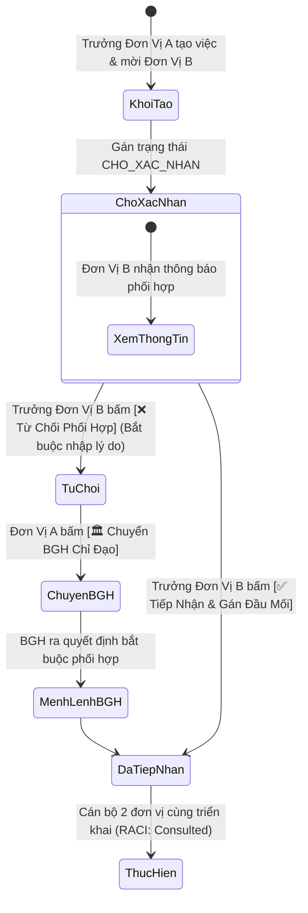

# HueIC Internal Management Portal (HueIC IMP)

> **Cổng Quản Lý & Điều Hành Nội Bộ - Trường Cao đẳng Công nghiệp Huế**
> *Hệ thống điều hành, quản lý, phân công và giám sát tiến độ công việc liên đơn vị thuộc trường Cao đẳng Công nghiệp Huế. Thiết kế theo kiến trúc hiện đại API-First & Decoupled Multi-Page Modular, đóng gói Docker hoàn chỉnh và tối ưu hóa trải nghiệm mượt mà trên cả máy tính (PC) lẫn thiết bị di động (Smartphones/Tablets).*

[](https://www.docker.com/)
[](https://fastapi.tiangolo.com/)
[](https://www.postgresql.org/)
[](https://tailwindcss.com/)

---

## 📖 MỤC LỤC TỔNG QUAN

1. [🌐 Quy Hoạch Dải Cổng Cố Định (Block 88xx)](#-1-quy-hoạch-dải-cổng-cố-định-block-88xx)
2. [🧩 Kiến Trúc Đa Trang Tinh Gọn (Multi-Page Modular Architecture)](#-2-kiến-trúc-đa-trang-tinh-gọn-multi-page-modular-architecture)
3. [📱 Tối Ưu Hóa Trải Nghiệm Trên PC & Thiết Bị Di Động (Responsive UI/UX)](#-3-tối-ưu-hóa-trải-nghiệm-trên-pc--thiết-bị-di-động-responsive-uiux)
4. [🏢 Chuẩn Hóa Cơ Cấu 12 Đơn Vị HueIC](#-4-chuẩn-hóa-cơ-cấu-12-đơn-vị-hueic)
5. [🏛️ Mô Hình Quản Trị 2 Pha Chuẩn Mực (Two-Phase Task Lifecycle)](#-5-mô-hình-quản-trị-2-pha-chuẩn-mực-two-phase-task-lifecycle)
6. [🤝 Giao Thức Phối Hợp Liên Đơn Vị 2 Chiều (2-Way Collaboration Protocol)](#-6-giao-thức-phối-hợp-liên-đơn-vị-2-chiều-2-way-collaboration-protocol)
7. [🛡️ Ma Trận Phân Quyền Thông Minh & Kiểm Soát Phân Hệ (Smart RBAC)](#-7-ma-trận-phân-quyền-thông-minh--kiểm-soát-phân-hệ-smart-rbac)
8. [🎯 Trung Tâm Lọc Nhận Thức 8 Mục (Cognitive Quick Filter Bar)](#-8-trung-tâm-lọc-nhận-thức-8-mục-cognitive-quick-filter-bar)
9. [📋 Phân Hệ Quản Lý Danh Mục Quy Trình Chuẩn (SOP Engine)](#-9-phân-hệ-quản-lý-danh-mục-quy-trình-chuẩn-sop-engine)
10. [⚡ Không Gian Làm Việc Đa Chế Độ & Quản Trị Deadline Thông Minh](#-10-không-gian-làm-việc-đa-chế-độ--quản-trị-deadline-thông-minh)
11. [🏗️ Bản Đặc Tả Kỹ Thuật Tổng Thể & Sơ Đồ Luồng End-to-End](#-11-bản-đặc-tả-kỹ-thuật-tổng-thể--sơ-đồ-luồng-end-to-end)
12. [🔄 Đặc Tả Tách Biệt: Giao Việc (Tasks) vs Lịch Công Tác (Calendar)](#-12-đặc-tả-tách-biệt-giao-việc-tasks-vs-lịch-công-tác-calendar)
13. [🚀 Hướng Dẫn Khởi Chạy Local & Triển Khai Ubuntu Server](#-13-hướng-dẫn-khởi-chạy-local--triển-khai-ubuntu-server)

---

## 🌐 1. Quy Hoạch Dải Cổng Cố Định (Block 88xx)

| Dịch vụ Container | Cổng Host (Máy chủ) | Cổng Container | Mục đích sử dụng |
| :--- | :---: | :---: | :--- |
| **Frontend Web (Nginx)** | `8880` | `80` | Giao diện Web Portal Multi-Page & Reverse Proxy API (`/api/`) |
| **Backend API (FastAPI)** | `8881` | `8000` | Cổng Backend API Python 3.11 & Tài liệu tương tác Swagger UI (`/docs`) |
| **Database (PostgreSQL 15)** | `8882` | `5432` | Kết nối CSDL PostgreSQL 15 (DBeaver / Navicat / pgAdmin) |

---

## 🧩 2. Kiến Trúc Đa Trang Tinh Gọn (Multi-Page Modular Architecture)

Để đảm bảo hiệu năng cao nhất, DOM siêu nhẹ, tải trang tức thì (< 50ms) và dễ dàng phát triển thêm các phân hệ mới mà không lo xung đột mã nguồn:

```text
HueIC IMP/
├── docker-compose.yml         # Điều phối 3 containers cố định dải cổng 8880, 8881, 8882
├── .env                       # File cấu hình môi trường bảo mật
├── .keywork.md                # 61 Nhóm nguyên tắc cốt lõi bất biến của dự án
├── HISTORY.md                 # Nhật ký lịch sử cải tiến từng phiên bản & Rollback Log
├── README.md                  # Tài liệu hướng dẫn vận hành & triển khai toàn diện
├── cachtinhKPI.md             # Sổ tay hướng dẫn & Đặc tả chi tiết cách tính điểm KPI Engine
│
├── backend/
│   ├── Dockerfile             # Container image Python 3.11 Alpine
│   ├── requirements.txt       # FastAPI, SQLAlchemy 2.0, Pydantic v2, Jose, Passlib
│   └── app/
│       ├── main.py            # Entry point FastAPI & CORS
│       ├── core/              # Config, Security, Granular Permissions Catalog
│       ├── db/                # PostgreSQL Session & init_db.py (Khởi tạo CSDL mẫu)
│       ├── models/            # SQLAlchemy ORM (Department, User, Task, Kpi, Assignment...)
│       ├── kpi_engine/        # Core KPI Engine (Base, Time, Quality, Parent, Governance, SPI)
│       ├── schemas/           # Pydantic Schemas validation
│       └── api/v1/            # API Endpoints (auth, departments, users, tasks, kpi, permissions...)
│
└── frontend/
    ├── nginx.conf             # Cấu hình Nginx Web Server & Reverse Proxy
    ├── login.html             # Trang Đăng nhập 1-chạm 4 cấp bậc
    ├── index.html             # [Module 1] Executive Operational Dashboard (BGH / SuperAdmin)
    ├── tasks.html             # [Module 2] Không gian làm việc, Bảng tiến độ & Kanban
    ├── calendar.html          # [Module 3] Lịch Công Tác Độc Lập (Month / Week / Day / Agenda)
    ├── settings.html          # [Module 4] Cấu Hình 12 Đơn Vị, Nhân Sự & RBAC 2 chế độ
    ├── assets.html            # [Module 5] Quản Lý Cơ Sở Vật Chất & Thiết Bị (Phòng QTĐT)
    ├── documents.html         # [Module 6] Sổ Văn Bản & Hồ Sơ Điện Tử
    ├── database.html          # [Module 7] Quản Trị CSDL & SQL (Dành riêng SuperAdmin)
    │
    └── assets/js/
        ├── api.js             # Core API Client (Xử lý Fetch, JWT Bearer Token)
        ├── common.js          # Core Layout (Sidebar Drawer, Mobile Nav, Toast, RBAC Guards)
        ├── dashboard.js       # Logic riêng Dashboard: Chart.js, KPI Cards, Lọc 3 cấp
        ├── calendar.js        # Logic Lịch Công Tác: 4 Views, Mini-Calendar, Timeline
        ├── tasks.js           # Logic riêng Quản lý việc: Bảng tiến độ, Kanban, 3 Modals
        └── settings.js        # Logic riêng Thiết lập: CRUD Đơn vị, CRUD Cán bộ, Ma trận RBAC
```

---

## 📱 3. Tối Ưu Hóa Trải Nghiệm Trên PC & Thiết Bị Di Động (Responsive UI/UX)

Hệ thống được thiết kế **Adaptive Mobile-First**, tự động biến đổi giao diện tối ưu theo kích thước màn hình:

- **🖥️ Trải nghiệm trên PC / Laptop:**
  - Sidebar cố định bên trái màn hình với đầy đủ danh mục chức năng.
  - Bảng biểu hiển thị dạng bảng chuẩn đầy đủ các cột thông tin chi tiết.
  - Bố cục 2-3 cột trực quan (KPI 5 cột, biểu đồ Doughnut kết hợp Horizontal Bar Chart).
- **📱 Trải nghiệm trên Điện thoại Di động (Mobile / Tablet):**
  - **Mobile Sidebar Drawer**: Trượt mượt mà từ cạnh trái khi bấm nút Hamburger 3 gạch, kèm lớp phủ làm mờ (Backdrop).
  - **Thanh Điều Hướng Nhanh (Mobile Bottom Navigation Bar)**: Cố định dưới đáy màn hình điện thoại giúp chuyển trang 1 chạm như App Native.
  - **Sub-navigation cuộn ngang cảm ứng**: Chuyển đổi giữa các tab phòng ban, nhân sự, phân quyền bằng cử chỉ vuốt mượt mà.
  - **Modals chống tràn**: Chiều cao co giãn tối đa `90vh`, tự động cuộn nội dung, không bị bàn phím ảo che mất nút bấm Lưu.

---

## 🏢 4. Chuẩn Hóa Cơ Cấu 12 Đơn Vị HueIC

Hệ thống đã chuẩn hóa đúng 12 Đơn vị/Khoa/Phòng và mã viết tắt theo cơ cấu chính thức của Trường Cao đẳng Công nghiệp Huế:

| STT | Mã Đơn Vị | Tên Đầy Đủ Đơn Vị | Chức Năng Chính |
|:---:|:---:|---|---|
| 1 | `BGH` | **Ban Giám Hiệu** | Lãnh đạo, chỉ đạo chiến lược và điều hành toàn trường |
| 2 | `HCTH` | **Phòng Hành chính - Tổng hợp** | Công tác văn thư, tổng hợp, sự kiện và khánh tiết |
| 3 | `ĐT` | **Phòng Đào tạo** | Quản lý kế hoạch giảng dạy, chương trình đào tạo và sinh viên |
| 4 | `QTĐT` | **Phòng Quản trị - Đầu tư** | Quản trị cơ sở vật chất, mua sắm thiết bị, bảo trì giảng đường |
| 5 | `TSDV` | **Trung tâm Tuyển sinh - dịch vụ & CTSV** | Tuyển sinh, học bổng, việc làm và hỗ trợ sinh viên |
| 6 | `CKOT` | **Khoa Cơ khí - Ô tô** | Đào tạo chuyên ngành Cơ khí chế tạo, Công nghệ Ô tô |
| 7 | `DC` | **Khoa Điện - Điện tử** | Đào tạo chuyên ngành Điện công nghiệp, Điện tử |
| 8 | `CNTT` | **Khoa Công nghệ thông tin và Kinh tế số** | Đào tạo CNTT, Chuyển đổi số, Quản trị mạng và phần mềm |
| 9 | `NL` | **Khoa Nhiệt lạnh** | Đào tạo chuyên ngành Kỹ thuật Nhiệt, Điện lạnh |
| 10 | `KHCB` | **Khoa Khoa học cơ bản** | Giảng dạy các môn khoa học đại cương, lý luận chính trị |
| 11 | `TTGD` | **Tổ Thanh tra giáo dục** | Giám sát chất lượng dạy và học, kiểm định giáo dục |
| 12 | `CĐ` | **Ban Chuyển đổi số** | Triển khai hạ tầng CNTT, hệ thống số hóa và phần mềm |

---

## 🏛️ 5. Mô Hình Quản Trị 2 Pha Chuẩn Mực (Two-Phase Task Lifecycle)

Quy trình quản lý công việc trên HueIC IMP được tách bạch thành **2 Giai Đoạn hoàn chỉnh**:

```mermaid
flowchart LR
    subgraph P1 [PHA 1: KHỞI TẠO & CHỈ ĐẠO (MACRO LEVEL - <30s)]
        BGH([🏛️ Ban Giám Hiệu / Lãnh Đạo]) -->|Giao việc cấp trường| TaskCreate[Tạo Nhiệm Vụ Nhanh:<br/>• Tiêu đề cốt lõi<br/>• Đơn vị chủ trì Khoa/Phòng<br/>• Hạn chót & Mức độ ưu tiên]
    end

    subgraph P2 [PHA 2: TIẾP NHẬN & PHÂN CÔNG (MICRO LEVEL - TÁC NGHIỆP)]
        TaskCreate -->|Tiếp nhận nhiệm vụ| DeptHead[👔 Trưởng Đơn Vị Chủ Trì]
        DeptHead --> DelegateModal[Mở Modal: Triển Khai & Phân Công<br/>• Chia 2 đến 8 bước mốc Milestones<br/>• Gán cán bộ: ⭐ Chính tôi / 👤 Nhân viên<br/>• Đặt hạn chót từng bước]
        DelegateModal --> StaffDo[👤 Cán Bộ / Giảng Viên Thực Hiện]
    end

    subgraph Sync [LŨY KẾ TIẾN ĐỘ THỜI GIAN THỰC]
        StaffDo -->|Hoàn thành bước mốc| AutoCalc[Tự động cập nhật % tiến độ tổng<br/>Gửi báo cáo nghiệm thu lên BGH]
    end
```

### 🔹 Pha 1: Giao Nhiệm Vụ Mới (Chỉ Đạo / Khởi Tạo - Tối Giản < 30 Giây)
* **Người thực hiện**: Ban Giám Hiệu, Trưởng đơn vị hoặc Cá nhân tự lập việc.
* **Đặc trưng**: Thao tác cực nhanh, không bắt buộc dựng bước thủ công lúc phát lệnh.
* **Trường thông tin cốt lõi**: Tiêu đề, Đơn vị chủ trì, Đơn vị phối hợp (nếu có), Hạn chót, Mức độ ưu tiên (*Thấp, Trung bình, Cao, Khẩn cấp*).

### 🔹 Pha 2: Triển Khai & Phân Công (Thực Thi / Phân Rã Chi Tiết)
* **Người thực hiện**: Trưởng đơn vị chủ trì (sau khi tiếp nhận nhiệm vụ từ cấp trên).
* **Đặc trưng**: Minh bạch trách nhiệm theo ma trận RACI (*Accountable vs. Responsible*).
* **Thao tác**: Bấm nút **`[📋 Triển Khai & Phân Công]`** tại chi tiết nhiệm vụ để:
  * Lập lộ trình từ 2 đến 8 bước mốc thực hiện.
  * Chỉ định đích danh cán bộ phụ trách từng bước (hệ thống tự động hiển thị tải công việc: `🟢 Rảnh: 0 việc`, `🟡 Đang làm`, `🔴 Quá tải`).
  * Trưởng phòng có thể tự nhận bước mốc (`⭐ [Chính tôi]`) hoặc giao cho cấp dưới.

---

## 🤝 6. Giao Thức Phối Hợp Liên Đơn Vị 2 Chiều (2-Way Collaboration Protocol)

HueIC IMP thiết lập quy chế phối hợp hành chính chuẩn mực giữa 12 đơn vị:



* **Lệnh từ Ban Giám Hiệu**: Tự động chuyển sang `DA_TIEP_NHAN` (Mệnh lệnh cấp trường, bắt buộc phối hợp).
* **Phối hợp ngang cấp (Khoa A 🤝 Khoa B)**: Trạng thái ban đầu là `CHO_XAC_NHAN`. Trưởng đơn vị B được quyền xem xét khối lượng công việc trước khi nhận hoặc từ chối có giải trình.

---

## 🛡️ 7. Ma Trận Phân Quyền Thông Minh & Kiểm Soát Phân Hệ (Smart RBAC)

Hệ thống thẩm định quyền theo công thức:
$$\text{Quyền Thực Thi} = \text{Thao Tác (Action)} \times \text{Phạm Vi (Scope)} \times \text{Bối Cảnh (Context)}$$

### 📊 Bảng Ma Trận Phân Quyền Module Gốc Chuẩn:

| Phân Hệ / Module (Trang) | 👑 SuperAdmin | 🏛️ BGH | 👔 Trưởng ĐV | 🎖️ Phó ĐV | 👤 Nhân Viên |
|---|:---:|:---:|:---:|:---:|:---:|
| **📊 Tổng Quan (Dashboard)** | ✅ *(Toàn trường)* | ✅ *(Toàn trường)* | ❌ *(Chỉ thấy khi cấp thêm)* | ❌ *(Chỉ thấy khi cấp thêm)* | ❌ *(Chỉ thấy khi cấp thêm)* |
| **📋 Quản Lý Công Việc (Tasks)** | ✅ *(Toàn trường)* | ✅ *(Toàn trường)* | ✅ *(Phạm vi Đơn vị)* | ✅ *(Phạm vi Đơn vị)* | ✅ *(Phạm vi Cá nhân)* |
| **📅 Lịch Biểu (Calendar)** | ✅ | ✅ | ❌ *(Chỉ thấy khi cấp thêm)* | ❌ *(Chỉ thấy khi cấp thêm)* | ❌ *(Chỉ thấy khi cấp thêm)* |
| **🏢 Cơ Sở Vật Chất (Assets)** | ✅ | ✅ | ➕ *(Chỉ QTĐT hoặc khi cấp)* | ➕ *(Chỉ QTĐT hoặc khi cấp)* | ❌ *(Chỉ thấy khi cấp thêm)* |
| **📁 Văn Bản & Hồ Sơ (Documents)** | ✅ | ✅ | ❌ *(Chỉ thấy khi cấp thêm)* | ❌ *(Chỉ thấy khi cấp thêm)* | ❌ *(Chỉ thấy khi cấp thêm)* |
| **🗄️ Quản Trị CSDL (Database)** | ✅ | ❌ | ❌ | ❌ | ❌ |
| **⚙️ Thiết Lập Hệ Thống (Settings)** | ✅ *(Toàn bộ 5 Tabs)* | ✅ *(Toàn bộ 5 Tabs)* | 🔓 *(Chỉ xem Quy Trình & Theme)* | 🔓 *(Chỉ xem Quy Trình & Theme)* | 🔓 *(Chỉ xem Quy Trình & Theme)* |

### 🔒 2 Chế Độ Cấu Hình RBAC Linh Hoạt (`settings.html`):
1. **🏛️ Cấu Hình Quyền Gốc Theo Vai Trò (Role Baseline)**: Thiết lập chuẩn mực quyền hạn và module mặc định cho toàn bộ 5 nhóm vai trò.
2. **👤 Cấu Hình Tùy Biến Theo Cán Bộ (User Overrides)**: Cấp thêm quyền hoặc thu hồi quyền cho từng cá nhân, tự động hiển thị thanh **Smart Diff**, cảnh báo vượt cấp (`⚠️ Vượt cấp`), nút **Hoàn Tác** và **Khôi Phục Mặc Định Gốc 100%**.

### 🚀 Điều Hướng Đăng Nhập Thông Minh:
* **SuperAdmin & BGH**: Đăng nhập tự động mở **Dashboard Tổng Quan (`index.html`)**.
* **Trưởng Phòng & Nhân Viên**: Đăng nhập tự động mở thẳng **Bảng Quản Lý Công Việc (`tasks.html`)**.

---

## 🎯 8. Trung Tâm Lọc Nhận Thức 8 Mục (Cognitive Quick Filter Bar)

Trên thanh lọc nhanh của trang Công Việc (`tasks.html`), hệ thống cung cấp 8 thẻ lọc 1-chạm theo đúng tư duy điều hành:

1. **`Tất cả`**: Bức tranh tổng thể toàn bộ nhiệm vụ được phép xem.
2. **`🎯 Việc của tôi`**: Các nhiệm vụ do chính người đăng nhập chủ trì hoặc trực tiếp thực hiện.
3. **💡 `Đề xuất chờ duyệt`** *(Kèm số đếm)*: Hộp thư các tờ trình/đề xuất do cấp dưới gửi lên cần lãnh đạo phê chuẩn.
4. **🤝 `Đề xuất phối hợp`** *(Kèm số đếm)*: Các yêu cầu phối hợp 2 chiều từ khoa/phòng khác đang chờ xác nhận.
5. **🔥 `Khẩn cấp`**: Các nhiệm vụ hỏa tốc, đột xuất cần ưu tiên xử lý trước.
6. **🚨 `Quá hạn`**: Các nhiệm vụ đã trễ hạn so với cam kết để lãnh đạo đôn đốc ngay.
7. **⏳ `Sắp đến hạn (48h)`**: Cảnh báo vàng - Các công việc cần hoàn thành trong 2 ngày tới.
8. **🟢 `Chưa đến hạn`**: Các công việc đang diễn ra bình thường, đúng lộ trình (> 48h).

---

## 📋 9. Phân Hệ Quản Lý Danh Mục Quy Trình Chuẩn (SOP Engine)

Hệ thống cung cấp một **Phân hệ Quản lý Quy trình Chuẩn hóa động (SOP Engine)** hoàn chỉnh:
- **Quản lý danh mục quy trình trên trang Cài đặt (`settings.html`)**:
  * Cho phép Quản trị viên / Trưởng đơn vị tạo mới, chỉnh sửa và quản lý các bước mốc (1 đến 8 bước) cho từng đơn vị HueIC hoặc dùng chung toàn trường.
- **Thư viện 7 quy trình chuẩn nạp sẵn trong CSDL**:
  * ⚡ `QT_CHUNG_01`: *Quy trình Soạn thảo & Trình ký văn bản (2 bước)* - Toàn trường
  * 📋 `QT_CHUNG_02`: *Quy trình Quản trị chất lượng & Cải tiến PDCA (4 bước)* - Toàn trường
  * 🎓 `QT_DT_01`: *Quy trình Xây dựng & Thẩm định Đề cương CTĐT (5 bước)* - Phòng ĐT
  * 🏗️ `QT_QTDT_01`: *Quy trình Mua sắm & Đầu tư Cơ sở vật chất (8 bước)* - Phòng QTĐT
  * 🏢 `QT_HCTH_01`: *Quy trình Tổ chức Sự kiện / Hội thảo Toàn trường (6 bước)* - Phòng HCTH
  * 🌟 `QT_TSDV_01`: *Quy trình Tiếp nhận & Xét duyệt Học bổng Sinh viên (4 bước)* - Trung tâm TSDV
  * 💻 `QT_CNTT_01`: *Quy trình Nâng cấp & Bảo trì Hệ thống Máy chủ (5 bước)* - Khoa CNTT
- **Bộ chọn quy trình động khi giao việc (`tasks.html`)**:
  * Tự động lọc gợi ý danh mục quy trình theo Đơn vị chủ trì.
  * Tự động nạp tên quy trình chính xác (`workflow_name`) và các bước mốc vào nhiệm vụ.
- **Tự động hóa thông minh**:
  * Tự động tính `% = (Số bước đã hoàn thành / Tổng số bước) * 100`.
  * Hiển thị: `[Tên Quy Trình] • Bước X/Y: Tên bước (Z%)` trên Bảng PC, Thẻ Mobile, Dashboard và Stepper Timeline.

---

## ⚡ 10. Không Gian Làm Việc Đa Chế Độ & Quản Trị Deadline Thông Minh

HueIC IMP tích hợp 4 tính năng đột phá theo chuẩn quản trị công việc doanh nghiệp & đại học tiên tiến:
- 📊 **Không gian làm việc Đa chế độ (Multi-View Workspace)**:
  * **Chế độ Danh sách (List View)**: Màn hình PC hiển thị bảng 8 cột chuyên sâu với deadline badges và phân bổ cán bộ; Mobile hiển thị Touch Cards to rõ.
  * **Chế độ Bảng Thẻ Kanban Kéo Thả (Kanban Board Drag & Drop)**: 4 cột trạng thái (*Chưa bắt đầu, Đang thực hiện, Chờ nghiệm thu, Đã hoàn thành*), hỗ trợ kéo thả HTML5 siêu mượt để chuyển trạng thái và tự động cập nhật % bước mốc tức thì.
  * **Chế độ Lịch Công Tác Tháng (Calendar View)**: Tự động phân bổ công việc theo hạn chót `due_date`, gắn badge màu theo mức độ ưu tiên, click xem chi tiết 1 chạm.
- 🚨 **Hệ thống Cảnh báo Hạn chót & Điểm nghẽn Thời gian thực (Real-Time Deadline Alerts)**:
  * Tự động tính toán ngày chênh lệch và hiển thị Badges: `🚨 Quá hạn X ngày`, `⏳ Còn Y ngày` (<=48h), `⚡ Hạn hôm nay`, `✅ Đúng hạn`.
- 🔍 **Thanh Bộ Lọc Nhanh 1 Chạm (Quick Filter Pills)**:
  * `[Tất cả]`, `[🚨 Quá hạn (count)]`, `[⏳ Sắp đến hạn (count)]`, `[🎯 Việc của tôi]`, `[🔥 Khẩn cấp]`.
- ✨ **Bộ Gợi Ý Quy Trình Thông Minh (Smart Workflow Suggester)**:
  * Tự động nhận diện từ khóa khi nhập tiêu đề nhiệm vụ để gợi ý quy trình chuẩn HueIC (Mua sắm, Đào tạo, Học bổng, Sự kiện, Máy chủ, PDCA...) và áp dụng 1-click.

---

## 🏗️ 11. Bản Đặc Tả Kỹ Thuật Tổng Thể & Sơ Đồ Luồng End-to-End

Hệ thống điều hành và phân công nhiệm vụ HueIC IMP được xây dựng dựa trên 4 trụ cột kiến trúc cốt lõi:

1. **Mô hình Dữ liệu Đơn vị Sự thật (`parent_id`)**:
   - Tận dụng `parent_id` (Self-referencing Foreign Key) trên bảng `tasks` để phân rã nhiệm vụ thành các bước con/mốc PDCA.
   - Hỗ trợ công thức tính lũy kế tiến độ cha (`progress_rule`: `AVERAGE`, `WEIGHTED`, `ALL`).
2. **Động cơ Cảnh báo 3 Nấc Escalation (Human-in-the-loop)**:
   - `24h`: Nhắc nhở thân thiện Trưởng đơn vị.
   - `48h`: Cảnh báo Vàng trên Dashboard BGH.
   - `72h`: Cảnh báo Đỏ cấp BGH kèm 3 nút hành động chủ động: `[Điều chuyển]`, `[Nhắc lại lần cuối]`, `[Bỏ qua]`.
3. **Phân tầng Hiển thị 3 Tầng Tuyệt Đối (`visibility`)**:
   - `PRIVATE`: Việc cá nhân (To-Do) - Ẩn hoàn toàn khỏi Dashboard chung.
   - `DEPARTMENT`: Việc nội bộ phòng/khoa - Tính KPI Đơn vị, ẩn khỏi Dashboard chiến lược BGH.
   - `ORGANIZATIONAL`: Việc toàn trường - Hiển thị trên Dashboard BGH.

### 📊 Sơ Đồ Luồng Xử Lý Tổng Thể (End-to-End Workflow Diagram)

```mermaid
flowchart TD
    %% ==========================================
    %% KHỞI TẠO & PHÂN LOẠI (STEPS 1 & 2)
    %% ==========================================
    subgraph S1_S2 [BƯỚC 1 & 2: KHỞI TẠO & CHỌN HÌNH THÁI FORM ĐỘNG]
        Start([Bắt đầu khởi tạo]) --> RoleCheck{Role người tạo?}
        
        RoleCheck -->|BGH| FormBGH[Form BGH: Giao chiến lược / toàn trường]
        RoleCheck -->|Trưởng Đơn Vị| FormTP[Form Trưởng phòng: Giao chuyên môn / phân rã]
        RoleCheck -->|Nhân Viên| FormNV[Form Chuyên viên: To-do cá nhân / Đề xuất]

        FormBGH --> TitleInput[Nhập Tiêu Đề Nhiệm Vụ]
        FormTP --> TitleInput
        FormNV --> TitleInput

        TitleInput --> SmartSuggest{Smart Workflow Suggester<br/>AI Nhận diện từ khóa Mua sắm, Đề cương...}
        SmartSuggest -->|Khớp từ khóa| AutoSuggest[Gợi ý 1-Click: Áp dụng Quy trình Chuẩn]
        SmartSuggest -->|Không khớp / Tùy chọn| TaskType

        AutoSuggest --> TaskType

        TaskType{Chọn Hình Thái Nhiệm Vụ}
        TaskType -->|1. Giao nhanh| TypeQuick[Loại: Giao nhanh - Ad-hoc]
        TaskType -->|2. Quy trình chuẩn| TypePDCA[Loại: Gắn Workflow Template PDCA]
        TaskType -->|3. Định kỳ| TypeRecurring[Loại: Định kỳ - Ghi task_recurring_rules]
        TaskType -->|4. Phối hợp| TypeCollab[Loại: Đa phòng ban / RACI Matrix]
    end

    %% ==========================================
    %% THIẾT LẬP THÔNG MINH (STEPS 3, 4, 5)
    %% ==========================================
    subgraph S3_S4_S5 [BƯỚC 3, 4, 5: ĐIỀU PHỐI, DEADLINE & PHÂN RÃ MỐC]
        TypeQuick & TypePDCA & TypeRecurring & TypeCollab --> AssignCheck[Chọn Đầu Mối: Bật Smart Workload Indicator]
        AssignCheck --> SetPriority[Đặt Mức Ưu Tiên & Deadline]
        
        SetPriority --> WeekendCheck{Rơi vào Thứ 7 / CN?}
        WeekendCheck -->|Có| AutoShift[Gợi ý 1-Chạm: Tự động lùi sang Thứ 2]
        WeekendCheck -->|Không| MilestoneSetup[Thiết lập các mốc thực hiện]
        AutoShift --> MilestoneSetup

        MilestoneSetup --> SplitCheck{Có phân rã chi tiết?}
        SplitCheck -->|Có| CreateChildTasks[Tạo các Task Con với parent_id<br/>Tự động chia đều số ngày theo PDCA<br/>Gán progress_rule: AVERAGE | WEIGHTED]
        SplitCheck -->|Không| SingleTask[Giữ nguyên Single Task instance]
    end

    %% ==========================================
    %% PHẠM VI HIỂN THỊ (VISIBILITY FILTER)
    %% ==========================================
    subgraph VisibilityScope [LỌC PHẠM VI HIỂN THỊ VISIBILITY]
        CreateChildTasks & SingleTask --> ScopeFilter{Gán nhãn Visibility}
        ScopeFilter -->|PRIVATE| VisPrivate[PRIVATE: Việc cá nhân<br/>Ẩn hoàn toàn khỏi Dashboard chung]
        ScopeFilter -->|DEPARTMENT| VisDept[DEPARTMENT: Việc nội bộ phòng<br/>Tính KPI Đơn vị - Ẩn khỏi BGH]
        ScopeFilter -->|ORGANIZATIONAL| VisOrg[ORGANIZATIONAL: Việc toàn trường<br/>Hiển thị Dashboard BGH]
    end

    %% ==========================================
    %% BƯỚC 6: PHÁT LỆNH & THỰC THI (STEP 6)
    %% ==========================================
    subgraph S6_Execution [BƯỚC 6: PHÁT LỆNH, VẬN HÀNH & SMART RULES]
        VisPrivate & VisDept & VisOrg --> Dispatch[Ghi task_assignments & Phát lệnh]
        
        Dispatch --> DeptPending{Trưởng Đơn Vị Tiếp Nhận}
        
        DeptPending -->|Nhận & Phân công| AssignStaff[Gán Nhân Viên thực hiện - RACI: Responsible]
        DeptPending -->|Phòng quá tải / Trả việc| RejectToBGH[Từ chối / Trả lại BGH kèm lý do]
        RejectToBGH -->|BGH nhận lý do & Giao lại| FormBGH
        
        DeptPending -->|Không thao tác| EscalationTimer{Bộ đếm thời gian}
        EscalationTimer -->|Sau 24h| EscNac1[Nấc 1: Digest / Ping nhắc nhở Trưởng Đơn Vị]
        EscalationTimer -->|Sau 48h| EscNac2[Nấc 2: Cảnh báo Vàng trên Dashboard BGH]
        EscalationTimer -->|Sau 72h| EscNac3[Nấc 3: Cảnh báo Đỏ cấp BGH<br/>BGH chọn: Điều chuyển | Nhắc lần cuối | Bỏ qua]

        AssignStaff --> StaffAction{Nhân Viên Tiếp Nhận}
        StaffAction -->|Từ chối quá tải| ReturnToDept[Trả lại Trưởng Đơn Vị phân bổ lại]
        ReturnToDept -->|Trưởng phòng gán nhân sự khác| AssignStaff
        StaffAction -->|Chấp nhận| Working[Thực hiện & Cập nhật % Tiến độ PDCA]
        
        Working --> BlockCheck{Bị nghẽn liên phòng?}
        BlockCheck -->|Có| EscalateCross[Kích hoạt Hỗ trợ Liên phòng<br/>Ping Trưởng 2 phòng phối hợp]
        BlockCheck -->|Không| CheckDone[Nộp báo cáo / Minh chứng hoàn thành]
        EscalateCross --> Working
    end

    %% ==========================================
    %% NGHIỆM THU & TÍNH TOÁN LŨY KẾ
    %% ==========================================
    subgraph Review_Closure [NGHIỆM THU & ĐÓNG NHIỆM VỤ]
        CheckDone --> DeptReview{Trưởng Đơn Vị Nghiệm Thu}
        DeptReview -->|Chưa đạt| RequestRework[Yêu cầu chỉnh sửa / Làm lại bước con]
        RequestRework --> Working
        
        DeptReview -->|Đạt 100%| ChildClosed[Đóng toàn bộ Task con]
        
        ChildClosed --> CascadeRule{Kiểm tra Cascade Rule}
        CascadeRule -->|Tất cả Task con = 100%| RollupProgress[Tính lũy kế tiến độ lên Task Cha<br/>Progress_Parent = 100%]
        CascadeRule -->|Còn task con dở dang| BlockParentClosure[Chặn đóng Task Cha]
        
        RollupProgress --> BGHVerify{BGH Xác Nhận Cuối}
        BGHVerify -->|Đạt mục tiêu| TaskCompleted([HOÀN THÀNH NHIỆM VỤ - COMPLETED])
        BGHVerify -->|Chỉ đạo thêm| FormBGH
    end

    %% ==========================================
    %% HẠ TẦNG THÔNG BÁO (NOTIFICATION ENGINE)
    %% ==========================================
    subgraph NotificationLayer [HẠ TẦNG THÔNG BÁO CHỐNG BÃO]
        EscNac3 & EscalateCross & RejectToBGH -.->|Khẩn cấp| NotifRealtime[Gửi REALTIME Webhook / Push ngay]
        Working & CheckDone & EscNac1 -.->|Cập nhật định kỳ| NotifDigest[Gom vào Hàng đợi - Gửi DIGEST mỗi 2h]
    end
```

---

## 🔄 12. Đặc Tả Tách Biệt: Giao Việc (Tasks) vs Lịch Công Tác (Calendar)

### 📌 Nguyên Tắc Kiến Trúc Cốt Lõi:
* **Hệ Sinh Thái Giao Việc (Task Dispatch)**: Thực thi & chịu trách nhiệm, có deadline, % tiến độ và nghiệm thu. **Tuyệt đối không có Recurring** trong bảng `tasks` để ngăn ngừa hoàn toàn rác dữ liệu trên Dashboard KPI & Kanban.
* **Hệ Sinh Thái Lịch Công Tác (Calendar Events - `calendar.html`)**: Ghi nhớ, lịch trình và nhắc nhở định kỳ (Họp giao ban thứ 2, nộp báo cáo ngày 15...). Sử dụng **Cơ chế Chiếu Ảo (Virtual Projection)** theo thời gian thực — chỉ lưu 1 bản ghi Rule trong `event_recurrence_rules`, không clone task bừa bãi.

```mermaid
flowchart TD
    subgraph CalendarUI [GIAO DIỆN LỊCH CÔNG TÁC (calendar.html)]
        OpenEventForm[Người dùng bấm 'Thêm Sự Kiện / Lịch Họp'] --> ToggleRecurrence{Bật 'Lặp lại định kỳ'?}
        
        ToggleRecurrence -->|Không| CreateSingleEvent[Tạo Sự Kiện Đơn Lẻ trong 'calendar_events']
        ToggleRecurrence -->|Có| SetRuleForm[Thiết lập Rule Lặp Lại:<br/>• Tần suất: Hàng tuần | Hàng tháng | Hàng năm<br/>• Kết thúc: Không bao giờ | Sau X lần | Đến ngày Y<br/>• Nhắc trước: 15 phút | 1 giờ | 1 ngày<br/>• Checkbox: ✔️ Né ngày nghỉ / Lễ Tết]
    end

    subgraph RecurrenceStorage [LƯU TRỮ RULE GỌN NHẸ (ZERO DATABASE CLUTTER)]
        SetRuleForm --> SaveRule[Lưu 1 BẢN GHI DUY NHẤT vào 'event_recurrence_rules':<br/>• event_id, freq, interval, byday, start_date, until_date<br/>• holiday_shift = TRUE]
    end

    subgraph VirtualProjection [CƠ CHẾ CHIẾU ẢO LÊN LỊCH (VIRTUAL PROJECTION)]
        UserViewsMonth[Người xem Lịch Tháng / Tuần] --> ProjectEngine[Động cơ Chiếu Ảo In-Memory Projection:<br/>Tính toán ngày xuất hiện trong tháng đang xem]
        ProjectEngine --> CheckHoliday{Trùng Lễ / Cuối tuần & Bật Né ngày nghỉ?}
        CheckHoliday -->|Có| ShiftDay[🛡️ Tự động dời hiển thị sang ngày làm việc kế tiếp]
        CheckHoliday -->|Không| KeepDay[Hiển thị đúng ngày]
        ShiftDay & KeepDay --> RenderGrid[Render Sự Kiện lên Calendar Grid Badge: 🔁 Lặp định kỳ]
    end

    subgraph ReminderEngine [HẠ TẦNG NHẮC NHỞ ĐỊNH KỲ (APScheduler Reminders)]
        ScanReminders[APScheduler quét sự kiện sắp diễn ra trong 15-30 phút] --> SendAlert[Gửi Push Notification / Email nhắc giờ họp]
    end
```

---

## 🚀 13. Hướng Dẫn Khởi Chạy Local & Triển Khai Ubuntu Server

### 🔹 1. Khởi Chạy trên Môi trường Phát triển (Windows / macOS)
Mở PowerShell hoặc Terminal tại thư mục dự án và chạy:

```bash
docker compose up -d --build
```

- **Truy cập Web Portal:** [http://localhost:8880](http://localhost:8880)
- **Tài liệu API Swagger UI:** [http://localhost:8880/docs](http://localhost:8880/docs) hoặc [http://localhost:8881/docs](http://localhost:8881/docs)

### 🔹 2. Danh Sách 4 Tài Khoản Trải Nghiệm Mẫu 1-Chạm:

| Cấp Bậc | Username | Mật Khẩu | Vai Trò & Thẩm Quyền Trải Nghiệm |
|---|---|---|---|
| 👑 **SuperAdmin** | `admin` | `HueIC@2026!` | Toàn quyền quản trị hệ thống, truy cập toàn bộ 7 phân hệ và CSDL |
| 🏛️ **Hiệu Trưởng** | `thcgiang` | `HueIC@123` | TS. Trần Hữu Châu Giang (BGH): Dashboard chiến lược, giao việc cấp trường, duyệt đề xuất |
| 👔 **Trưởng Phòng** | `qtdt` | `HueIC@123` | ThS. Trần Tiến Dũng - Trưởng phòng QTĐT: Phân công nhân viên, quản lý tài sản, duyệt KPI phòng |
| 👤 **Nhân Viên** | `ndltrung` | `HueIC@123` | Nguyễn Đình Lê Trung - Chuyên viên QTĐT: Nhận việc, làm To-Do, gửi đề xuất lên Trưởng phòng |

---

### 🐧 3. Triển Khai Toàn Diện Lên Máy Chủ Ubuntu Server (Production Ready)

#### Bước 1: Sao chép thư mục dự án lên Server
```bash
scp -r "HueIC IMP" user@server-ip:/opt/hueic-imp
```

#### Bước 2: Cấu hình Môi trường & Bảo mật
```bash
ssh user@server-ip
cd /opt/hueic-imp
cp .env.example .env
# Chỉnh sửa POSTGRES_PASSWORD, SECRET_KEY bảo mật trên file .env
nano .env
```

#### Bước 3: Cấu hình Tường lửa UFW (Firewall)
```bash
# Mở cổng 8880 (Frontend Web) và 8881 (Backend API)
sudo ufw allow 8880/tcp
sudo ufw allow 8881/tcp
sudo ufw allow 22/tcp  # Đảm bảo giữ kết nối SSH
sudo ufw enable
sudo ufw status
```

#### Bước 4: Khởi Động Toàn Bộ Hệ Thống Bằng Docker Compose
```bash
sudo docker compose up -d --build
```

#### Bước 5: Kiểm Tra Trạng Thái & Nhật Ký Hoạt Động (Healthcheck & Logs)
```bash
sudo docker compose ps
sudo docker compose logs -f backend
```

#### Bước 6: Thiết Lập Tự Động Sao Lưu CSDL Định Kỳ (Automated PostgreSQL Backup Cron)
Tạo file script backup tại `/opt/hueic-imp/backup.sh`:
```bash
#!/bin/bash
BACKUP_DIR="/opt/hueic-imp/backups"
mkdir -p $BACKUP_DIR
TIMESTAMP=$(date +"%Y%m%d_%H%M%S")
docker exec hueic_imp_db pg_dump -U hueic_admin hueic_imp_db > $BACKUP_DIR/backup_$TIMESTAMP.sql
# Xóa bản sao lưu cũ hơn 30 ngày
find $BACKUP_DIR -type f -name "*.sql" -mtime +30 -delete
```
Cấp quyền thực thi và đưa vào cron:
```bash
chmod +x /opt/hueic-imp/backup.sh
# Mở crontab để chạy tự động lúc 02:00 sáng hàng ngày
(crontab -l 2>/dev/null; echo "0 2 * * * /opt/hueic-imp/backup.sh") | crontab -
```

---

&copy; 09/2026 **HueIC-IMP**  
**Idea & Direction by Nguyen Dinh Le Trung**  
*Built with AI Assistance.*

