# HueIC Internal Management Portal (HueIC IMP)

> **Cổng Quản Lý & Điều Hành Nội Bộ - Trường Cao đẳng Công nghiệp Huế**

Hệ thống điều hành, quản lý, phân công và giám sát tiến độ công việc liên đơn vị thuộc trường Cao đẳng Công nghiệp Huế. Thiết kế theo kiến trúc hiện đại **API-First & Decoupled Multi-Page Modular**, đóng gói Docker hoàn chỉnh và tối ưu hóa trải nghiệm mượt mà trên cả máy tính (PC) lẫn thiết bị di động (Smartphones/Tablets).

---

## 🌐 1. Quy Hoạch Dải Cổng Cố Định (Block 88xx)

| Dịch vụ Container | Cổng Host (Máy chủ) | Cổng Container | Mục đích sử dụng |
| :--- | :---: | :---: | :--- |
| **Frontend Web (Nginx)** | `8880` | `80` | Giao diện Web Portal Multi-Page & Reverse Proxy API (`/api/`) |
| **Backend API (FastAPI)** | `8881` | `8000` | Cổng Backend API Python 3.11 & Tài liệu tương tác Swagger UI (`/docs`) |
| **Database (PostgreSQL 15)** | `8882` | `5432` | Kết nối CSDL PostgreSQL 15 (DBeaver / Navicat / pgAdmin) |

---

## 🧩 2. Kiến Trúc Đa Trang Tinh Gọn (Multi-Page Modular Architecture)

Để đảm bảo hiệu năng cao nhất, DOM siêu nhẹ, tải trang tức thì (< 50ms) và dễ dàng phát triển thêm các phân hệ mới mà không lo xung đột mã nguồn:

```text
HueIC IMP/
├── docker-compose.yml         # File điều phối 3 containers Docker (Frontend, Backend, Database)
├── .env                       # File cấu hình môi trường bảo mật
├── .keywork.md                # 8 Nhóm nguyên tắc cốt lõi bất biến của dự án
├── HISTORY.md                 # Nhật ký lịch sử cải tiến từng phiên bản & Rollback Log
├── README.md                  # Tài liệu hướng dẫn sử dụng & triển khai toàn diện
│
├── backend/
│   ├── Dockerfile             # Container image Python 3.11 Alpine
│   ├── requirements.txt       # FastAPI, SQLAlchemy 2.0, Pydantic v2, Jose, Passlib
│   └── app/
│       ├── main.py            # Entry point FastAPI & CORS
│       ├── core/              # Config, Security, JWT Token
│       ├── db/                # PostgreSQL Session & init_db.py (Khởi tạo CSDL mẫu)
│       ├── models/            # SQLAlchemy ORM (Department, User, Task, Comment)
│       ├── schemas/           # Pydantic Schemas validation
│       └── api/v1/            # API Endpoints (auth, departments, users, tasks, stats)
│
└── frontend/
    ├── nginx.conf             # Cấu hình Nginx Web Server & Reverse Proxy
    ├── login.html             # Trang Đăng nhập hệ thống
    ├── index.html             # [Trang 1] Executive Operational Dashboard (Action Queue, Tabs, Ưu tiên, Cảnh báo 12 Đơn vị)
    ├── calendar.html          # [Trang 2] Lịch Công Tác Độc Lập (Month / Week / Day / Agenda)
    ├── tasks.html             # [Trang 3] Quản Lý Tiến Độ, Phân Công & Thảo Luận Nhiệm Vụ
    ├── settings.html          # [Trang 4] Cấu Hình 12 Đơn Vị, Nhân Sự & Phân Quyền RBAC
    ├── assets.html            # [Trang 5 - Phase 2] Quản Lý Tài Sản & Thiết Bị (Sắp mở)
    ├── documents.html         # [Trang 6 - Phase 2] Sổ Văn Bản & Hồ Sơ Điện Tử (Sắp mở)
    │
    └── assets/js/
        ├── api.js             # Core API Client (Xử lý Fetch, JWT Bearer Token)
        ├── common.js          # Core Layout (Sidebar Drawer, Mobile Nav, Toast, Profile)
        ├── dashboard.js       # Logic riêng Dashboard: Chart.js, KPI Cards, Lọc 3 cấp
        ├── calendar.js        # Logic Lịch Công Tác: 4 Views, Mini-Calendar, Timeline
        ├── tasks.js           # Logic riêng Quản lý việc: Bảng tiến độ, 3 Modals
        └── settings.js        # Logic riêng Thiết lập: CRUD Đơn vị, CRUD Cán bộ, Ma trận RBAC
```

---

## 📱 3. Tối Ưu Hóa Trải Nghiệm Trên PC & Thiết Bị Di Động (Responsive UI/UX)

Hệ thống được thiết kế **Adaptive Mobile-First**, tự động biến đổi giao diện tối ưu theo kích thước màn hình:

- **🖥️ Trải nghiệm trên PC / Laptop:**
  - Sidebar cố định bên trái màn hình với đầy đủ danh mục chức năng.
  - Bảng biểu hiển thị dạng bảng chuẩn đầy đủ các cột thông tin chi tiết.
  - Bố cục 2-3 cột trực quan (KPI 5 cột, biểu đồ Doughnut kết hợp Horizontal Bar Chart).
- **📱 Trải nghiệm trên Điện thoại Di động (Mobile / Tablet):**
  - **Mobile Sidebar Drawer**: Trượt mượt mà từ cạnh trái khi bấm nút Hamburger 3 gạch, kèm lớp phủ làm mờ (Backdrop).
  - **Thanh Điều Hướng Nhanh (Mobile Bottom Navigation Bar)**: Cố định dưới đáy màn hình điện thoại giúp chuyển trang 1 chạm như App Native.
  - **Sub-navigation cuộn ngang cảm ứng**: Chuyển đổi giữa các tab phòng ban, nhân sự, phân quyền bằng cử chỉ vuốt mượt mà.
  - **Modals chống tràn**: Chiều cao co giãn tối đa `90vh`, tự động cuộn nội dung, không bị bàn phím ảo che mất nút bấm Lưu.

---

## 🏢 4. Chuẩn Hóa Cơ Cấu 12 Đơn Vị HueIC

Hệ thống đã chuẩn hóa đúng 12 Đơn vị/Khoa/Phòng và mã viết tắt theo cơ cấu chính thức của Trường Cao đẳng Công nghiệp Huế:

1. `BGH`: Ban Giám hiệu
2. `HCTH`: Phòng Hành chính - Tổng hợp
3. `ĐT`: Phòng Đào tạo
4. `QTĐT`: Phòng Quản trị - Đầu tư
5. `TSDV`: Trung tâm Tuyển sinh - dịch vụ & Công tác sinh viên
6. `CKOT`: Khoa Cơ khí - Ô tô
7. `DC`: Khoa Điện - Điện tử
8. `CNTT`: Khoa Công nghệ Thông tin
9. `NL`: Khoa Năng lượng
10. `KHCB`: Khoa Khoa học Cơ bản
11. `TTGD`: Trung tâm Giáo dục nghề nghiệp
12. `CĐ`: Công đoàn cơ sở

---

## 🎯 5. Phân Hệ Quản Lý Danh Mục Quy Trình Chuẩn (Workflow Template Catalog & Engine)

Hệ thống cung cấp một **Phân hệ Quản lý Quy trình Chuẩn hóa động (SOP Engine)** hoàn chỉnh:
- **Quản lý danh mục quy trình trên trang Cài đặt (`settings.html`)**:
  * Cho phép Quản trị viên / Trưởng đơn vị tạo mới, chỉnh sửa và quản lý các bước mốc (1 đến 8 bước) cho từng đơn vị HueIC hoặc dùng chung toàn trường.
- **Thư viện 7 quy trình chuẩn nạp sẵn trong CSDL**:
  * ⚡ `QT_CHUNG_01`: *Quy trình Soạn thảo & Trình ký văn bản (2 bước)* - Toàn trường
  * 📋 `QT_CHUNG_02`: *Quy trình Quản trị chất lượng & Cải tiến PDCA (4 bước)* - Toàn trường
  * 🎓 `QT_DT_01`: *Quy trình Xây dựng & Thẩm định Đề cương CTĐT (5 bước)* - Phòng ĐT
  * 🏗️ `QT_QTDT_01`: *Quy trình Mua sắm & Đầu tư Cơ sở vật chất (8 bước)* - Phòng QTĐT
  * 🏢 `QT_HCTH_01`: *Quy trình Tổ chức Sự kiện / Hội thảo Toàn trường (6 bước)* - Phòng HCTH
  * 🌟 `QT_TSDV_01`: *Quy trình Tiếp nhận & Xét duyệt Học bổng Sinh viên (4 bước)* - Trung tâm TSDV
  * 💻 `QT_CNTT_01`: *Quy trình Nâng cấp & Bảo trì Hệ thống Máy chủ (5 bước)* - Khoa CNTT
- **Bộ chọn quy trình động khi giao việc (`tasks.html`)**:
  * Tự động lọc gợi ý danh mục quy trình theo Đơn vị chủ trì.
  * Tự động nạp tên quy trình chính xác (`workflow_name`) và các bước mốc vào nhiệm vụ.
- **Tự động hóa thông minh**:
  * Tự động tính `% = (Số bước đã hoàn thành / Tổng số bước) * 100`.
  * Hiển thị: `[Tên Quy Trình] • Bước X/Y: Tên bước (Z%)` trên Bảng PC, Thẻ Mobile, Dashboard và Stepper Timeline.

---

## ⚡ 6. Không Gian Làm Việc Đa Chế Độ & Quản Trị Deadline Chuẩn MISA AMIS
HueIC IMP tích hợp 4 tính năng đột phá được chắt lọc theo tinh hoa từ nền tảng MISA AMIS Công Việc:
- 📊 **Không gian làm việc Đa chế độ (Multi-View Workspace)**:
  * **Chế độ Danh sách (List View)**: Màn hình PC hiển thị bảng 8 cột chuyên sâu với deadline badges và phân bổ cán bộ; Mobile hiển thị Touch Cards to rõ.
  * **Chế độ Bảng Thẻ Kanban Kéo Thả (Kanban Board Drag & Drop)**: 4 cột trạng thái (*Chưa bắt đầu, Đang thực hiện, Chờ nghiệm thu, Đã hoàn thành*), hỗ trợ kéo thả HTML5 siêu mượt để chuyển trạng thái và tự động cập nhật % bước mốc tức thì.
  * **Chế độ Lịch Công Tác Tháng (Calendar View)**: Tự động phân bổ công việc theo hạn chót `due_date`, gắn badge màu theo mức độ ưu tiên, click xem chi tiết 1 chạm.
- 🚨 **Hệ thống Cảnh báo Hạn chót & Điểm nghẽn Thời gian thực (Real-Time Deadline Alerts)**:
  * Tự động tính toán ngày chênh lệch và hiển thị Badges: `🚨 Quá hạn X ngày`, `⏳ Còn Y ngày` (<=48h), `⚡ Hạn hôm nay`, `✅ Đúng hạn`.
- 🔍 **Thanh Bộ Lọc Nhanh 1 Chạm (Quick Filter Pills)**:
  * `[Tất cả]`, `[🚨 Quá hạn (count)]`, `[⏳ Sắp đến hạn (count)]`, `[🎯 Việc của tôi]`, `[🔥 Khẩn cấp]`.
- ✨ **Bộ Gợi Ý Quy Trình Thông Minh (Smart Workflow Suggester)**:
  * Tự động nhận diện từ khóa khi nhập tiêu đề nhiệm vụ để gợi ý quy trình chuẩn HueIC (Mua sắm, Đào tạo, Học bổng, Sự kiện, Máy chủ, PDCA...) và áp dụng 1-click.

---

## 🏗️ 7. Bản Đặc Tả Kỹ Thuật Tổng Thể & 4 Trụ Cột Chốt Cứng (Final Blueprint)

Hệ thống điều hành và phân công nhiệm vụ HueIC IMP được xây dựng dựa trên 4 trụ cột kiến trúc cốt lõi:

1. **Mô hình Dữ liệu Đơn vị Sự thật (`parent_id`)**:
   - Tận dụng `parent_id` (Self-referencing Foreign Key) trên bảng `tasks` để phân rã nhiệm vụ thành các bước con/mốc PDCA.
   - Hỗ trợ công thức tính lũy kế tiến độ cha (`progress_rule`: `AVERAGE`, `WEIGHTED`, `ALL`).
2. **Động cơ Cảnh báo 3 Nấc Escalation (Human-in-the-loop)**:
   - `24h`: Nhắc nhở thân thiện Trưởng đơn vị.
   - `48h`: Cảnh báo Vàng trên Dashboard BGH.
   - `72h`: Cảnh báo Đỏ cấp BGH kèm 3 nút hành động chủ động: `[Điều chuyển]`, `[Nhắc lại lần cuối]`, `[Bỏ qua]`.
3. **Phân tầng Hiển thị 3 Tầng Tuyệt Đối (`visibility`)**:
   - `PRIVATE`: Việc cá nhân (To-Do) - Ẩn hoàn toàn khỏi Dashboard chung.
   - `DEPARTMENT`: Việc nội bộ phòng/khoa - Tính KPI Đơn vị, ẩn khỏi Dashboard chiến lược BGH.
### 📊 Sơ Đồ Luồng Xử Lý Tổng Thể (End-to-End Workflow Diagram)

```mermaid
flowchart TD
    %% ==========================================
    %% KHỞI TẠO & PHÂN LOẠI (STEPS 1 & 2)
    %% ==========================================
    subgraph S1_S2 ["BƯỚC 1 & 2: KHỞI TẠO & CHỌN HÌNH THÁI (FORM ĐỘNG)"]
        Start([Bắt đầu khởi tạo]) --> RoleCheck{Role người tạo?}
        
        RoleCheck -->|BGH| FormBGH["Form BGH: Giao chiến lược / toàn trường"]
        RoleCheck -->|Trưởng Đơn Vị| FormTP["Form Trưởng phòng: Giao chuyên môn / phân rã"]
        RoleCheck -->|Nhân Viên| FormNV["Form Chuyên viên: To-do cá nhân / Đề xuất"]

        FormBGH --> TitleInput["Nhập Tiêu Đề Nhiệm Vụ"]
        FormTP --> TitleInput
        FormNV --> TitleInput

        TitleInput --> SmartSuggest{"Smart Workflow Suggester<br/>(AI Nhận diện từ khóa Mua sắm, Đề cương...)"}
        SmartSuggest -->|Khớp từ khóa| AutoSuggest["Gợi ý 1-Click: Áp dụng Quy trình Chuẩn"]
        SmartSuggest -->|Không khớp / Tùy chọn| TaskType

        AutoSuggest --> TaskType

        TaskType{Chọn Hình Thái Nhiệm Vụ}
        TaskType -->|1. Giao nhanh| TypeQuick["Loại: Giao nhanh - Ad-hoc"]
        TaskType -->|2. Quy trình chuẩn| TypePDCA["Loại: Gắn Workflow Template PDCA"]
        TaskType -->|3. Định kỳ| TypeRecurring["Loại: Định kỳ - Ghi task_recurring_rules"]
        TaskType -->|4. Phối hợp| TypeCollab["Loại: Đa phòng ban / RACI Matrix"]
    end

    %% ==========================================
    %% THIẾT LẬP THÔNG MINH (STEPS 3, 4, 5)
    %% ==========================================
    subgraph S3_S4_S5 ["BƯỚC 3, 4, 5: ĐIỀU PHỐI, DEADLINE & PHÂN RÃ MỐC"]
        TypeQuick & TypePDCA & TypeRecurring & TypeCollab --> AssignCheck["Chọn Đầu Mối: Bật Smart Workload Indicator"]
        AssignCheck --> SetPriority["Đặt Mức Ưu Tiên & Deadline"]
        
        SetPriority --> WeekendCheck{Rơi vào Thứ 7 / CN?}
        WeekendCheck -->|Có| AutoShift["Gợi ý 1-Chạm: Tự động lùi sang Thứ 2"]
        WeekendCheck -->|Không| MilestoneSetup["Thiết lập các mốc thực hiện"]
        AutoShift --> MilestoneSetup

        MilestoneSetup --> SplitCheck{Có phân rã chi tiết?}
        SplitCheck -->|Có| CreateChildTasks["Tạo các Task Con với parent_id<br/>Tự động chia đều số ngày theo PDCA<br/>Gán progress_rule: AVERAGE | WEIGHTED"]
        SplitCheck -->|Không| SingleTask["Giữ nguyên Single Task instance"]
    end

    %% ==========================================
    %% PHẠM VI HIỂN THỊ (VISIBILITY FILTER)
    %% ==========================================
    subgraph VisibilityScope ["LỌC PHẠM VI HIỂN THỊ (VISIBILITY)"]
        CreateChildTasks & SingleTask --> ScopeFilter{Gán nhãn Visibility}
        ScopeFilter -->|PRIVATE| VisPrivate["PRIVATE: Việc cá nhân<br/>Ẩn hoàn toàn khỏi Dashboard chung"]
        ScopeFilter -->|DEPARTMENT| VisDept["DEPARTMENT: Việc nội bộ phòng<br/>Tính KPI Đơn vị - Ẩn khỏi BGH"]
        ScopeFilter -->|ORGANIZATIONAL| VisOrg["ORGANIZATIONAL: Việc toàn trường<br/>Hiển thị Dashboard BGH"]
    end

    %% ==========================================
    %% BƯỚC 6: PHÁT LỆNH & THỰC THI (STEP 6)
    %% ==========================================
    subgraph S6_Execution ["BƯỚC 6: PHÁT LỆNH, VẬN HÀNH & SMART RULES"]
        VisPrivate & VisDept & VisOrg --> Dispatch["Ghi task_assignments & Phát lệnh"]
        
        Dispatch --> DeptPending{Trưởng Đơn Vị Tiếp Nhận}
        
        %% Luồng phân công của Trưởng đơn vị
        DeptPending -->|Nhận & Phân công| AssignStaff["Gán Nhân Viên thực hiện - RACI: Responsible"]
        DeptPending -->|Phòng quá tải / Trả việc| RejectToBGH["Từ chối / Trả lại BGH kèm lý do"]
        RejectToBGH -->|BGH nhận lý do & Giao lại| FormBGH
        
        %% Smart Rule: Escalation Engine
        DeptPending -->|Không thao tác| EscalationTimer{Bộ đếm thời gian}
        EscalationTimer -->|Sau 24h| EscNac1["Nấc 1: Digest / Ping nhắc nhở Trưởng Đơn Vị"]
        EscalationTimer -->|Sau 48h| EscNac2["Nấc 2: Cảnh báo Vàng trên Dashboard BGH"]
        EscalationTimer -->|Sau 72h| EscNac3["Nấc 3: Cảnh báo Đỏ cấp BGH<br/>BGH chọn: Điều chuyển | Nhắc lần cuối | Bỏ qua"]

        %% Nhân viên thực hiện
        AssignStaff --> StaffAction{Nhân Viên Tiếp Nhận}
        StaffAction -->|Từ chối quá tải| ReturnToDept["Trả lại Trưởng Đơn Vị phân bổ lại"]
        ReturnToDept -->|Trưởng phòng gán nhân sự khác| AssignStaff
        StaffAction -->|Chấp nhận| Working["Thực hiện & Cập nhật % Tiến độ PDCA"]
        
        Working --> BlockCheck{Bị nghẽn liên phòng?}
        BlockCheck -->|Có| EscalateCross["Kích hoạt Hỗ trợ Liên phòng<br/>Ping Trưởng 2 phòng phối hợp"]
        BlockCheck -->|Không| CheckDone["Nộp báo cáo / Minh chứng hoàn thành"]
        EscalateCross --> Working
    end

    %% ==========================================
    %% NGHIỆM THU & TÍNH TOÁN LŨY KẾ
    %% ==========================================
    subgraph Review_Closure ["NGHIỆM THU & ĐÓNG NHIỆM VỤ"]
        CheckDone --> DeptReview{Trưởng Đơn Vị Nghiệm Thu}
        DeptReview -->|Chưa đạt| RequestRework["Yêu cầu chỉnh sửa / Làm lại bước con"]
        RequestRework --> Working
        
        DeptReview -->|Đạt 100%| ChildClosed["Đóng toàn bộ Task con"]
        
        ChildClosed --> CascadeRule{Kiểm tra Cascade Rule}
        CascadeRule -->|Tất cả Task con = 100%| RollupProgress["Tính lũy kế tiến độ lên Task Cha<br/>Progress_Parent = 100%"]
        CascadeRule -->|Còn task con dở dang| BlockParentClosure["Chặn đóng Task Cha"]
        
        RollupProgress --> BGHVerify{BGH Xác Nhận Cuối}
        BGHVerify -->|Đạt mục tiêu| TaskCompleted(["HOÀN THÀNH NHIỆM VỤ - COMPLETED"])
        BGHVerify -->|Chỉ đạo thêm| FormBGH
    end

    %% ==========================================
    %% HẠ TẦNG THÔNG BÁO (NOTIFICATION ENGINE)
    %% ==========================================
    subgraph NotificationLayer ["HẠ TẦNG THÔNG BÁO CHỐNG BÃO"]
        EscNac3 & EscalateCross & RejectToBGH -.->|Khẩn cấp| NotifRealtime["Gửi REALTIME Webhook / Push ngay"]
        Working & CheckDone & EscNac1 -.->|Cập nhật định kỳ| NotifDigest["Gom vào Hàng đợi - Gửi DIGEST mỗi 2h"]
    end
```



---

## 🚀 8. Hướng Dẫn Khởi Chạy (Local & Server)

### 🔹 Khởi chạy trên Môi trường Phát triển (Windows / macOS)
Mở PowerShell hoặc Terminal tại thư mục dự án và chạy:

```bash
docker compose up -d --build
```

- **Truy cập Web Portal:** [http://localhost:8880](http://localhost:8880)
- **Tài liệu API Swagger UI:** [http://localhost:8880/docs](http://localhost:8880/docs) hoặc [http://localhost:8881/docs](http://localhost:8881/docs)
- **Tài khoản Quản trị viên (SuperAdmin):**
  - **Username:** `admin`
  - **Password:** `HueIC@2026!`
- **Tài khoản Demo Trưởng Phòng QTĐT:**
  - **Username:** `qtdt`
  - **Password:** `HueIC@123`

---

### 🐧 Triển khai lên Máy Chủ Ubuntu Server
```bash
# 1. Sao chép thư mục dự án lên server
scp -r "HueIC IMP" user@server-ip:/opt/hueic-imp

# 2. Đăng nhập SSH và chuẩn bị môi trường
ssh user@server-ip
cd /opt/hueic-imp
cp .env.example .env

# 3. Mở cổng tường lửa UFW (chỉ mở 8880 và 8881)
sudo ufw allow 8880/tcp
sudo ufw allow 8881/tcp
sudo ufw reload

# 4. Khởi động các container nền tảng
sudo docker compose up -d --build
```


